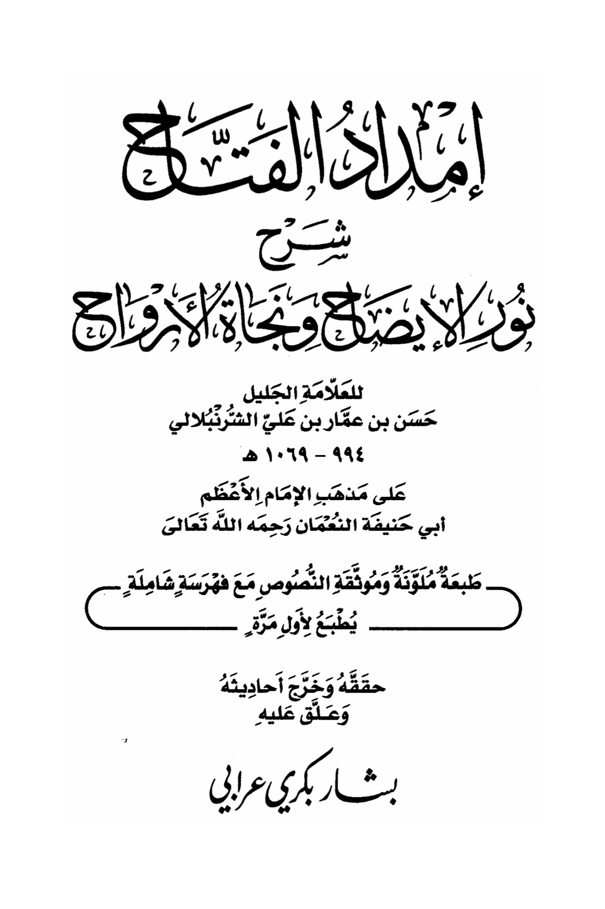

# al-Shurunbulālī (d. 1069)

With your arrival before us, coming from distant lands and faraway places, we traverse the plains and rugged terrain to visit you, <mark style="color:red;">**seeking your intercession, to behold your deeds and promises, to fulfill some of your rights, and to seek your intercession with our Lord**</mark>. Our sins have burdened us, and our burdens have weighed heavily on us, <mark style="color:red;">**and you are the intercessor promised with the greatest intercession, the praised station and means**</mark>. Allah the Almighty has said: "And if, when they wronged themselves, they had come to you, \[O Muhammad], and asked forgiveness of Allah, and the Messenger had asked forgiveness for them, they would have found Allah Accepting of repentance and Merciful." \[Quran, 4:64]. <mark style="color:red;">**We come to you as wrongdoers to ourselves, seeking forgiveness for our sins, so intercede for us with your Lord,**</mark> and ask Him to make us die upon your way, and to gather us in your group, and to admit us to your basin, and to give us to drink from your cup, without disgrace or regret. *<mark style="color:red;">**Intercession, intercession, intercession, O Messenger of Allah**</mark>*. Say it three times: "Our Lord, forgive us and our brothers who preceded us in faith and do not put in our hearts any resentment toward those who have believed. Our Lord, indeed You are Kind and Merciful." And convey to him our greetings as you were instructed, saying: "<mark style="color:red;">**Peace be upon you, O Messenger of Allah, from so-and-so who seeks your intercession with your Lord, so intercede for him and for the Muslims**</mark>." Then send blessings upon him and supplicate as you wish in front of his noble face, the one facing the direction of prayer. T<mark style="color:red;">**hen turn slightly until you are aligned with the head of the truthful Abu Bakr, may Allah be pleased with him, and say: "Peace be upon you, O Caliph of the Messenger of Allah, peace be upon you, O companion of the Messenger of Allah, his confidant in the cave, his companion in travels, his confidant in secrets**</mark>.&#x20;

"<mark style="color:purple;">**The text is a description of a book titled "Imdad al-Fattah: Explanation of Noon al-Iyadah and Nahw al-Murawah" by the esteemed scholar Hasan bin Ammar bin Ali al-Sharnubalali**</mark>"

<figure><figcaption></figcaption></figure> <figure><figcaption></figcaption></figure>

