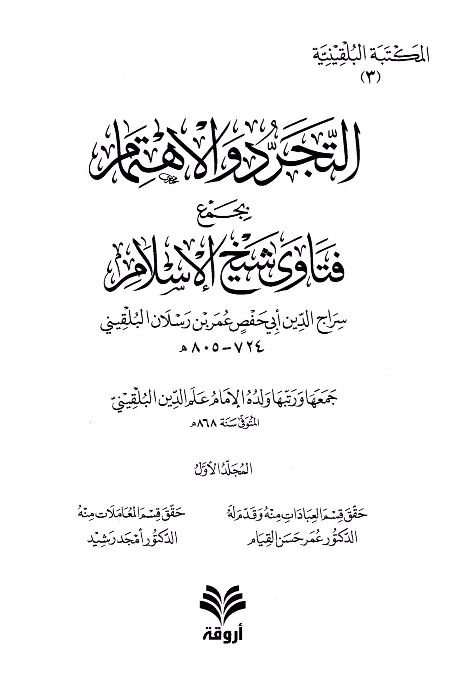
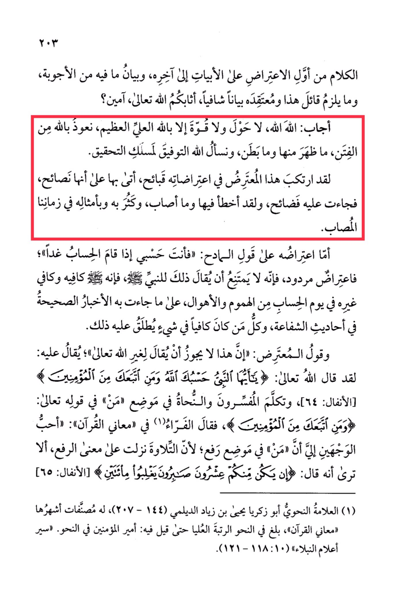

# al-Sirāj al-Bulqīnī (d. 805)

al-Sirāj al-Bulqīnī (d. 805), Mujaddid of the 8th century, was asked about poetry with Istighāthah and someone who prohibited it. He said that the one who prohibited it is a Jāhil and a causer of Fitnah, then refutes his arguments in dozens of pages.

<mark style="color:yellow;">**The speech from the beginning of the objection to the verses to the end, and the clarification of the responses within it, and what is required for the proponent of this and his belief to provide a clear explanation,**</mark> may Allah reward you, Ameen? He replied: Allah, Allah, there is no power or strength except with Allah, the Most High, the Almighty. We seek refuge in Allah from the trials, whether apparent or hidden, and we ask Allah for success in the path of seeking the truth. This objector has committed grave errors in his objections, presenting them as advice, but they turned out to be shameful for him. He has erred in them and in what he has achieved, and such errors have multiplied among him and his likes in our afflicted time. As for his objection to the praise of the one being praised, "You are sufficient for me when the account is established tomorrow," it is a rejected objection, for it is not impossible to say that to the Prophet, peace be upon him, as he is sufficient for himself and others on the Day of Judgment from worries and horrors, as reported in authentic narrations about intercession. Anyone who is sufficient in something is called that. And the objector's statement, "It is not permissible to say this to other than Allah, the Most High," it can be said to him: Allah, the Most High, has said, "O Prophet, Allah is sufficient for you and for those who follow you among the believers" \[Quran 8:64]. The commentators and grammarians have spoken about the word "···" (who) in the verse, "and for those who follow you among the believers," and Al-Farra' in "Ma'ani al-Quran" said: "The most preferable interpretation to me is that '···' is in the nominative case, because the recitation was revealed in the nominative sense. Do you not see that He said, 'If there are twenty steadfast ones among you, they will overcome two hundred' \[Quran 8:65]." Abu Zakariya Yahya ibn Ziyad al-Dilami (144-207), a prominent grammarian, reached the highest rank in grammar to the extent that he was called the Commander of the Faithful in Grammar.

"<mark style="color:purple;">**The Balqini Library (3) Asceticism and Neglect brings together the fatwas of Shaykh al-Islam Siraj al-Din Abu Hafs Umar ibn Raslan al-Bulqini (724-805 AH), compiled and arranged by his son Imam Ali al-Din al-Bulqini who passed away in 868 AH**</mark>"

<figure><figcaption></figcaption></figure> <figure><figcaption></figcaption></figure>

