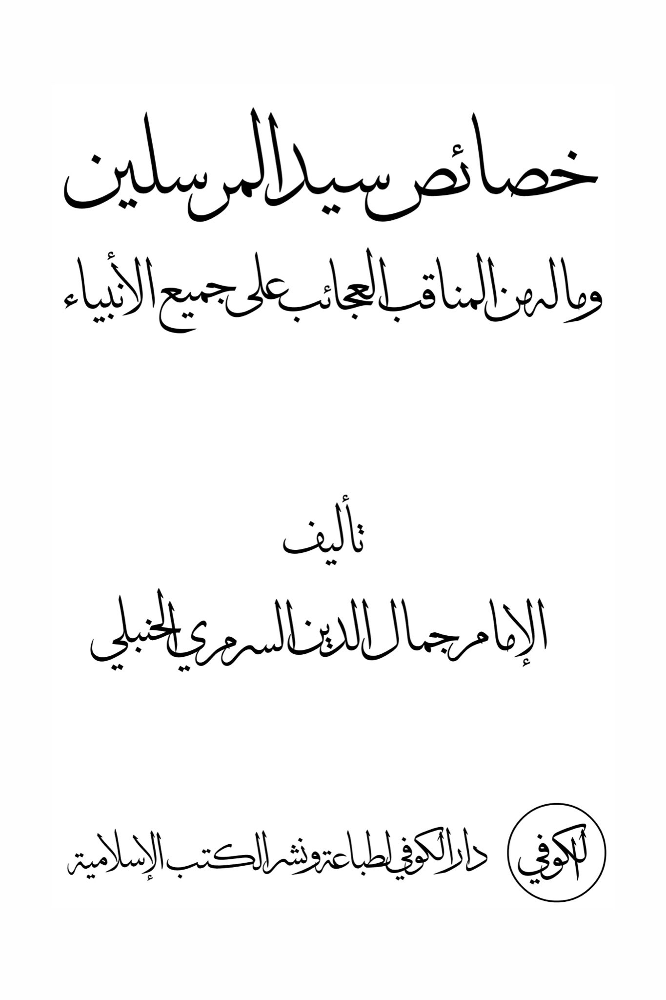
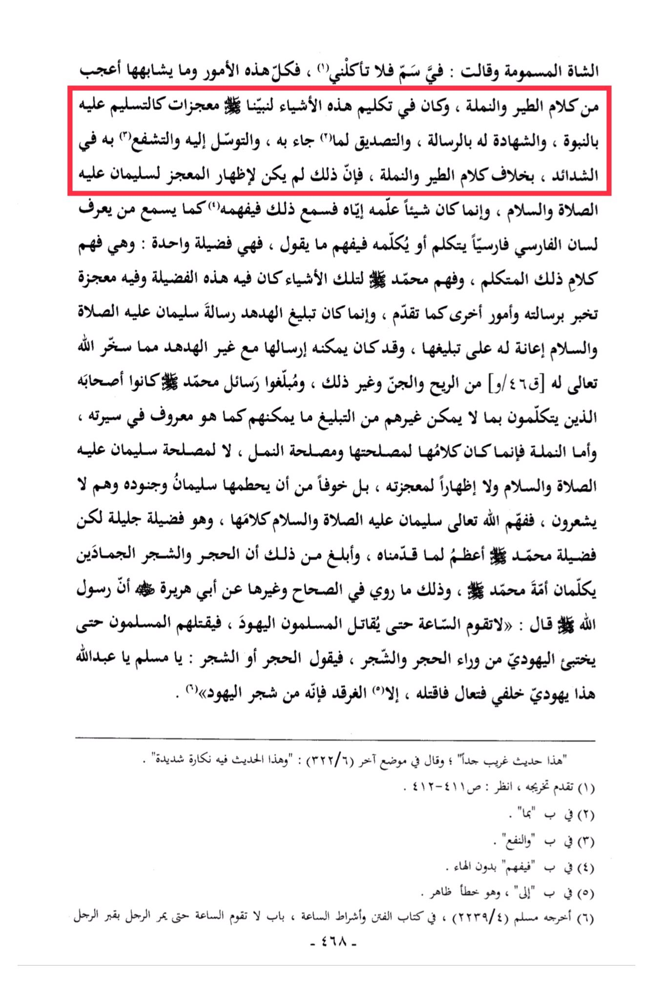

# al-Surramarrī (d. 776)

The poisoned sheep said, "I have poison, so do not eat me." All of these matters and the like are more astonishing than the speech of birds and ants. In addressing these things to our Prophet, it was to demonstrate miracles, <mark style="color:red;">**such as acknowledging his prophethood, testifying to his message, affirming what he brought, seeking intercession and mediation with him in times of hardship**</mark>, unlike the speech of birds and ants. This was not to demonstrate a miracle to Solomon, peace be upon him, but rather to teach him something so he could hear and understand it, just as someone who knows Persian can understand when spoken to in Persian. It is a virtue to understand the speech of the speaker. Understanding those things was a virtue in the Prophet Muhammad, peace be upon him, and it contained a miracle that indicated his message and other matters as mentioned earlier. The conveying of the message by the hoopoe was a message from Solomon, peace be upon him, to assist him in delivering it. He could have sent it with someone other than the hoopoe, as Allah had subjected to him the wind, the jinn, and other creatures. The messengers of Muhammad, peace be upon him, were his companions who spoke in a way that others could not, as is well known from his biography. As for the ant, its speech was for its own benefit and the benefit of the ants, not for the benefit of Solomon, peace be upon him, or to demonstrate his miracle. It was out of fear that Solomon and his soldiers might unknowingly trample them, so Allah, the Most High, enabled Solomon to understand their speech. This was a great virtue, but the virtue of Muhammad, peace be upon him, is greater, as we have presented. Furthermore, it is more significant that inanimate objects like stones and trees speak to the nation of Muhammad, peace be upon him, as narrated in authentic sources, such as the hadith of Abu Huraira where the Prophet, peace be upon him, said, "The Hour will not be established until the Muslims fight the Jews, and the Jews will hide behind stones and trees, and the stones or trees will say, 'O Muslim, O servant of Allah, there is a Jew behind me; come and kill him,' except for the gharqad tree, for it is one of the trees of the Jews." This hadith is very strange, and in another place, it is mentioned that there is a severe flaw in it. (1) Its verification has been mentioned earlier. (2) In place of "what." (3) In place of "and benefit." (4) In place of "so he understands" without the pronoun. (5) In place of "to," which is an obvious error. (6) Narrated by Muslim in the Book of Tribulations and Signs of the Hour, in the chapter "The Hour will not be established until a man passes by a grave and wishes that he was in the place of the deceased."

"<mark style="color:purple;">**The Characteristics of the Master of Messengers and his Virtues among the Prophets: A work by Imam Jamal al-Din al-Sururi al-Hanbali, published by Kofi Dar al-Kofi for printing and distributing Islamic books.**</mark>"

<figure><figcaption></figcaption></figure> <figure><figcaption></figcaption></figure>

