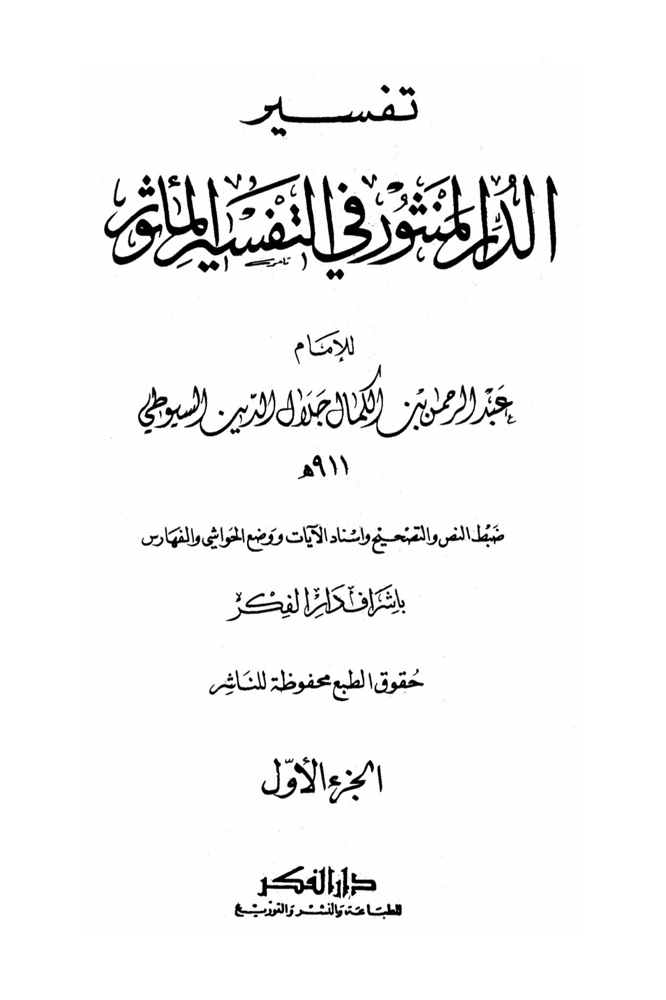
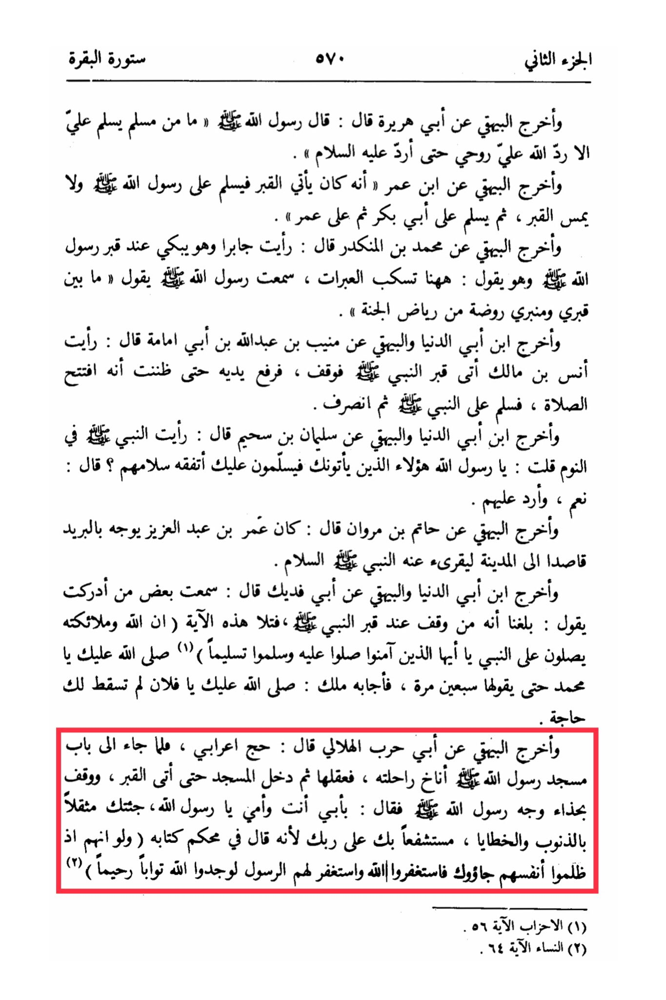

# al-Suyūṭī (d. 910)

Part two of the story of Al-Baqarah, as narrated by Al-Bayhaqi from Abu Huraira, who said: The Messenger of Allah · said, "Whenever a Muslim greets me, Allah returns my soul to me so that I may return the greeting to him." <mark style="color:red;">**And Al-Bayhaqi also narrated from Ibn Umar that he used to come to the grave and greet the Messenger of Allah · without touching the grave, then he would greet Abu Bakr and then Umar.**</mark> And Al-Bayhaqi also narrated from Muhammad ibn Al-Munkadir who said: I saw Jabir crying at the grave of the Messenger of Allah and saying, "Here tears are shed." I heard the Messenger of Allah saying, "Between my grave and my pulpit is a garden from the gardens of Paradise." Ibn Abi Ad-Dunya and Al-Bayhaqi also narrated from Muni'b ibn Abdullah ibn Abi Imama who said: <mark style="color:red;">**I saw Anas ibn Malik come to the Prophet's grave, stand, raise his hands as if in prayer, greet the Prophet, and then leave**</mark>. Ibn Abi Ad-Dunya and Al-Bayhaqi also narrated from Sulaiman ibn Sahim who said: I saw the Prophet · in a dream and asked him, <mark style="color:yellow;">**"O Messenger of Allah, do you understand the greetings of those who come to you?" He replied, "Yes, and I return their greetings."**</mark> And Al-Bayhaqi also narrated from Hatim ibn Marwan who said: Umar ibn Abdul Aziz used to send letters to Al-Madinah seeking blessings from the Prophet. Ibn Abi Ad-Dunya and Al-Bayhaqi also narrated from Abu Fadeek who said: I heard from someone who stood at the Prophet's grave reciting the verse, "Indeed, Allah and His angels send blessings upon the Prophet. O you who have believed, ask \[ Allah to confer] blessing upon him and ask \[ Allah to grant him] peace." (Al-Ahzab 56) "May Allah bless you, O Muhammad," seventy times, and an angel responded, "May Allah bless you, O so-and-so, your need has been fulfilled." And Al-Bayhaqi also narrated from Abu Harb Al-Hilali who said: A Bedouin performed Hajj, and when he reached the gate of the Prophet's mosque, he tied his camel, entered the mosque, <mark style="color:red;">**approached the grave, stood at the head of the Prophet's grave, and said, "By my father and mother, O Messenger of Allah, I have come to you burdened with sins and transgressions, seeking your intercession with your Lord**</mark>, for He has said in His decisive Book, 'And if they had wronged themselves, they would have come to you, \[O Muhammad], then asked forgiveness of Allah, and the Messenger asked forgiveness for them, they would have found Allah Accepting of repentance and Merciful.'" (An-Nisa 64)

"<mark style="color:purple;">**Interpretation of Al-Manshur for Imam Abdul Rahman bin Al-Kulman Jalal al-Din al-Suyuti**</mark>"

<figure><figcaption></figcaption></figure> <figure><figcaption></figcaption></figure>

