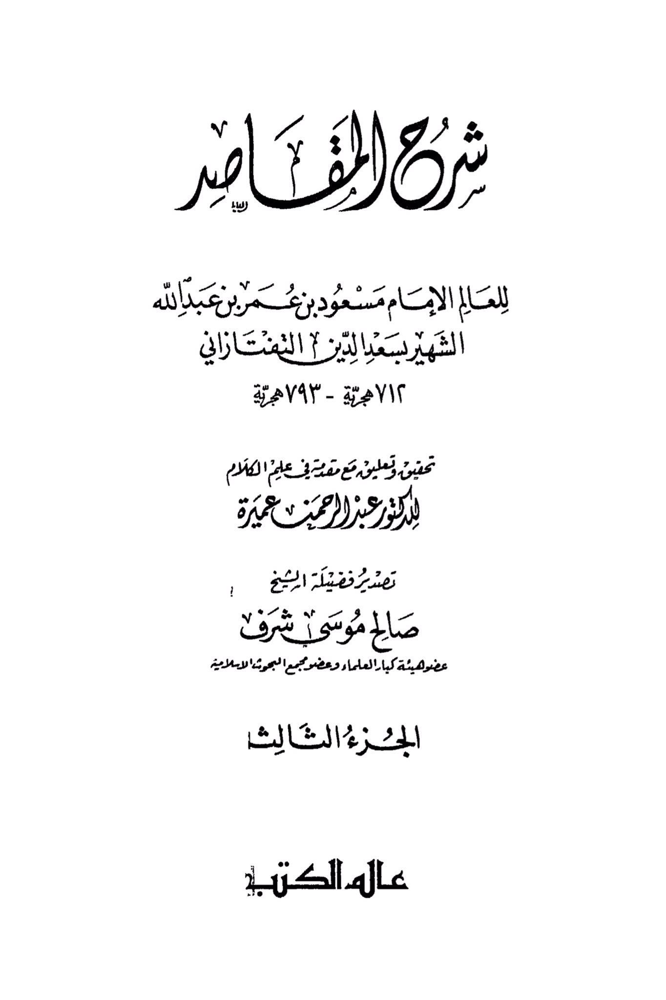
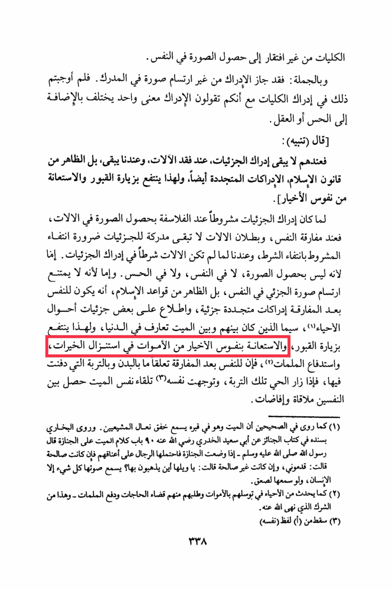

# al-Taftāzānī (d. 793)

The faculties do not lack the ability to form an image within themselves. In summary: perception is possible without the presence of an image in the perceiver. So why do you insist on the perception of faculties, even though you claim that perception is a single concept that differs in addition to sensation or reason? It is noted that for them, the perception of details does not remain when the instruments are lost, while for us it does remain. In fact, it seems from the laws of Islam that perceptions are also renewable. Therefore, one benefits from visiting graves and seeking help from the souls of the righteous. Since the perception of details was conditioned by philosophers on the presence of an image in the instruments, when the soul is separated and the instruments become invalid, there is no longer a perceiver of the details, as the condition disappears with the absence of the requirement. However, for us, the instruments were not a condition for perceiving details. This may be because the image does not occur within the self or the senses, or because it is not impossible to form an image of the detail within the self. It appears from the rules of Islam that the soul, after separation, has renewed partial perceptions and insight into some details of the living conditions, especially those who had a relationship with the deceased in the world. Therefore, one benefits from visiting graves and seeking help from the souls of the righteous among the dead in obtaining blessings and repelling evils. After separation, the soul maintains a connection with the body and the soil in which it was buried. When the living visit that soil and direct their thoughts towards the deceased, a meeting and communication between the two souls occur. As narrated in the two Sahihs, the deceased hears the footsteps of those attending the funeral while in their grave. It was also narrated by Al-Bukhari in his book of funerals from Abu Sa'eed Al-Khudri that the Prophet Muhammad, peace be upon him, said: "When the deceased is placed in the grave and the men carry it on their shoulders, if the deceased was righteous, it says, 'Hurry and take me forward,' but if not, it says, 'Woe to it, where are they taking it?' Everything hears its voice except humans, for if they were to hear it, they would be stunned." Additionally, living individuals sometimes seek help from the deceased to fulfill their needs, which is considered a form of polytheism that Allah has forbidden. The term "himself" was omitted from point (3) on page 338.

"<mark style="color:purple;">**Explanation of "Al-Faseer" by the scholar Imam Mas'ood bin Umar bin Abdullah, known as Sa'd al-Din al-Tafazzani**</mark>"

<figure><figcaption></figcaption></figure> <figure><figcaption></figcaption></figure>

