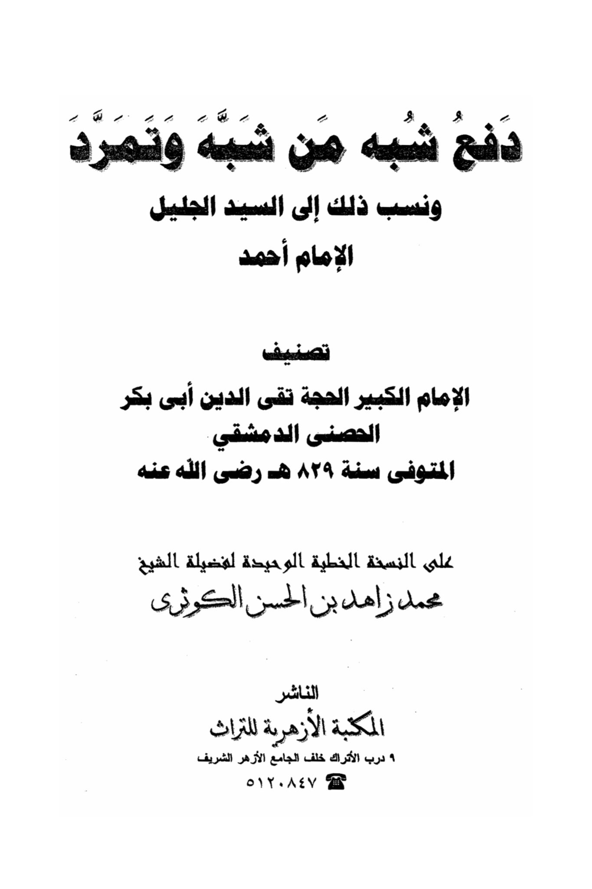
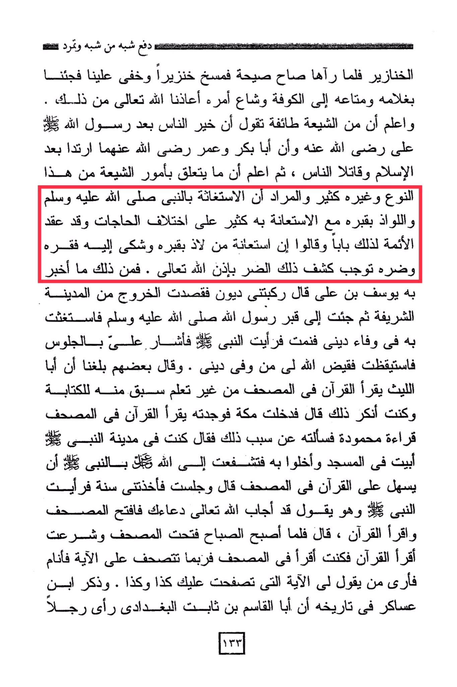

# al-Taqī al-Ḥiṣnī (d. 829)

Know that among the Shia, there is a group that claims that the best of people after the Messenger of Allah (peace be upon him) is Ali, may Allah be pleased with him, and that Abu Bakr and Umar, may Allah be pleased with them, apostatized after Islam and fought against people. Then know that there are many <mark style="color:yellow;">**matters related to the Shia of this kind and others, and the intention is to seek help from the Prophet (peace be upon him) and seek refuge at his grave, along with seeking his assistance in various needs**</mark><mark style="color:red;">**. The Imams have established a chapter for this and said that seeking help from the one who seeks refuge at his grave and complains to him of his poverty and distress will lead to the relief of that distress by the permission of Allah.**</mark> Among what Yusuf ibn Ali reported is that debts overwhelmed him, so he intended to leave the sacred city. <mark style="color:red;">**Then he came to the grave of the Messenger of Allah (peace be upon him) and sought his help in fulfilling his debt**</mark>. He slept and saw the Prophet of Allah, who gestured for him to sit. He woke up, and Allah resolved his debt faithfully. Some have informed us that Abu Al-Leith reads the Quran from the Quran without learning it, as he had prior knowledge of writing. I used to deny that. He said, "I entered Mecca and found him reading the Quran from the Quran in a beautiful recitation. I asked him about the reason for that, and he said, 'I stayed in the Prophet's city, and I spent the night in the mosque, seeking intercession with Allah through the Prophet to facilitate reading the Quran from the Quran.' He said, 'I sat, and I was taken by sleep, and I saw the Prophet saying, 'Allah has answered your supplication, so open the Quran and read it.' He said, 'When morning came, I opened the Quran and started reading it. I would read from the Quran, and sometimes I would fall asleep after reciting a verse, and I would see someone telling me the verse that you missed is such and such.' Ibn Asakir mentioned in his history that Abu Al-Qasim ibn Thabit al-Baghdadi saw a man 133...

"<mark style="color:purple;">**The payment was made by someone similar, who rebelled and attributed that to the honorable master, Imam Ahmad, the classification of the great Imam, Al-Hujjah Taqi al-Din Abu Bakr al-Husayn al-Dimashqi**</mark>"

<figure><figcaption></figcaption></figure> <figure><figcaption></figcaption></figure>

