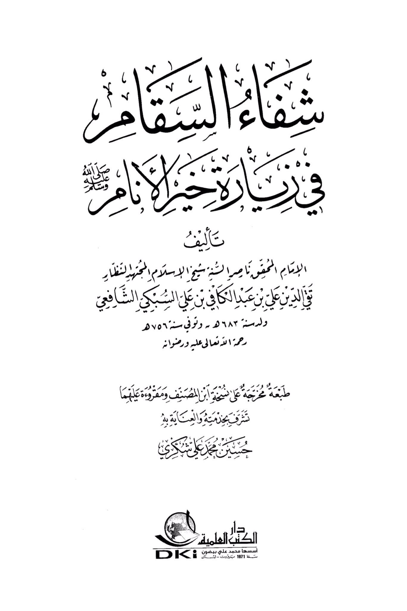
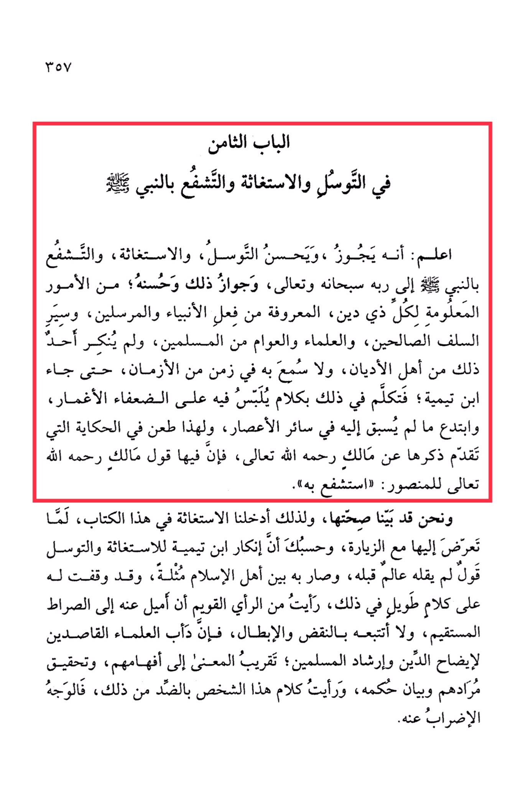

# al-Taqī al-Subkī (d. 756)

&#x20;Regarding Seeking Intercession, Seeking Help, and Seeking Intercession through the Prophet · <mark style="color:red;">**Know that it is permissible and commendable to seek intercession, seek help, and seek intercession through the Prophet to his Lord, Glorified and Exalted be He**</mark>. This is permissible and commendable, as it is well-known to all people of religion, evident from the actions of the prophets and messengers, the righteous predecessors, scholars, and the common Muslims. *<mark style="color:yellow;">**None of the people of religions have denied this, nor has it been unheard of in any time period until Ibn Taymiyyah came and spoke about it in a manner that confused the weak-minded**</mark>**,*** introducing innovations that were unprecedented in all eras. This is why he criticized the narration mentioned earlier about **Malik**, may Allah have mercy on him, where he said to Al-Mansur: "Intercede for him." We have clarified the authenticity of this narration, which is why we included seeking help in this book, as it is related to visitation. <mark style="color:red;">**It is enough to note that Ibn Taymiyyah's denial of seeking help and intercession is a statement that no scholar before him had made, and it has become a point of contention among the people of Islam**</mark>. I have presented a lengthy argument against his stance, but I believe it is better to lean towards the straight path without engaging in refutation and invalidation. The practice of scholars who aim to clarify the religion and guide Muslims is to simplify the meaning for their understanding, fulfill their intentions, explain the ruling clearly. I found this person's words to be contrary to that, hence it is necessary to reject them.

"<mark style="color:purple;">**In a visit to the best of people, authored by Sam Al-Imam Al-Haqq, Naseer Al-Shubayyah, the Sheikh of Islam, the deduction, the glasses, the religion, on Ibn Abd al-Kaafi ibn Ali Al-Subki Al-Shafi'**</mark>i"

<figure><figcaption></figcaption></figure> <figure><figcaption></figcaption></figure>

