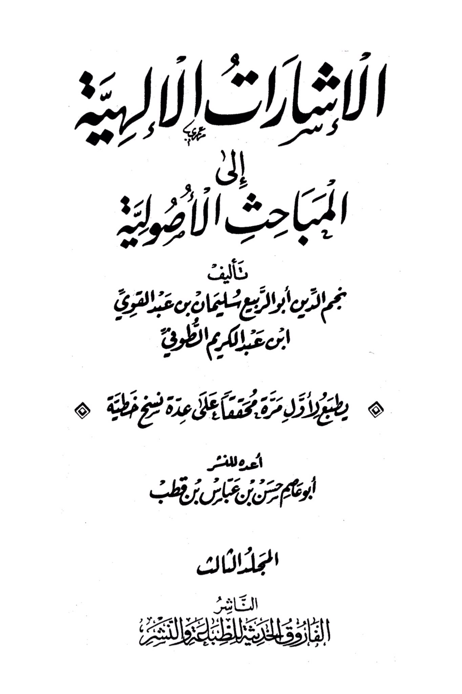
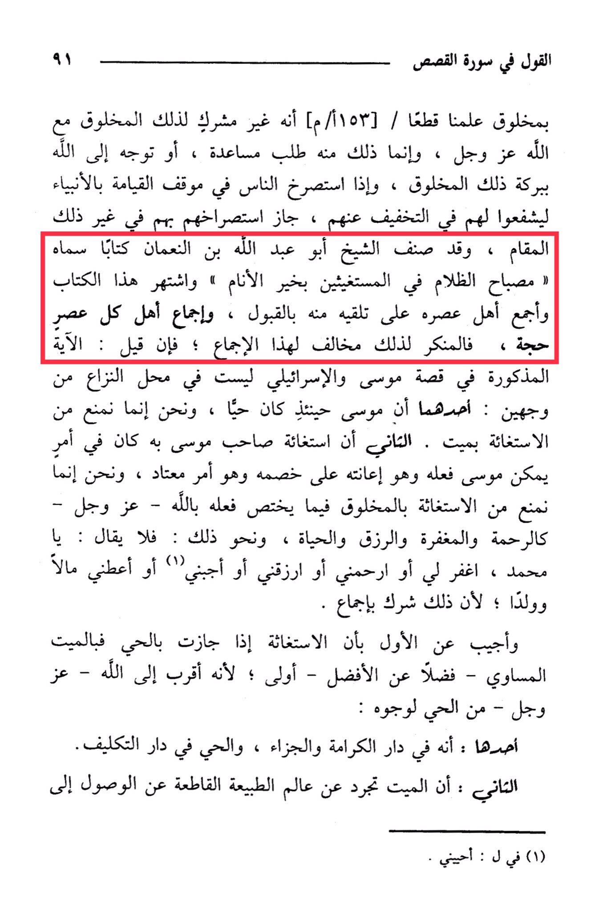

# al-Ṭūfī (d. 716)

The saying in Surah Al-Qasas 91 about a created being, we have learned definitively that he is not a polytheist with that created being, but rather seeking assistance from him, or turning to Allah in that situation. <mark style="color:red;">**By the blessing of that created being, when people call upon the prophets on the Day of Resurrection to intercede for them to alleviate their situation, it is permissible for them to call upon them in other situations as well. The Sheikh Abu Abdullah ibn al-Nu'man authored a book called "The Lamp of Darkness for Those Seeking Help from the Best of Mankind," and this book became well-known and widely accepted by the people of his time.**</mark> <mark style="color:yellow;">**The rejection of this is contrary to this consensus.**</mark> If it is said: the mentioned verse in the story of Moses and the Israelites is not a subject of dispute for two reasons: one is that Moses was alive at that time, and we only prohibit seeking help from the dead. The second is that the seeking of help by Moses' companion was in a matter of assisting him against his opponent, which is a common practice, and what we prohibit is seeking help from a created being in matters that are specific to Allah, such as mercy, forgiveness, sustenance, and life, and the like. So it should not be said: "O forgive me, have mercy on me, provide for me, answer me, or grant me wealth and children," because that is considered polytheism by consensus. And the response to the first point is that seeking help, if permissible with the living, is more appropriate with the deceased - preferably the equal - because they are closer to Allah for several reasons: one is that they are in the abode of honor and reward, while the living are in the abode of responsibility. The second reason is that the deceased has transcended the realm of natural limitations that prevent access to Allah.

"<mark style="color:purple;">**Divine Signs pointing to the Fundamentals of Jurisprudence, authored by Najm al-Din Abu al-Rabi' Sulaiman ibn Abd al-Qawi ibn Abd al-Karim al-Tuqi**</mark>"

<figure><figcaption></figcaption></figure> <figure><figcaption></figcaption></figure>

