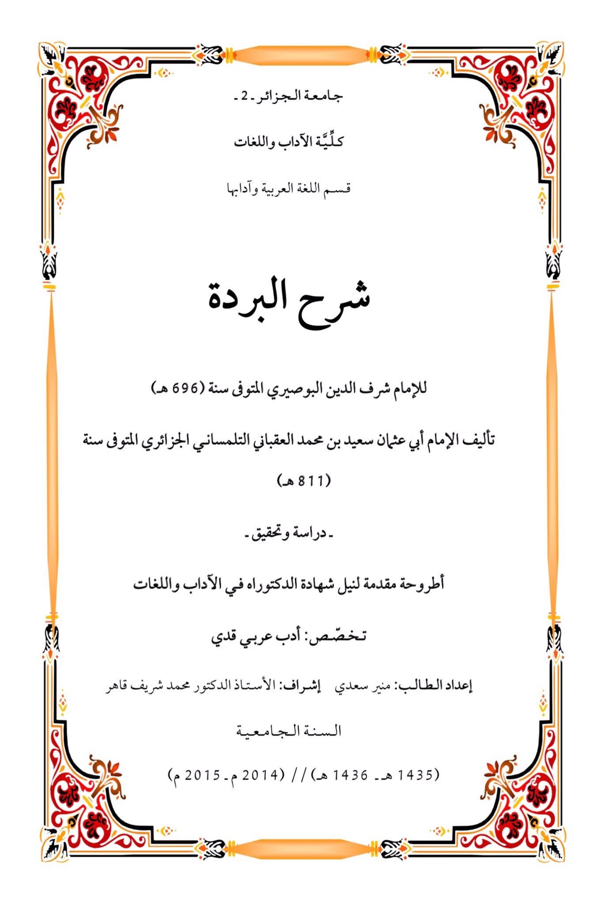
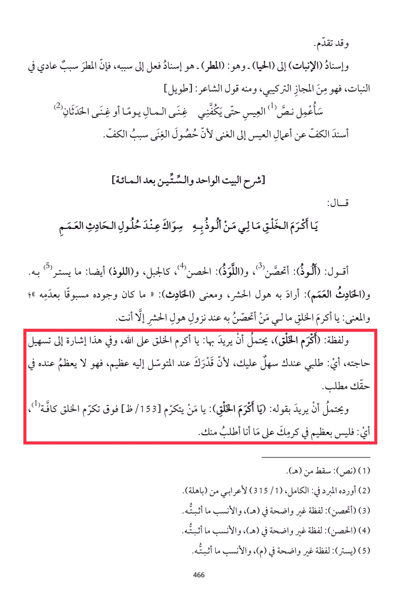

# al-ʿUqbānī (d. 811)

Progress has been made. And attributing (germination) to (rain) - which is: (the cause) - is attributing an action to its cause, for rain is a normal cause in germination, it is a metaphorical composition, as in the poet's saying: \[Tawil] (1) "I will refrain from the deeds of Al-A'is until wealth or the two events make me rich." The act of refraining from the deeds of Al-A'is is attributed to wealth because the attainment of wealth is the cause of refraining. It was said \[Explanation of the sixty-first verse after one hundred]: "O most generous of creation, what do I have to seek refuge in other than you when the blind event approaches." I say: (I seek refuge), I seek protection, and (Al-Lawz): the fortress, like a mountain, and (Al-Lawz) also means what is covered by. And (the blind event): he meant the horror of resurrection, and the meaning of (the event): "its existence was preceded by its absence"; and the meaning: O most generous of creation, I have nothing to seek refuge in when the horror of resurrection descends except you. And the phrase: (most generous of creation), may mean: O most generous of creation towards Allah, and in this is an indication of facilitating his request, meaning: my request is easy for you, because your power is great when supplicated to, so it is not great in his right to seek. And it may mean by saying: (O most generous of creation): O one who is honored above the honor of all creation, meaning: your generosity is not great in your kindness to what I ask of you. (1) (Tawil): Dropped from (H). (2) Mentioned by Al-Mubarrad in Al-Kamil (1/315) for an Arab from (Bahila). (3) (I seek refuge): A word not clear in (H), and what is confirmed is more appropriate. (4) (The fortress): A word not clear in (H), and what is confirmed is more appropriate. (5) (Covered): A word not clear in (M), and what is confirmed is more appropriate.

"<mark style="color:purple;">**University of Algiers - 2 - Faculty of Arts and Languages Department of Arabic Language and Literature Explanation of Al-Burdah by Imam Sharaf al-Din al-Busiri**</mark>"

<figure><figcaption></figcaption></figure> <figure><figcaption></figcaption></figure>

