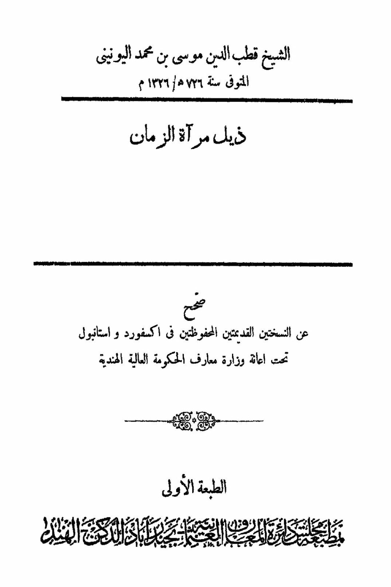
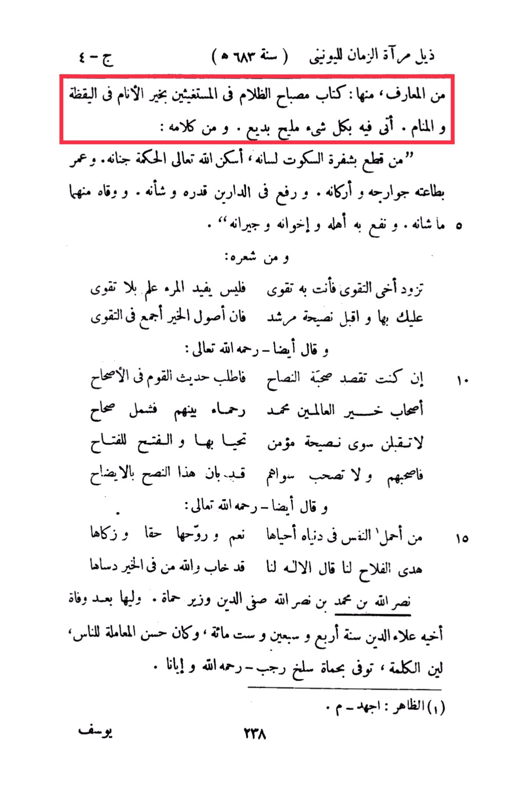

# al-Yūnīnī (d. 726)

On the 15th of Dhu al-Hijjah in the year 5683 of the Hegira (corresponding to 1284 AD), from the <mark style="color:red;">**knowledge, including: the book "The Lamp of Darkness for Those Seeking Help from the Best of Mankind in Wakefulness and Sleep." He presented everything beautifully and creatively.**</mark> Among his sayings: "Whoever cuts off his tongue with the blade of silence, God Almighty will settle wisdom in his gardens, and lengthen his life through obedience, and elevate his status and reputation in both worlds. He will be protected from their harm and benefit his family, brothers, and neighbors. From his poetry, my brother, increase in piety, for by it you will gain strength. Knowledge without piety is of no use to a person, so hold on to it, and accept the advice of a guide, for the roots of goodness are all in piety." He also said - may God have mercy on him: "If you seek the company of the sincere, seek the conversation of those who are upright in their ways. The companions of the best of mankind, Muhammad, are merciful among themselves. So, accept only the advice of a believer, live by it, and the key to success is with the successful, so accompany them and do not accompany others. This advice has been made clear." He also said - may God have mercy on him: "Whoever carries his soul in this world, truly lives it, and his spirit is pure, and his guidance is the path to success. The divine has spoken the truth to us, and whoever conceals goodness has indeed failed. May God grant victory to Ibn Muhammad Ibn Nasr Allah Safi al-Din, the minister of Hama. He succeeded his brother Alaa al-Din after his death in the year 674 AH. He was kind to people, gentle in speech, and passed away in Hama in the month of Rajab - may God have mercy on him and on us." (1) Al-Zahir: Exerted - M. 238 Yusuf.

"<mark style="color:purple;">**Sheikh Qutb al-Din Musa ibn Muhammad al-Yunini, who passed away in the year 5726/1326 AH, edited from the two old preserved copies in Oxford and Istanbul with the assistance of the Ministry of Education of the High Indian Government, the first edition of the "Tail of the Mirror of Time.**</mark>""

<figure><figcaption></figcaption></figure> <figure><figcaption></figcaption></figure>

