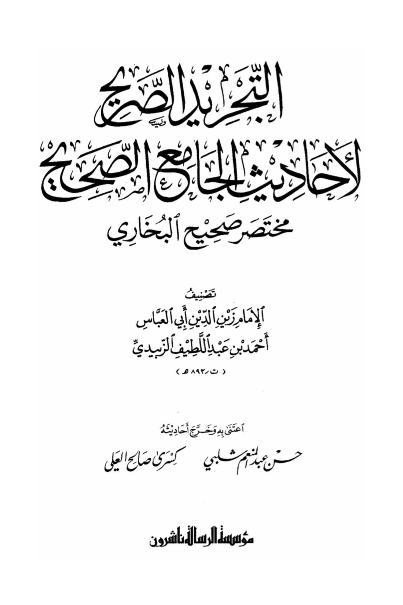
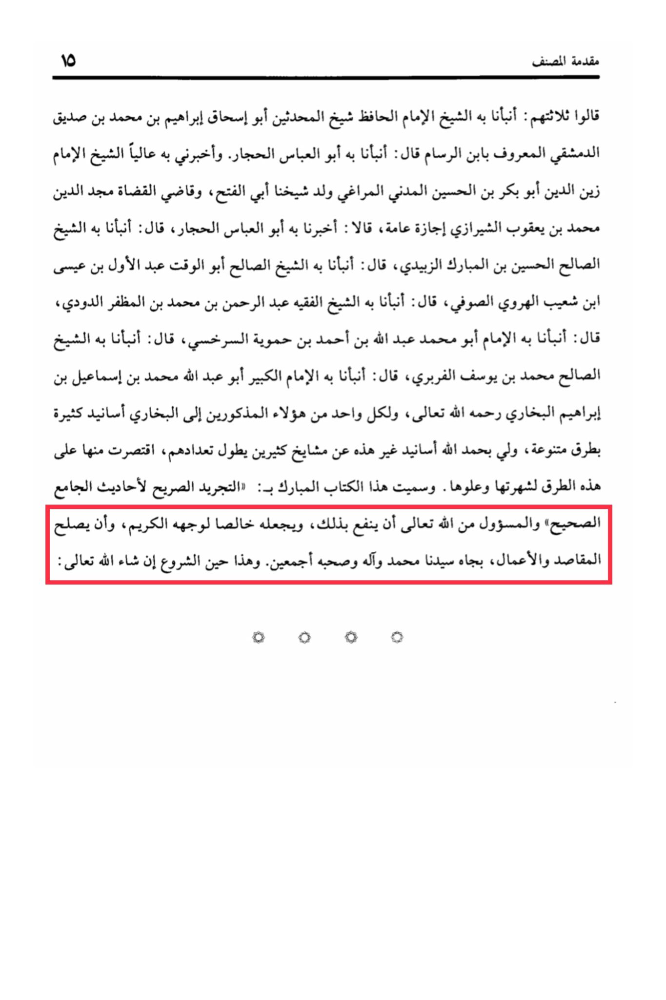

# al-Zabīdī (d. 893)

Introduction of the author of Al-Musannaf 15, they said: Three of them narrated to us, the Sheikh, the Imam, the Hafiz, the Sheikh of the Hadith scholars, Abu Ishaq Ibrahim ibn Muhammad ibn Sadiq al-Dimashqi, known as Ibn al-Rassam, said: Narrated to us Abu al-Abbas al-Hajjar. And he informed me highly, the Sheikh, the Imam, Zain al-Din Abu Bakr ibn al-Hussein al-Madani al-Maraghi, the son of our Sheikh Abu al-Fath, and the judge of judges, Majd al-Din Muhammad ibn Ya'qub al-Shirazi, with a general permission, they said: Narrated to us Abu al-Abbas al-Hajjar, he said: Narrated to us the righteous Sheikh Hussein ibn al-Mubarak al-Zubaidi, he said: Narrated to us the righteous Sheikh Abu al-Waqt Abdul Awal ibn Isa ibn Shuayb al-Harawi al-Sufi, he said: Narrated to us the jurist Sheikh Abdul Rahman ibn Muhammad ibn al-Muzaffar al-Dudi, he said: Narrated to us the Imam Abu Muhammad Abdullah ibn Ahmad ibn Hamwiya al-Sarkhsi, he said: Narrated to us the righteous Sheikh Muhammad ibn Yusuf al-Farbari, he said: Narrated to us the great Imam Abu Abdullah Muhammad ibn Ismail ibn Ibrahim al-Bukhari, may Allah have mercy on him. <mark style="color:yellow;">**And each one of these mentioned individuals has numerous chains of transmission to al-Bukhari through various ways**</mark>. <mark style="color:yellow;">**By the grace of Allah, I have chains of transmission other than these from many teachers, their number being numerous, but I have limited them to these chains for their fame and excellence.**</mark> This blessed book is named "Al-Tajreed Al-Sareeh li Ahadeeth Al-Jami' Al-Sahih" <mark style="color:red;">**and it is upon Allah to benefit through it, and to make it sincere for His noble countenance, and to rectify the intentions and actions through the status of our master Muhammad and his family and all his companions**</mark>. This is the beginning, God willing.

"<mark style="color:purple;">**The book "Al-Tahreed Al-Miya Fi Ahadith Al-Jami Al-Sahih Mukhtasar Sahih Al-Bukhari" is a concise collection of authentic hadiths from Sahih Al-Bukhari compiled by Imam Zain al-Din Abu al-Abbas Ahmad ibn Abdul Latif al-Zubaidi (d. 893 AH)**</mark>"

<figure><figcaption></figcaption></figure> <figure><figcaption></figcaption></figure>

