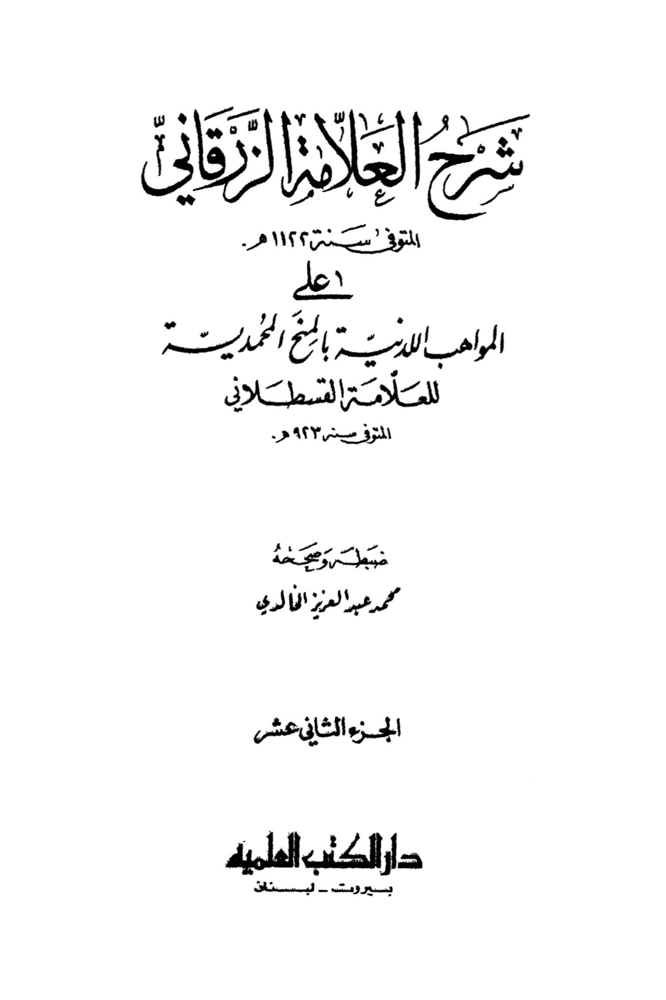
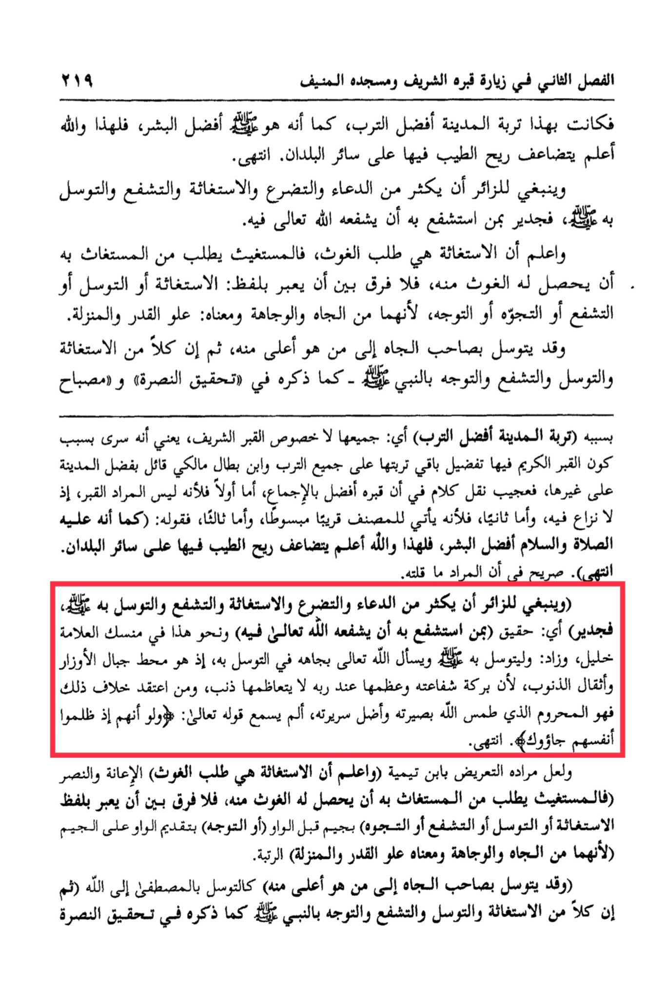

# al-Zarqānī (d. 1122)

The soil of the city was the best soil, just as he, perhaps, is the best of humans. Therefore, and Allah knows best, the fragrance of goodness in it multiplies over all other lands. End. <mark style="color:red;">**It is recommended for the visitor to increase in supplication, pleading, seeking help, intercession, and seeking closeness, as it is worthy for one who seeks intercession through him to be interceded by Allah in him**</mark>. Know that seeking help is seeking aid, and the one seeking help asks the one being sought for help to grant him aid. <mark style="color:red;">**There is no difference between using the term "seeking help," "seeking closeness," "intercession," "turning to," or "seeking," as they all imply honor and dignity, meaning high status and rank**</mark>. One may seek intercession from someone of high status to someone higher than him. B<mark style="color:red;">**oth seeking closeness and intercession through the Prophet - as mentioned in the verification of support and the lamp of seeking help through him (the soil of the city is the best soil (all of it, not just the noble grave), meaning that there is a preference for the rest of its soil due to the presence of the noble grave in it.**</mark> Ibn Battal al-Maliki said that the city has a virtue over others, so it is strange to convey words that his grave is the best by consensus. Firstly, because the grave itself is not the intended focus, as there is no dispute about it. Secondly, because it is mentioned closely and elaborately by the author. Thirdly, his statement: "Just as he is the best of humans, therefore, and Allah knows best, the fragrance of goodness in it multiplies over all other lands. End." It is clear that what is meant is as I have said. It is recommended for the visitor to increase in supplication, pleading, seeking help, intercession, and seeking closeness, as it is worthy. <mark style="color:red;">**That is, it is true for one who seeks intercession through him to be interceded by Allah in him**</mark>. Similar to this is mentioned in the rituals of the scholar Khalil, and it is added to seek closeness to Allah and to ask Allah by His status in seeking closeness, as he is the refuge from the burdens of sins and the weight of sins, because the blessing of his intercession and its greatness with his Lord is not outweighed by sin. <mark style="color:red;">**Whoever believes otherwise is deprived, as Allah has blinded his insight and misled his path**</mark>. Has he not heard the saying of Allah: "And when they wrong themselves, they come to you seeking forgiveness."&#x20;

"<mark style="color:purple;">**Explanation by the late scholar Al-Zarqani in 1122 AH on the book "Al-Mawahib Al-Ladunia" by the late scholar Al-Qastallani in 923 AH. Edited and annotated by Muhammad Abdul Aziz Al-Khaldi. Part twelve, Dar Al-Kutub Al-Ilmiyah, Beirut, Lebanon**</mark>"

<figure><figcaption></figcaption></figure> <figure><figcaption></figcaption></figure>

