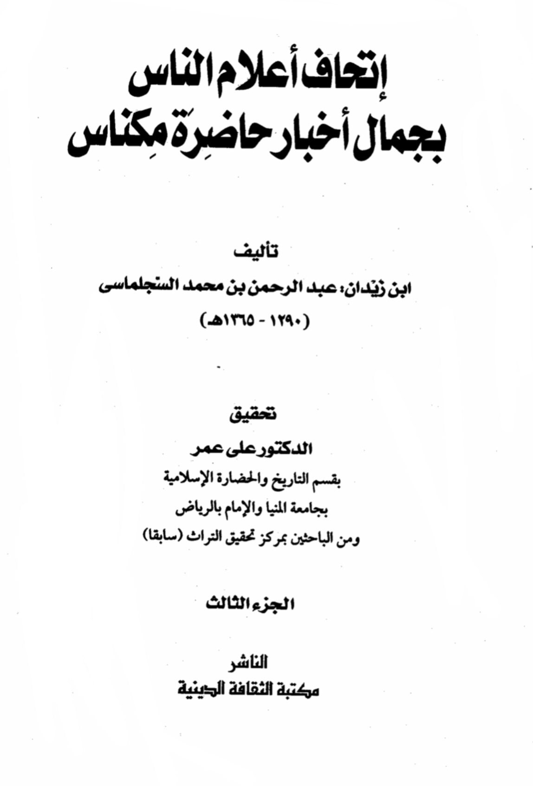
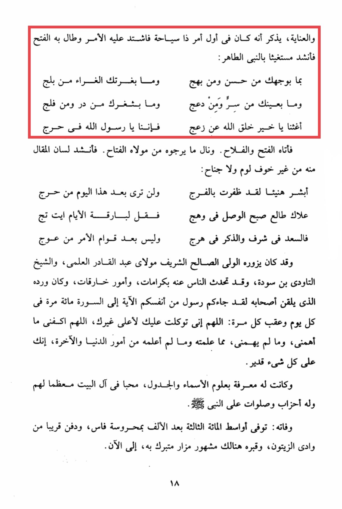

# Ḥammād b. ʿAbd al-Wāḥid (d. 1240)

In the beginning of his tourism, the situation became difficult for him and the conquest prolonged. He sought help from the pure Prophet, saying: "With the beauty and joy in your face, with the allure and charm not deceiving you, with the secrets and wonders in your eyes, with the eloquence in your speech, help us, O best of Allah's creation, from distress. For we, O Messenger of Allah, are in dire need." The conquest and success came to him, and he achieved what he hoped for from his Lord, the Opener. The speaker confidently proclaimed without fear or blame: "Rejoice, for you have found relief, and after this day you shall not face hardship. Your dawn of union is shining brightly, so tell the days to come with joy. Happiness is in honor, and remembrance in commotion. The matter will not be twisted anymore, as the righteous and honorable saint, my master Abdul Qadir Al-Alami, used to visit him, along with Sheikh Taoudi bin Souda. People spoke of his miracles and extraordinary matters. His daily practice was to recite the verse "Indeed, there has come to you a Messenger from among yourselves" along with Surah Al-Ikhlas a hundred times each day, followed by the supplication: "O Allah, I have entrusted my affairs to You for the highest good. Suffice me with what concerns me and what does not concern me from matters of this world and the Hereafter. You are capable of all things." He had knowledge of the sciences of names and numbers, loving and honoring the family of the Prophet, sending blessings upon him. He passed away in the middle of the third century after the year one thousand in Mouharousa Fes, and was buried near the Valley of Olives. His grave there is well-known and visited as a blessed shrine to this day.

"<mark style="color:purple;">**Enlightening People with the Beauty of the News of Present-day Meknes by Ibn Zaydan: Abdul Rahman bin Muhammad al-Sijilmassi (1290-1365 AH)**</mark>"

<figure><figcaption></figcaption></figure> <figure><figcaption></figcaption></figure>

