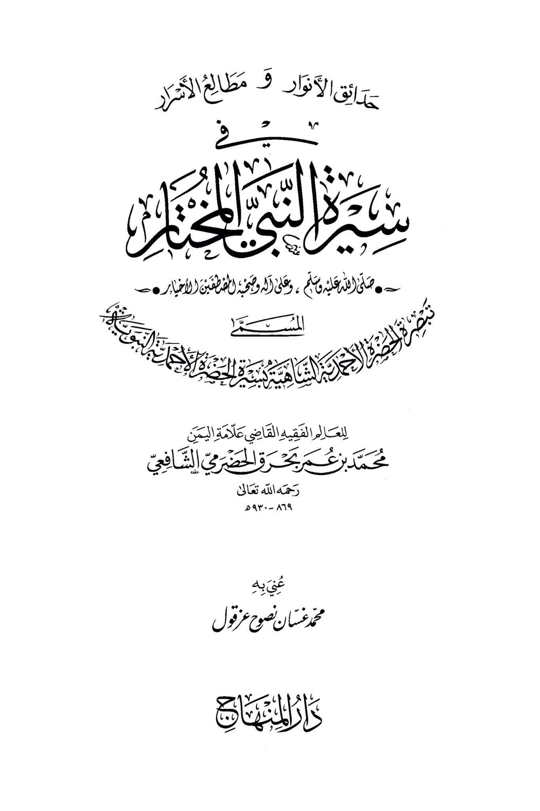
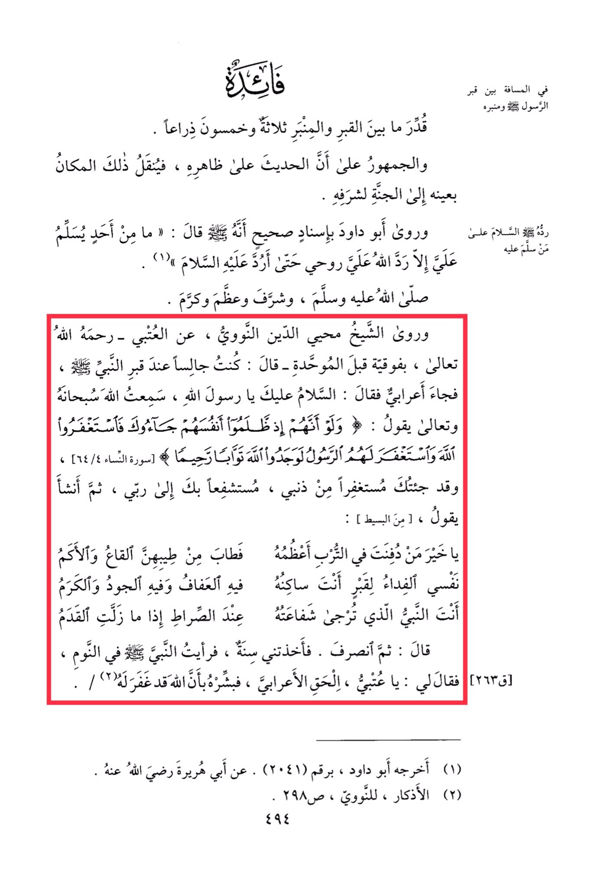

# Baḥraq al-Yamanī (d. 930)

The distance between the Prophet's grave (peace be upon him) and his pulpit is approximately the same as between the grave and the pulpit, fifty-three arm lengths. The majority agree that the Hadith is authentic, which indicates that this specific place will be transferred to Paradise due to its honor of returning the greetings of peace. Abu Dawood narrated with a sound chain of transmission that the Prophet (peace be upon him) said: "Whoever sends peace upon me, Allah returns my soul to me until I return the peace upon him." The Sheikh Muhyiddin al-Nawawi narrated from al-·Atabi, may Allah have mercy on him, with superiority before the Muwahhidah, saying: "I was sitting by the Prophet's grave (peace be upon him) when a Bedouin came and said: 'Peace be upon you, O Messenger of Allah. I heard Allah, Glorified and Exalted be He, saying: 'And if, when they wronged themselves, they had come to you, \[O Muhammad], and asked forgiveness of Allah, and the Messenger had asked forgiveness for them, they would have found Allah Accepting of repentance and Merciful' \[Quran 4:64].' Then he continued: 'I have come to you seeking forgiveness for my sins, seeking your intercession with my Lord.'" He said, reciting: "O best of those buried in the earth, your fragrance has perfumed the valleys and the mountains. My soul is the ransom for the grave where you reside, in it is chastity, generosity, and nobility. You are the Prophet whose intercession is hoped for at the Bridge when the feet slip." Then he left. A year passed, and I saw the Prophet (peace be upon him) in a dream, and he said to me: "O ·Atabi, convey the good news to the Bedouin that Allah has forgiven him." (Narrated by Abu Dawood, Hadith number 2041, from Abu Huraira. Source: Al-Adhkar by al-Nawawi, p. 298, 494)

"<mark style="color:purple;">**The Gardens of Lights and the Horizons of the Wicked, The protective shield of knowledge, the judge, the sign of Yemen, Muhammad bin Umar Bahar al-Hadrami, the Shafi**</mark>'"

<figure><figcaption></figcaption></figure> <figure><figcaption></figcaption></figure>

