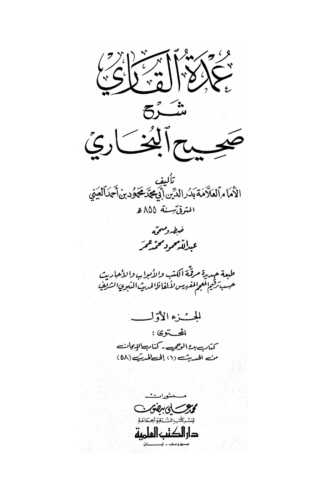
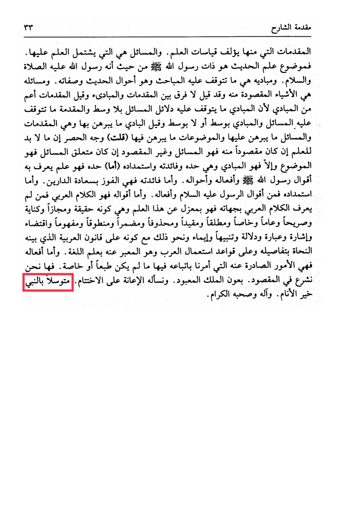

# Badr al-Dīn al-ʿAynī (d. 855)

As for its benefit, it is attaining success in both worlds. As for its derivation, it is from the statements and actions of the Prophet, peace be upon him, and as for his statements, they are in Arabic. Whoever does not know Arabic speech in its various aspects is disconnected from this knowledge, whether it is a reality, metaphor, metaphorical expression, explicit, general, specific, absolute, restricted, implied, spoken, understood, implication, indication, phrase, reference, warning, gesture, and similar, while being in accordance with the rules of Arabic grammar detailed by grammarians and the rules of Arabic usage expressed by the science of language. As for his actions, they are the matters that emanate from him, which he commanded us to follow in unless they are specific or exceptional. Here we begin with the intended with the help of the worshipped King, and we ask Him for assistance in concluding, <mark style="color:red;">**seeking the intercession of the Prophet, the best of mankind, and his noble family and companions**</mark>.

"<mark style="color:purple;">**Several readers explained Sahih al-Bukhari by Imam Badr al-Din Abu Muhammad Mahmoud ibn Ahmad al-Ayni, who passed away in the year 855 AH**</mark>"

<figure><figcaption></figcaption></figure> <figure><figcaption></figcaption></figure>

