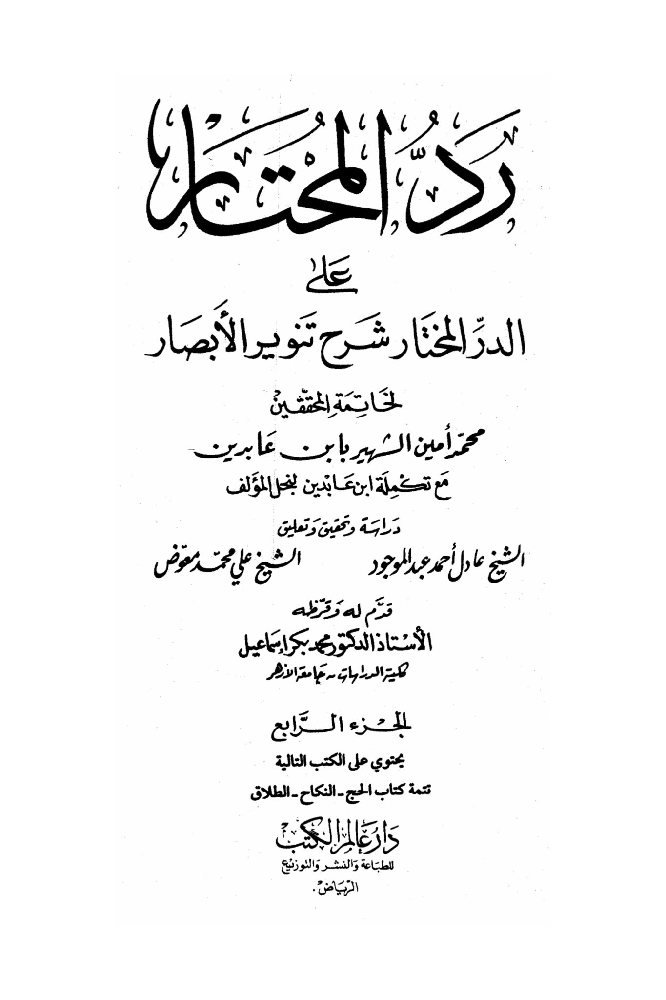
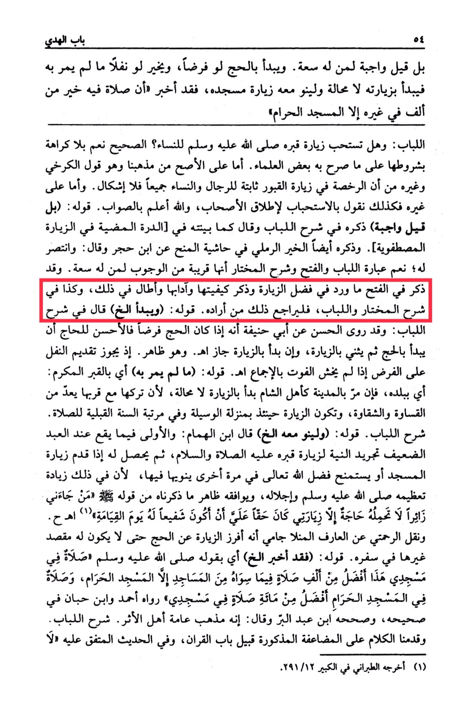

# Ibn ʿĀbidīn (d. 1252)

Explanation of Al-Lubab: (And he should also visit his mosque with it) Ibn Al-Humam said: <mark style="color:red;">**It is preferable for a weak servant to have the intention of visiting his grave, peace and blessings be upon him, then when he performs the visitation to the mosque or performs the ritual bath,**</mark> he should seek the favor of Allah the Almighty in another instance by intending it, because in doing so, there is an increase in honoring him, peace and blessings be upon him, and it aligns with what we have mentioned from his statement: "<mark style="color:red;">**Whoever visits me, not out of need, it is incumbent upon me to intercede for him on the Day of Resurrection."**</mark> And Al-Rahmati reported from Al-Arif Al-Manla Jami that he separated the visitation from the pilgrimage so that he would not have another purpose in his journey. His statement: (As he has informed) meaning by his statement, peace and blessings be upon him: "A prayer in this mosque is better than a thousand prayers in other mosques except for the Sacred Mosque, and a prayer in the Sacred Mosque is better than a hundred prayers in my mosque." Reported by Ahmad and Ibn Hibban in his Sahih, and Ibn Abd al-Barr authenticated it and said: It is the general opinion of the majority of the people of tradition. Explanation of Al-Lubab. We have presented the discussion on the mentioned repetition before the chapter on the Quran and in the agreed-upon hadith except for (1) Narrated by At-Tabarani in Al-Kabir 291/12. My mosque.

<figure><figcaption></figcaption></figure> <figure><figcaption></figcaption></figure>

"<mark style="color:purple;">**A possible response to the chosen explanation of the enlightenment of visions by the conclusion of the investigators, Muhammad Amin, known as Ibn Abidin, with the completion of Ibn Abidin's son of the author's study, investigation, and commentary by Sheikh Adel Ahmed Abdul Mawjood**</mark>"
