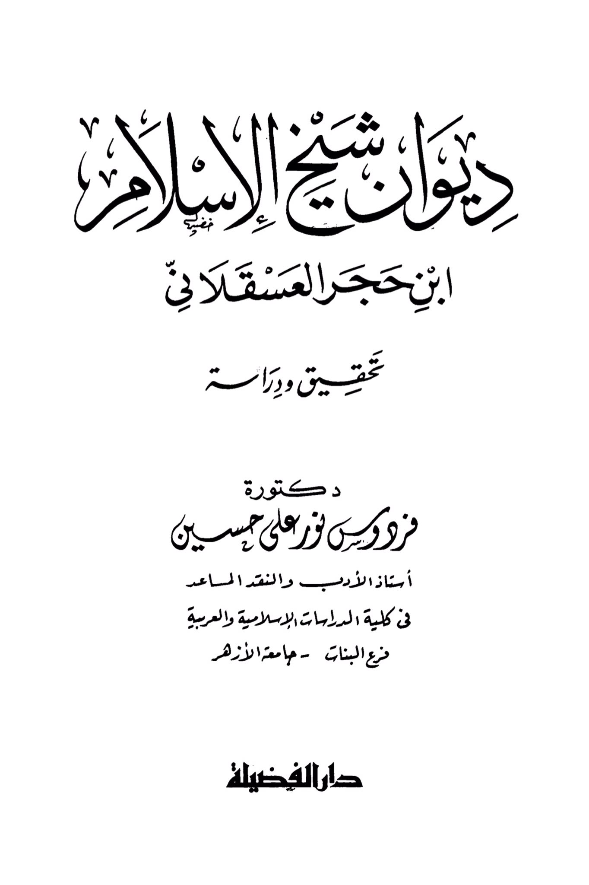
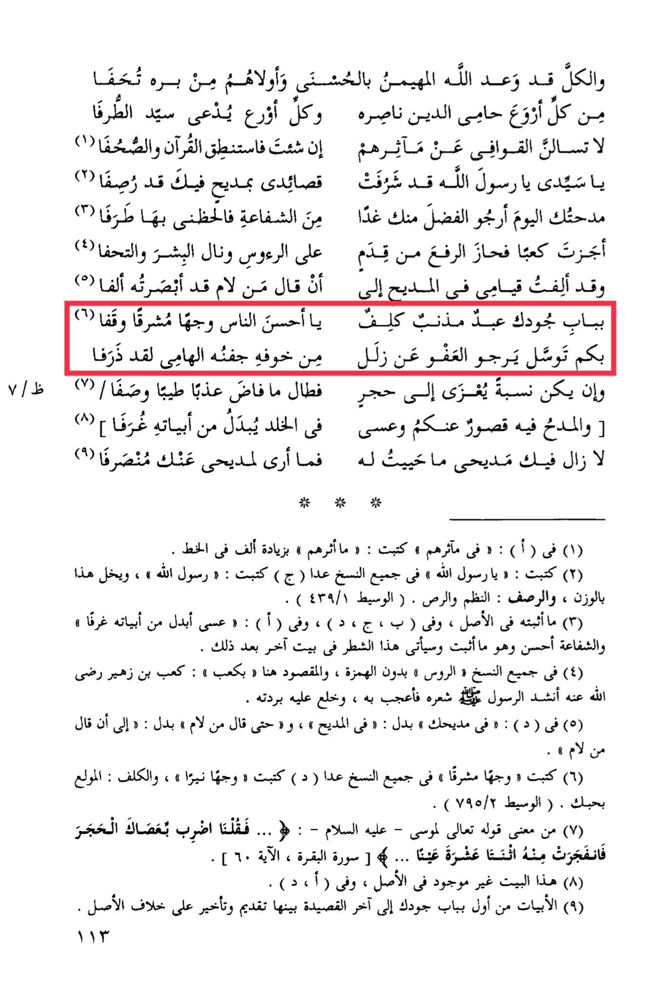

# Ibn Ḥajar al-ʿAsqalānī (d. 852)

Behold, and all have promised that God, the All-Bountiful, will grant them beauty, and the most virtuous among them, from his righteousness, is the protector of religion, his helper, and every virtuous person is called the master of excellence. Do not ask the verses about their exploits, if you wish, then recite the Quran and the scrolls. <mark style="color:red;">**O my master, O Messenger of Allah, my poems have been honored by praising you, meticulously crafted. Your praise today, I seek favor from you tomorrow, in intercession, so grant me a share of it**</mark>. Like Ka'b, he attained elevation from his humility, above heads, and received honor and gifts. I have composed my standing in praise until he said, "Whoever praises me, I have seen him compose." <mark style="color:red;">**At your door, a sinful servant seeks refuge, O best of people, with a radiant face, standing. Through you, he seeks forgiveness for his errors, from fear, his tearful eye shedding. Even if it is attributed to a stone, as long as it flows pure and sweet, it is praised. In eternity, its verses will be exchanged for chambers. Praise in it is abundant from you, and perhaps it will continue as long as my praise for you remains unchanged**</mark>.

"<mark style="color:purple;">**The Diwan of Shaykh al-Islam Ibn Hajar al-Asqalani**</mark>"

<figure><figcaption></figcaption></figure> <figure><figcaption></figcaption></figure>

