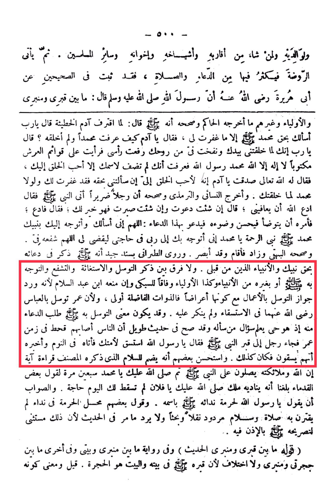

# Ibn Ḥajar al-Haytamī (d. 974)

And An-Nasa'i and At-Tirmidhi narrated and authenticated that a blind man came to the Prophet, peace be upon him, and said, "Pray to Allah to cure me." The Prophet said, "If you wish, I will pray for you, and if you wish, you can be patient, as that is better for you." The blind man said, "Pray." So <mark style="color:red;">**the Prophet ordered him to perform ablution and make it perfect, then to supplicate with this supplication: "**</mark>*<mark style="color:red;">**O Allah, I ask You and turn to You through Your Prophet Muhammad, the Prophet of Mercy. O Muhammad, I turn through you to my Lord in my need, so that Allah may fulfill it**</mark>*<mark style="color:red;">**. O Allah, accept his intercession for me and enhance my plea. So he performed the ablution and prayed, and his sight was restored.**</mark>" <mark style="color:orange;">At-Tabarani narrated with a good chain of transmission</mark> that it was mentioned in his supplication by the right of your Prophet and the prophets before me. There is no distinction between mentioning seeking nearness, seeking help, intercession, and turning to Allah or to other prophets, as well as the Awliya. This is in accordance with As-Subki, even though Ibn Abd al-Salam prevented it because he rejected the permissibility of seeking nearness through actions, even though they are manifestations. The noble beings are more deserving, and because Umar sought intercession through Abbas, may Allah be pleased with them, for rain, and it was not objected to. The meaning of seeking nearness to him may be to ask for supplication from him, as he is alive and knows the one who asks him.&#x20;

"<mark style="color:purple;">**The annotation of Al-Imam Ibn Hajar Al-Haytami on the explanation of Al-Izah in the rituals of Hajj by Al-Imam An-Nawawi**</mark>"

<figure><figcaption></figcaption></figure> <figure><figcaption></figcaption></figure>

