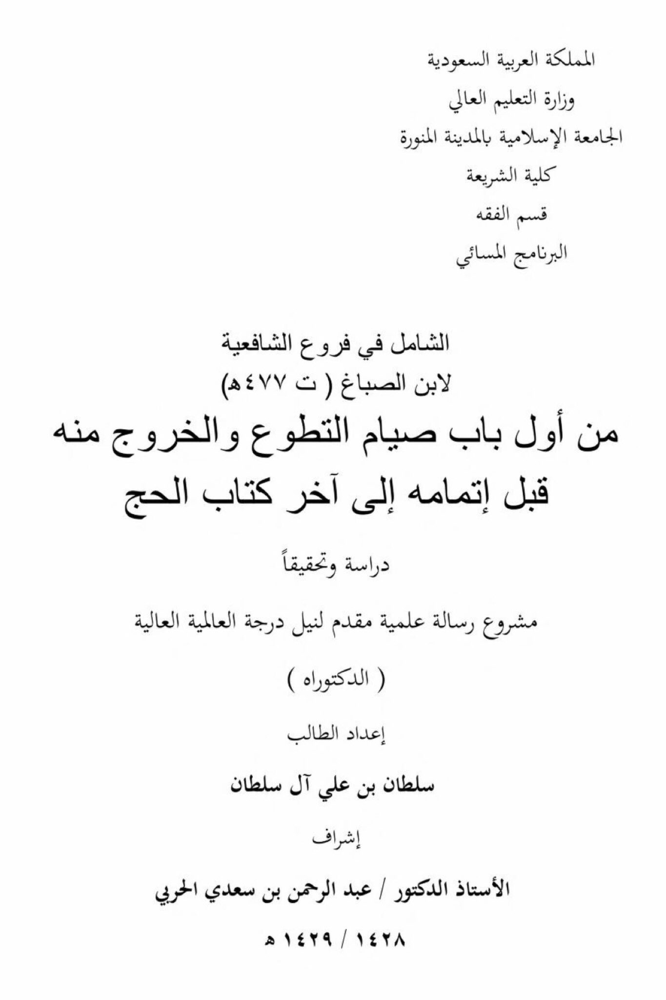
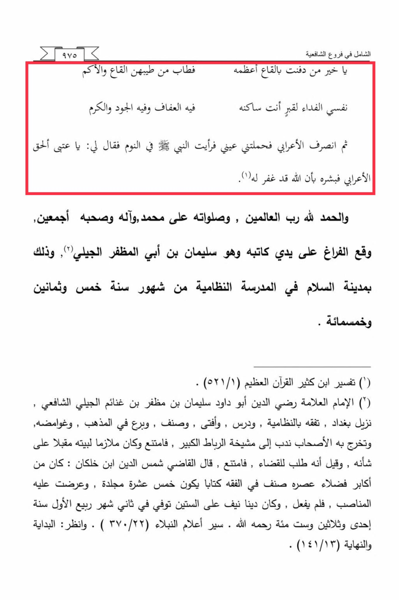

# Ibn al-Ṣabbāgh (d. 477)

The comprehensive in the branches of the Shafi'i school is better than burying it in the depths, for its greatness is manifest from the goodness of its depths and its essence. My soul is a ransom for the grave where you reside, in it is chastity, generosity, and nobility. Then the Bedouin departed, and my eyes carried me, and I saw the Prophet · in a dream, and he said to me: "O 'Atba the Bedouin, give him glad tidings that Allah has forgiven him." The truth and praise belong to Allah, the Lord of all the worlds, and His blessings upon Muhammad and his family and all his companions. The completion was done by the hand of its writer, who is Sulaiman ibn Abi al-Muzaffar al-Jili, in the city of peace at the Nizamiyya school, in the months of the year five hundred and eighty-five. (1) Tafsir Ibn Kathir, the Great Quran (521/1). (2) The Imam, the scholar, Radi al-Din Abu Dawud Sulaiman ibn Muzaffar ibn Ghannaim al-Jili, the Shafi'i resident of Baghdad, studied and issued legal opinions, authored works, excelled in the school of thought and its intricacies. He graduated and was recommended for the leadership of the great Ribat, but he declined and remained devoted to his home, focusing on his own affairs. It is said that he was sought after for judiciary positions but declined. The judge Shams al-Din ibn Khalkan said: He was one of the noblest and most virtuous of his time, he authored a fifteen-volume book on jurisprudence, and was offered prestigious positions, which he did not accept. He died at the age of over sixty in the second month of Rabi al-Awwal in the year six hundred and thirty-one, may Allah have mercy on him. Biographies of the Nobles (370/22). See also: Al-Bidayah wa al-Nihayah (141/13).

"<mark style="color:purple;">**Department of Jurisprudence, Comprehensive Evening Program in the Shafi'i branches of Ibn Sabagh (d. 477 AH)**</mark>"

<figure><figcaption></figcaption></figure> <figure><figcaption></figcaption></figure>

