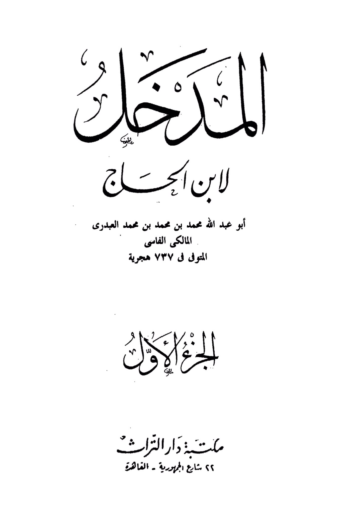
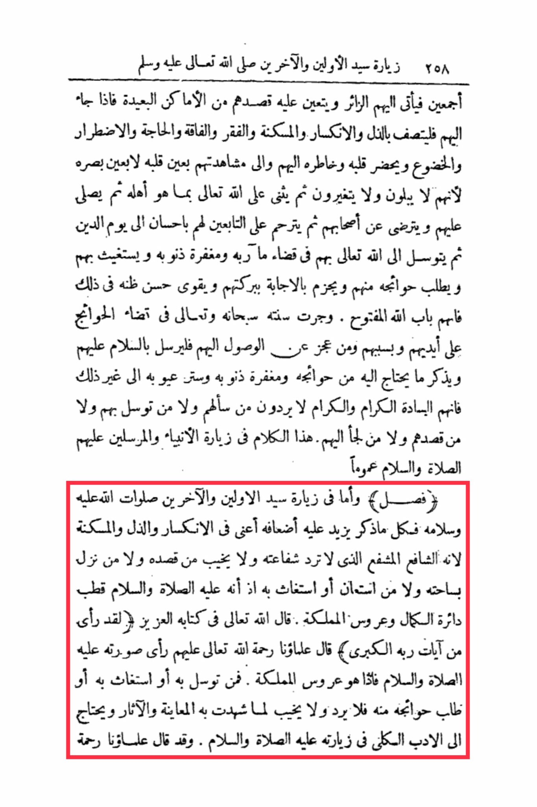

# Ibn al-Ḥājj (d. 737)

258 visits to the leader of the first and the last, peace and blessings be upon him all, so the visitor comes to them and it is necessary for him to seek them from distant places. When he comes to them, he should exhibit humility, submission, tranquility, poverty, need, necessity, and submission. His heart and thoughts should be present with them and in witnessing them with the eye of his heart, not with his physical eyes, because they do not change or alter. Then he should praise Allah with what befits Him, then send blessings upon them and be pleased with their companions. Then he should have mercy on those who followed them with kindness until the Day of Judgment. Then he should seek intercession with Allah through them in fulfilling his needs, seeking forgiveness of his sins, seeking their help, and asking for his needs from them. He should be certain of their response through their blessings and strengthen his good expectations in that, understanding the door of Allah is open. His tradition, exalted and glorified is He, is to fulfill needs through them and by their captivity. Whoever is unable to reach them should send peace upon them, mentioning what he needs from them in terms of needs, forgiveness of sins, and concealing his faults, for they are the noble and generous masters who do not reject those who ask, <mark style="color:red;">**seek intercession, visit, or seek refuge with them**</mark>. <mark style="color:red;">**This applies to visiting the prophets and messengers, peace and blessings be upon them all in general.**</mark> As for visiting the leader of the first and the last, may Allah's peace and blessings be upon him, everything mentioned is multiplied in terms of humility, submission, and tranquility, <mark style="color:red;">**because he is the intercessor who does not have his intercession rejected, and those who seek him, visit his sanctuary, or seek his help will not be disappointed, as he is the axis of perfection and the bride of the kingdom.**</mark> Allah, exalted is He, said in His Noble Book, "Indeed, he saw one of the greatest signs of his Lord." Our scholars, may Allah have mercy on them, said that he saw his image, peace and blessings be upon him, so he is the bride of the kingdom. <mark style="color:red;">**Whoever seeks intercession through him, seeks his help, or asks for his needs from him will not be rejected or disappointed, based on what has been witnessed through observation and effects.**</mark> One needs to have the appropriate manners in visiting him, peace and blessings be upon him. Our scholars, may Allah have mercy on them, have said...

"<mark style="color:purple;">**The book "Al-Murahk" by Ibn al-Hajjaj Abu Abdullah Muhammad ibn Muhammad ibn Muhammad al-Abdari al-Maliki al-Fasi, who passed away in 737 Hijri, Part One, Library of Dar Al-Turath, 22 Republic Street - Cairo.**</mark>"

<figure><figcaption></figcaption></figure> <figure><figcaption></figcaption></figure>

