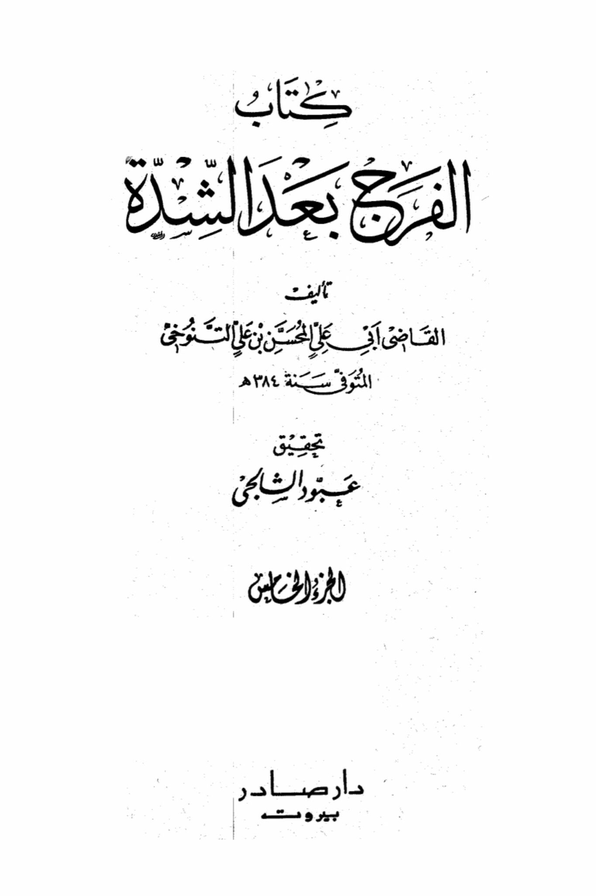
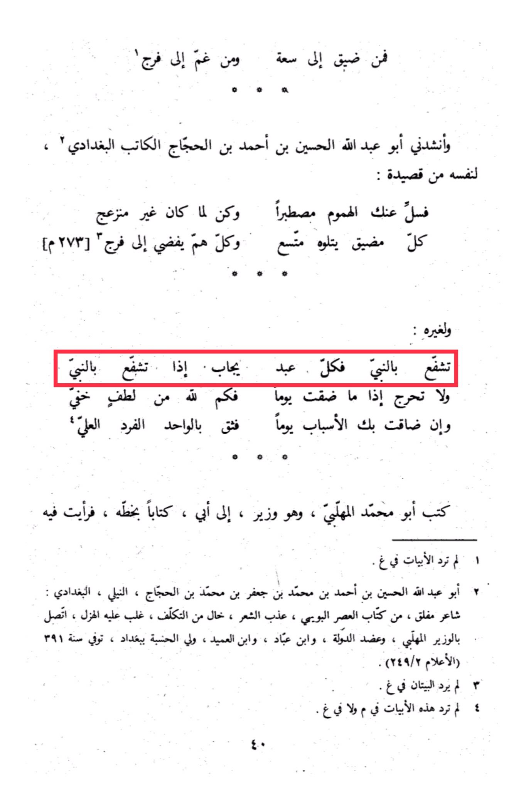

# Ibn al-Ḥajjāj (d. 391)

From constriction to spaciousness, from sorrow to relief, Abu Abdullah Al-Husayn ibn Ahmad ibn Al-Hajjaj Al-Katib Al-Baghdadi recited to himself a verse from his poem: "Cast away your worries patiently, and be untroubled by what has passed. Every constriction is followed by expansion, and every sorrow leads to relief." Another verse goes: "Seek intercession through the Prophet, for every servant is answered when he does. And do not despair if you face a day of distress. <mark style="color:red;">**Seek intercession through the Prophet, for Allah's hidden kindness is abundant.**</mark> And if circumstances ever narrow upon you, trust in the One, the Unique, the Most High." Abu Muhammad Al-Mahlabi, a minister, wrote a letter to his father in his own handwriting, in which I saw the verses not included in the manuscript. Abu Abdullah Al-Husayn ibn Ahmad ibn Muhammad ibn Ja'far ibn Muhammad ibn Al-Hajjaj, Al-Nili, Al-Baghdadi: a renowned poet from the Buwayhid era, known for his elegant poetry devoid of affectation, characterized by humor. He was associated with the minister Al-Mahlabi, supported the state, and was connected with Ibn Abbad and Ibn Al-Umayd, holding a prominent position in Baghdad. He passed away in the year 391 AH. These two verses were not included in the manuscript, neither in the original nor in the copy.

"<mark style="color:purple;">**The book "Joy After Hardship" by Judge Abu Ali Al-Muhsin ibn Ali Al-Tanuwi, who passed away in the year 14, verification 384 AH, edited by Aboud Al-Shalhani. Published by Dar Sader in Beirut.**</mark>"

<figure><figcaption></figcaption></figure> <figure><figcaption></figcaption></figure>

