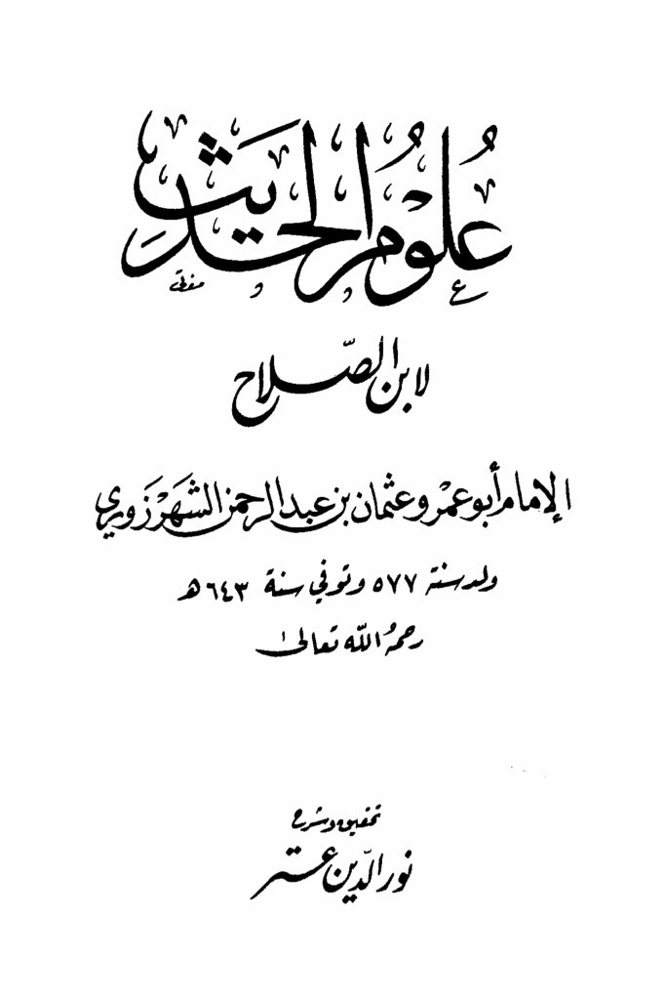
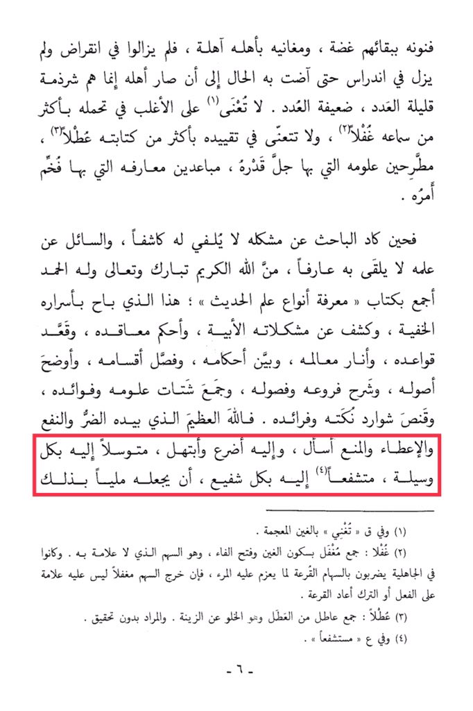

# Ibn al-Ṣalāḥ (d. 643)

This book reveals hidden secrets, solves complex issues, establishes principles, clarifies guidelines, explains rulings, distinguishes categories, elucidates fundamentals, elaborates on branches and chapters, gathers scattered knowledge and benefits, and captures the subtleties of its nuances and advantages. <mark style="color:red;">**I ask the Almighty God, in whose hands lie harm and benefit, giving and withholding, I implore and beseech Him,**</mark><mark style="color:red;">**&#x20;**</mark>*<mark style="color:red;">**seeking His help through every means, interceding with every intercessor**</mark>*<mark style="color:red;">**, to make it abundant in that**</mark>.

"<mark style="color:purple;">**The book "Al-Ulum" by Ibn al-Salah, Imam Abu Umar, and Uthman ibn Abdul Rahman al-Shahrazuri**</mark>"

<figure><figcaption></figcaption></figure> <figure><figcaption></figcaption></figure>

