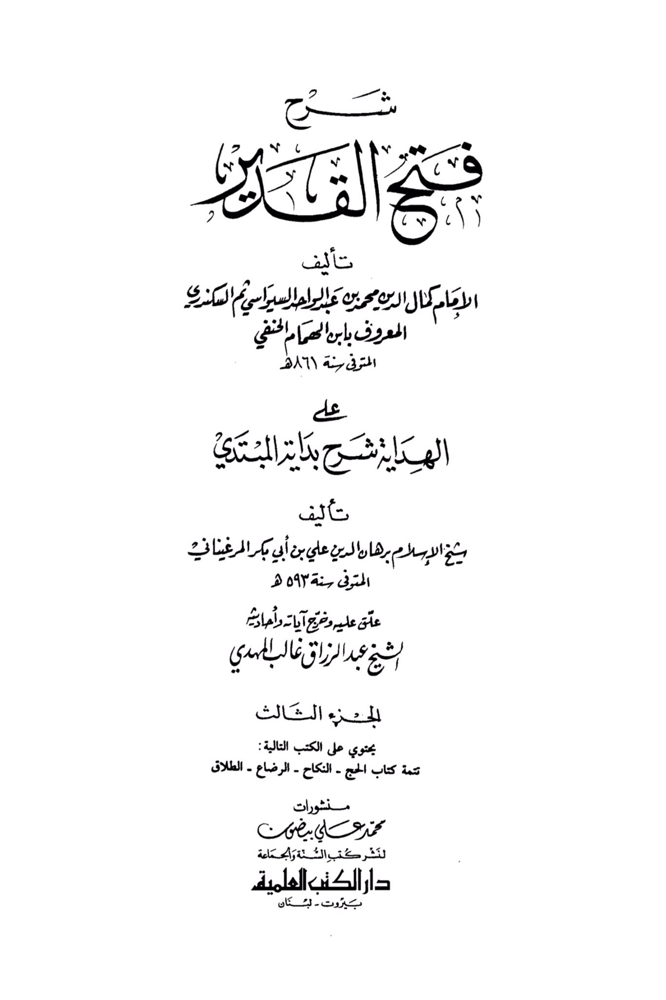
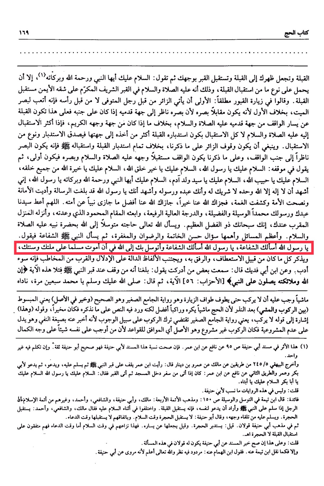

# Ibn al-Humām (d. 861)

His creation, the Qibla, and you make your back towards the Qibla and face the grave with your face, then you say: <mark style="color:red;">**Peace be upon you, O Prophet, and the mercy of Allah and His blessings**</mark>, unless it involves a certain type of facing the Qibla, which is that he, peace and blessings be upon him, in the honored and noble grave, on his right side facing the Qibla. They said in visiting graves in general: It is preferable for the visitor to come from the feet of the deceased, not from his head, as it strains the vision of the deceased, unlike the former because he is facing his vision, as his vision looks towards his feet if he is on his side. Therefore, the Qibla will be to the left of the one standing facing his feet, peace and blessings be upon him, unlike if it is from the side of his noble face. If the facing is more towards him, peace and blessings be upon him, not all facing, then facing the Qibla will be more accurate than turning towards it, so the facing will be true and a type of reception. The visitor should stand as mentioned, unlike completely facing the Qibla and receiving it, for the sight to be looking towards the side of the one standing. As mentioned, the one standing should be facing his face, peace and blessings be upon him, and his sight should be the priority. Then he should say in his position: <mark style="color:red;">**Peace be upon you, O Messenger of Allah, peace be upon you, O best of Allah's creation, peace be upon you, O chosen one of Allah from all. Peace be upon you, O beloved of Allah, peace be upon you, O master of the children of Adam, peace be upon you, O Prophet, and the mercy of Allah and His blessings, O Messenger of Allah**</mark>. I bear witness that there is no god but Allah alone, with no partner, and that you are His servant and Messenger, and I bear witness that, O Messenger of Allah, you have delivered the message, fulfilled the trust, advised the nation, and dispelled the darkness. May Allah reward you on our behalf with good, may Allah reward you on our behalf with the best of what He has rewarded a Prophet for his nation. O Allah, Your servant and Messenger Muhammad, the means, the virtue, the high and lofty rank, raise him to the praised station You have promised him, and bring him near to You, for You are indeed the Most Gracious, the Most Generous. *<mark style="color:red;">**And one asks Allah, the Most High, for his needs, seeking through the presence of His Prophet, peace and blessings be upon him.**</mark>* The greatest and most important matters include asking for a good end, satisfaction, and forgiveness. T<mark style="color:red;">**hen one asks the Prophet, peace and blessings be upon him, for intercession, saying: O Messenger of Allah, I ask you for intercession, O Messenger of Allah, I ask you for intercession, and I seek your intercession with Allah that I may die as a Muslim on your path and Sunnah**</mark>. He mentions all that is related to seeking compassion and kindness towards him, avoiding words that imply familiarity and closeness to the one addressed, as it is improper etiquette. Ibn Abi Fudayk said: I heard from someone I met saying: We were informed that whoever stands at the Prophet's grave, peace and blessings be upon him, and recites this verse: "Indeed, Allah and His angels send blessings upon the Prophet" \[Al-Ahzab: 56], <mark style="color:red;">**then says: "May Allah bless you and grant you peace, O Muhammad," seventy times,**</mark> he will be called: 'Grant our master what he asks for.' It is obligatory for him not to ride until he performs the Tawaf of visitation, as narrated in Al-Jami' Al-Saghir, which is authentic (and better in the original) meaning the extended version (between riding and walking) after the vow, because performing Hajj while walking is disliked, and riding is better, but the text mentions what we have stated, so it is optional.&#x20;

"<mark style="color:purple;">**The great scholar Kamal al-Din Muhammad ibn Abd al-Wahab al-Siyasi, then al-Sikandari known as Ibn al-Humam al-Hanafi, who passed away in the year 861 AH, authored "Al-Hidayah," an explanation of "Bidayat al-Muntaha" by the Shaykh al-Islam Burhan al-Din Ali ibn Abi Bakr al-Marghinani, who passed away in the year 593 AH**</mark>"

<figure><figcaption></figcaption></figure> <figure><figcaption></figcaption></figure>

