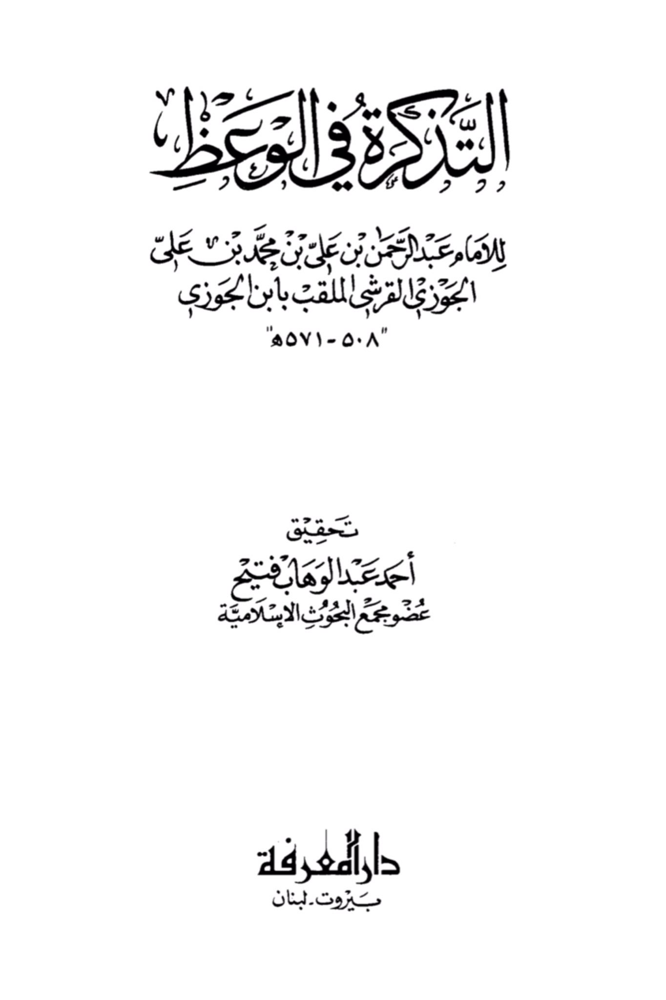
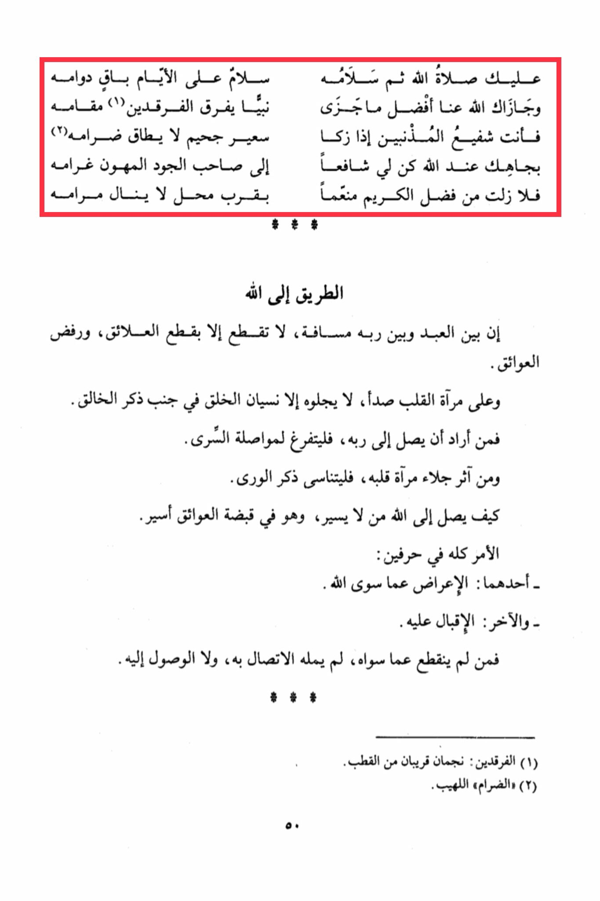

# Ibn al-Jawzī (d. 571)

Upon you be the blessings and peace of Allah, peace upon the days that continue to pass, and may Allah reward you with the best of rewards, as He rewarded a Prophet who distinguished between the two paths (1) with his station. You are the intercessor for sinners when the flames of Hell become unbearable in their intensity (2). By your status with Allah, be a means for me to reach the Generous Companion, the one whose love is overwhelming. I have always been a recipient of the grace of the Generous Bestower, near to a place that cannot be attained by mere wishes. The path to Allah is such that between the servant and his Lord lies a distance that can only be bridged by severing attachments and removing obstacles. The mirror of the heart is tarnished with rust, which can only be cleared by forgetting creation in favor of remembering the Creator. Whoever wishes to reach his Lord should devote himself to seeking the hidden. And whoever prefers to clear the mirror of his heart should forget the mention of worldly matters. How can one reach Allah without walking, while being a captive of obstacles? The matter is summed up in two letters: one is turning away from everything other than Allah, and the other is turning towards Him. Whoever does not detach from other than Him will not be filled with the connection to Him, nor will he reach Him. (1) The two paths: two stars near the pole. (2) "The unbearable flames of Hell."

"<mark style="color:purple;">**The book "Al-Tarikarah fi al-Wa'az" by Imam Abdul Rahman bin Ali bin Muhammad bin Ali al-Jawzi**</mark>"

<figure><figcaption></figcaption></figure> <figure><figcaption></figcaption></figure>

