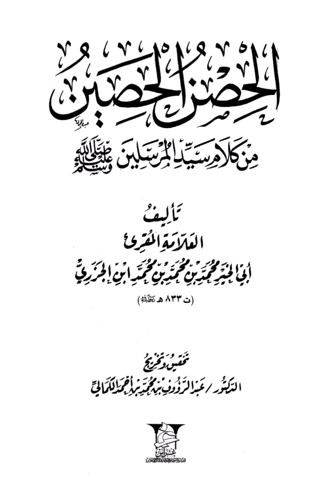
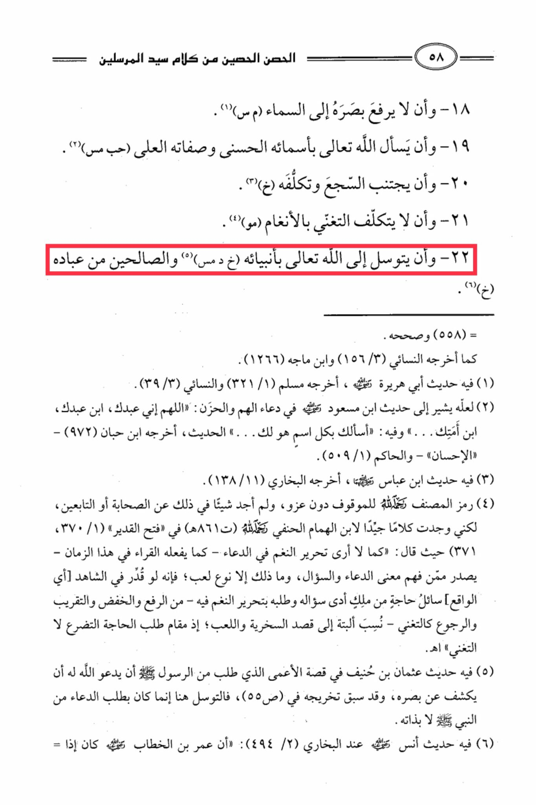

# Ibn al-Jazarī, Shaykh al-Qurrāʾ(d. 833)

The Stronghold of the Words of the Master of Messengers (peace be upon him): 18 - And that he does not raise his gaze to the sky (M.S.). 19 - And that he asks Allah the Exalted by His beautiful names and sublime attributes (J.M.S). 20 - And that he avoids rhymed speech and affectation (K) (3). 21 - And that he does not affect an air of wealth through melodies (M.W.). 22 - A<mark style="color:red;">**nd that he seeks nearness to Allah the Exalted through His Prophets (K.D.M.S) and the righteous among His servants (K) (1). = (558) And correct it as reported by An-Nasa'i (156/3) and Ibn Majah (1266). Allah (1) in it is a hadith of Abu Huraira**</mark>, may Allah be pleased with him, reported by Muslim (321/1) and An-Nasa'i (39/3). Allah (2) perhaps refers to the hadith of Ibn Mas'ud, may Allah be pleased with him, in supplication for distress and sadness: "O Allah, I am Your servant, son of Your servant, my forelock is in Your hand..." And in it: "I ask You by every name that is Yours..." The hadith was reported by Ibn Hibban (972) - N. Ibn "Al-Ihsan" - and Al-Hakim (509/1). (3) in it is a hadith of Ibn Abbas, reported by Al-Bukhari (138/11). (4) The symbol of the author, may Allah have mercy on him, for the suspended without attribution, and I did not find anything about it from the Companions or the Successors, but I found good words from Ibn al-Humam al-Hanafi and praise be to Allah (861 AH) in "Fath al-Qadir" (370/1, 371) where he said: Just as I do not see the use of musical tones in supplication - as reciters do in this time - coming from those who understand the meaning of supplication and asking, and that is nothing but a kind of play; for if it were decreed that a petitioner in need from a king would present his request and plea with musical tones - such as raising and lowering and approaching and receding like singing - it would be attributed to mockery and playfulness; for the place of seeking need is supplication, not singing. (5) in it is the hadith of Uthman ibn Haneef in the story of the blind man who asked the Messenger of Allah (peace be upon him) to pray for him to have his sight restored, and it has been previously cited in (S) (55), so the intercession here was only through requesting supplication from the Prophet (peace be upon him), not on its own. (6) in it is the hadith of Anas reported by Al-Bukhari (4942): That Umar ibn Al-Khattab, may Allah be pleased with him, when he...

"<mark style="color:purple;">**The book "Al-Khasr Al-Husr" is a compilation of the words of the master of messengers, authored by the scholar Al-Muqri Abdulmalaya Abu Al-Khair Muhammad bin Muhammad bin Muhammad Ibn Al-Jazari, died in 133 AH. Dedicated and graduated by Dr. Abdulraouf bin Muhammad bin Qamar Al-Kamali Aras.**</mark>"

<figure><figcaption></figcaption></figure> <figure><figcaption></figcaption></figure>

