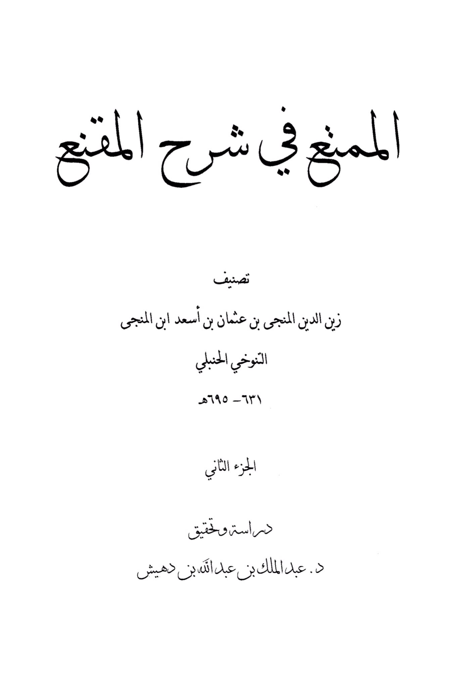
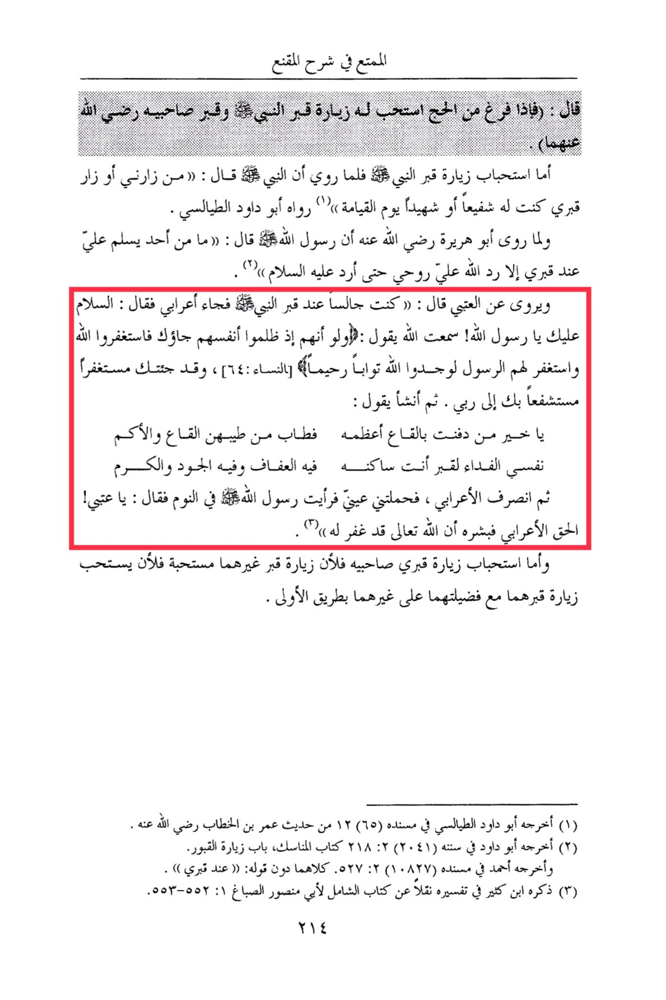

# Ibn al-Munjā (d. 695)

The enjoyable part in explaining Al-Muqni' said: "When he finishes his pilgrimage, it is recommended for him to visit the Prophet's grave and the graves of his two companions, may Allah be pleased with them." As for the recommendation of visiting the Prophet's grave, it is narrated that the Prophet · said: "Whoever visits me or visits my grave, I will intercede for him or testify for him on the Day of Resurrection." Narrated by Abu Dawood At-Tayalisi. And when Abu Huraira, may Allah be pleased with him, narrated that the Messenger of Allah · said: "No one greets me at my grave except that Allah returns my soul to me so that I may return the greeting to him." It is also narrated that Al-A'raabi said: "I was sitting by the Prophet's grave when a Bedouin came and said: 'Peace be upon you, O Messenger of Allah! I heard Allah say: 'And if, when they wronged themselves, they had come to you, \[O Muhammad], and asked forgiveness of Allah, and the Messenger had asked forgiveness for them, they would have found Allah Accepting of repentance and Merciful.' \[Quran 4:64] And I have come to you seeking forgiveness, seeking your intercession with my Lord." Then he recited: "O best of those buried in the valley, its greatest, its fragrance from the valley and the hills. My soul is the ransom for the grave where you reside, in it is chastity, generosity, and nobility." Then the Bedouin left, and I fell asleep and saw the Messenger of Allah · in my dream saying: 'O 'Atbi! Convey the truth to the Bedouin and give him the good news that Allah the Almighty has forgiven him." As for the recommendation of visiting the graves of his two companions, it is because visiting their graves along with their virtues over others makes it more recommended than visiting the graves of others in the first place. Al-Khattab, may Allah be pleased with him. (1) Narrated by Abu Dawood At-Tayalisi in his Musnad (65) from the hadith of Umar ibn (2) Narrated by Abu Dawood in his Sunan (2041) 218 Book of Hajj, Chapter of Visiting Graves. And narrated by Ahmad in his Musnad (10827) 527 both without the phrase: "at my grave". (3) Mentioned by Ibn Kathir in his Tafsir, citing from the book Al-Shamil by Abu Mansur Al-Sabbagh 1:552-553. 214

"<mark style="color:purple;">**The abridgement in explaining Al-Munba' by Zain al-Din Al-Munji bin Uthman bin As'ad ibn Al-Munja Al-Tanukhi Al-Hanbali 631-695 AH, Part Two, a study and verification by Dr. Abdul Malik bin Abdullah bin Duhaysh**</mark>."

<figure><figcaption></figcaption></figure> <figure><figcaption></figcaption></figure>

