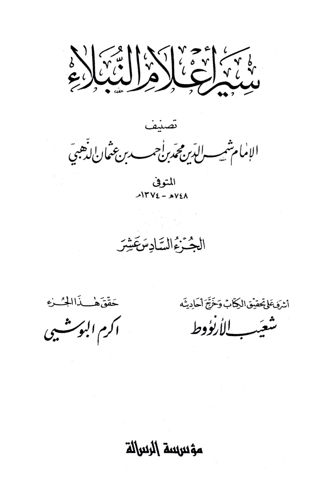
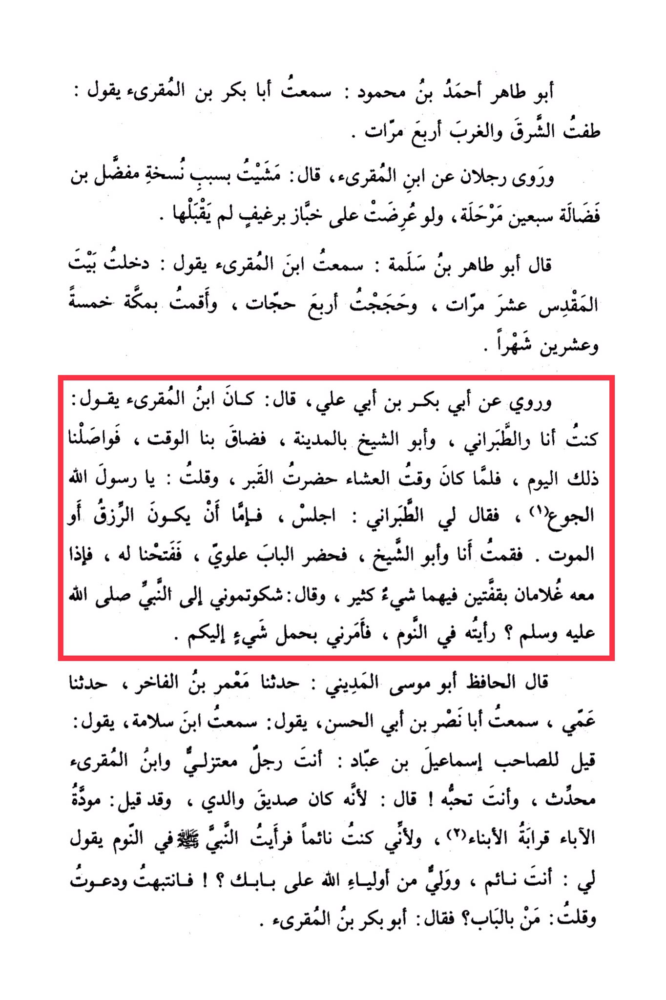

# Ibn al-Muqriʾ (d. 381)

Abu Tahir Ahmad ibn Mahmoud: I heard Abu Bakr ibn al-Muqri' saying: The East and the West have shifted four times. And two men narrated from Ibn al-Muqri', saying: I traveled because of a manuscript of Mu'adhdhal ibn Fadala seventy stages, and if it were presented to Khubbaz Barghif, he would not accept it. Abu Tahir ibn Salama said: I heard Ibn al-Muqri' saying: I entered the Bayt al-Maqdis ten times, performed four Hajj pilgrimages, and stayed in Mecca for twenty-five months. It was narrated from Abu Bakr ibn Abi Ali who said: Ibn al-Muqri' used to say: The time became tight for us, me, al-Tabarani, and Abu al-Shaykh in Al-Madinah, so we continued that day. When it was time for dinner, <mark style="color:red;">**I attended the grave and said: O Messenger of Allah, the hunger**</mark>. Al-Tabarani told me to sit, saying: Either sustenance will come or... So I and Abu al-Shaykh stood up, and Alawi arrived at the door. We opened it, and he had two boys with him, each carrying a lot of food. He said: Did you complain to the Prophet, peace be upon him, about me? I saw him in a dream, and he ordered me to bring something to you, death. Al-Hafiz Abu Musa al-Madini said: Ma'mar ibn al-Fakhr told us, my uncle told us, I heard Abu Nasr ibn Abi al-Hasan saying: I heard Ibn Salama saying: It was said to Isma'il ibn 'Ubad: You are a Mu'tazili man and Ibn al-Muqri' is a traditionist, yet you love him! He said: Because he was a friend of my father, and it is said: The love of fathers is like kinship to sons. And because I was asleep and saw the Prophet, peace be upon him, in a dream saying to me: Are you asleep, and a guardian from the guardians of Allah is at your door? So I woke up and called out, saying: Who is at the door? He said: Abu Bakr ibn al-Muqri'.

"<mark style="color:purple;">**The announcement of the nobility ranks the Imam Shams al-Din Muhammad ibn Ahmad ibn Uthman al-Dhahabi**</mark>"

<figure><figcaption></figcaption></figure> <figure><figcaption></figcaption></figure>

