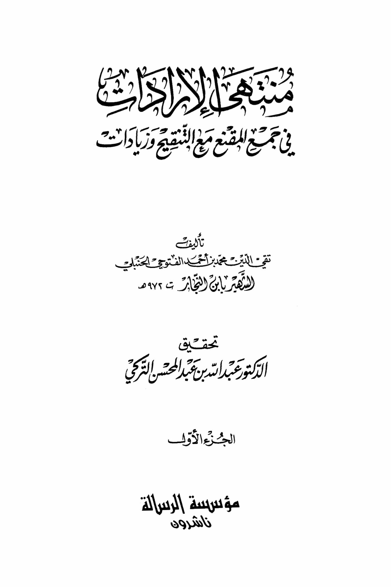
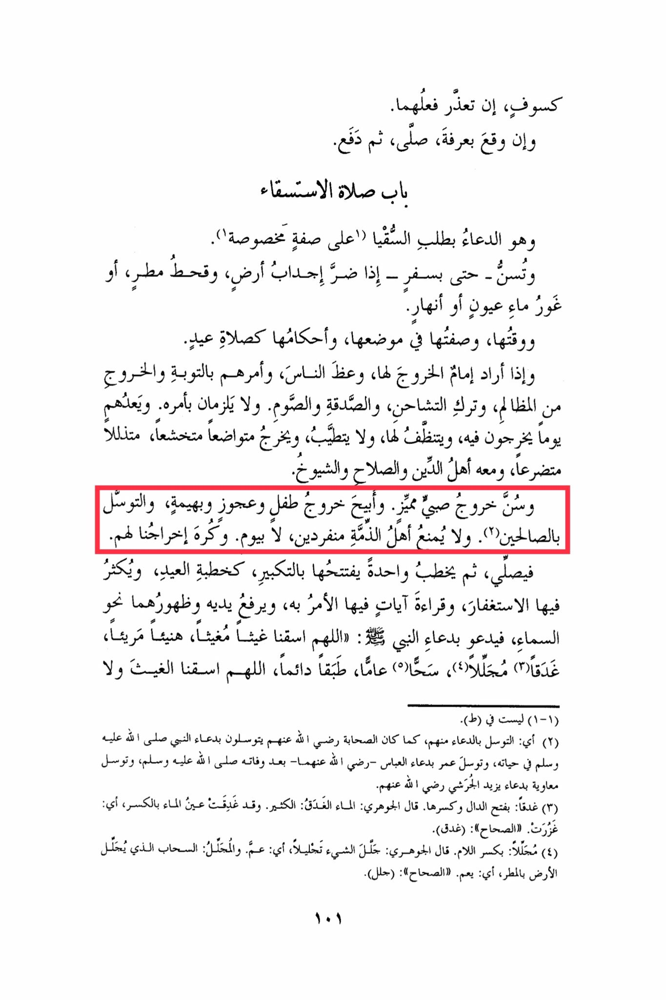

# Ibn al-Najjār (d. 972)

Eclipse, if it becomes impossible to perform them. And if it occurs in Arafat, he prays, then departs. It is the door of the prayer for rain, supplicating for water in a specific manner. It is recommended - even during travel - when there is harm in the land, drought, rain scarcity, or the drying up of springs or rivers. Its timing, description, and rulings are similar to the Eid prayer. If the imam intends to lead it, he advises the people, commands them to repent and rectify their wrongdoings, and to refrain from discord, charity, and fasting. It is not obligatory to follow his command. They are considered to have a day when they go out, prepare for it, do not apply perfume, go out humbly, in a state of humility, submissiveness, and supplication, accompanied by people of religion, righteousness, and elders. It is recommended for a distinguished child to go out. It is permissible for a child, an elderly person, and an animal to go out, and to seek intercession through righteous individuals. People of other faiths are not prohibited from going out individually, not even for a day. It is disliked to go out for them. The imam prays, then delivers a sermon, starting it with the takbir, similar to the Eid sermon, emphasizing seeking forgiveness, reciting verses that command rain, raising his hands and the backs of them towards the sky, supplicating with the Prophet's prayer: "O Allah, give us rain, beneficial and abundant, plentiful and widespread, continuous and abundant. O Allah, give us rain, not causing destruction." (1-1) Not found in (T). (2) Meaning: seeking intercession through supplication. Just as the companions used to seek intercession through the Prophet's supplication during his lifetime, and Umar sought intercession through Abbas's supplication - may Allah be pleased with them - after the Prophet's death, and Muawiyah sought intercession through the supplication of some of them, may Allah be pleased with them. The word "Ghadq" is with a fatha on the dal and a kasra on the ha. Al-Jawhari said: "Ghadq" means abundant. The water ghadq, with a kasra on the dal, means it became abundant. In "Al-Sahah," (Ghadq). "Majlal" with a kasra on the lam. Al-Jawhari said: "Majlal" means to cover something extensively, meaning to rain abundantly. The "Mujallil" is the cloud that covers the earth with rain, meaning it spreads widely. In "Al-Sahah," (Jall).

"<mark style="color:purple;">**The completion of the administration in collecting the factory with amendments and additions by Taqi al-Din Muhammad ibn Ahmad al-Futuhi al-Hanbali**</mark>"

<figure><figcaption></figcaption></figure> <figure><figcaption></figcaption></figure>

