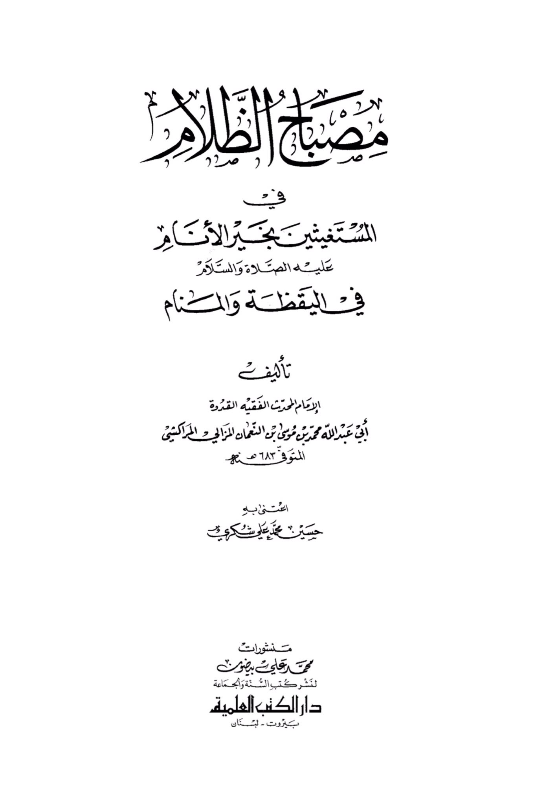
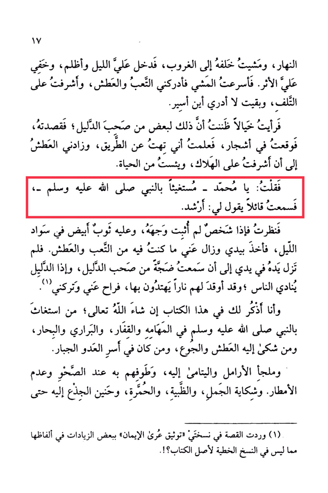

# Ibn al-Nuʿmān (d. 683)

During the day, I followed him until sunset, then night fell and darkness enveloped me, obscuring my tracks. I hastened my pace, but exhaustion and thirst caught up with me, and I found myself on the brink of ruin, not knowing where I was heading. I saw a figure that I thought might be one of the guides, so I approached it, only to stumble into trees, realizing I had lost my way. <mark style="color:red;">**The thirst intensified until I felt I was facing destruction, and I despaired of life. I said, "O Muhammad," seeking help from the Prophet, peace be upon him, and I heard a voice saying to me, "Be guided."**</mark> I looked and saw a person whose face I could not discern, wearing a white garment in the darkness of the night. He took my hand and relieved me of my exhaustion and thirst. His hand remained in mine until I heard a commotion from the guides, and I saw the guide calling out to the people, having lit a fire for them to find their way. He then left me and moved on. I recount this story to you in this book, God willing, about the Prophet, peace be upon him, in his missions and journeys, in deserts and seas, for those who suffered from thirst and hunger, and for those held captive by the enemy. He was the refuge for widows and orphans, guiding them during droughts and rainless periods. Even the camels, gazelles, wild donkeys, and tree trunks complained to him, seeking his help until... (The story continues with some additions not found in the original manuscript of the book).

"<mark style="color:purple;">**The title "Sah Al-Zalam Masbah Al-Mustaghithin Bi-Khayr Al-Anam" is a book written by the Imam, scholar, and role model Abu Abdullah Muhammad ibn Musa ibn al-Nu'man al-Mazali al-Marrakushi**</mark>"

<figure><figcaption></figcaption></figure> <figure><figcaption></figcaption></figure>

