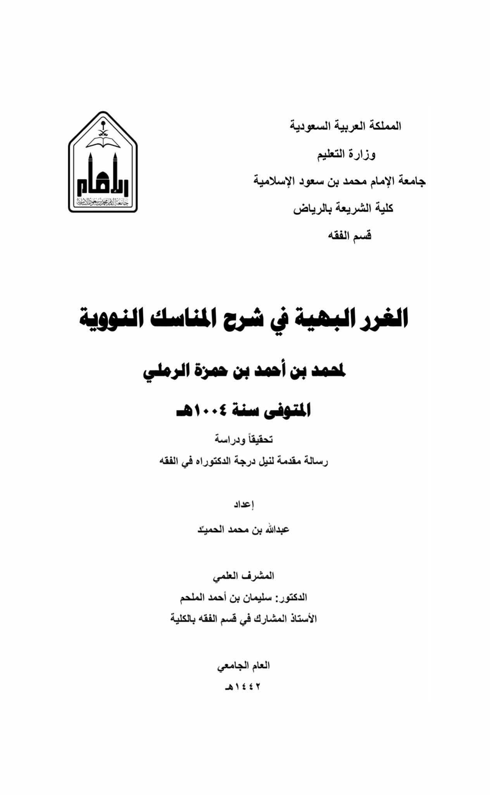
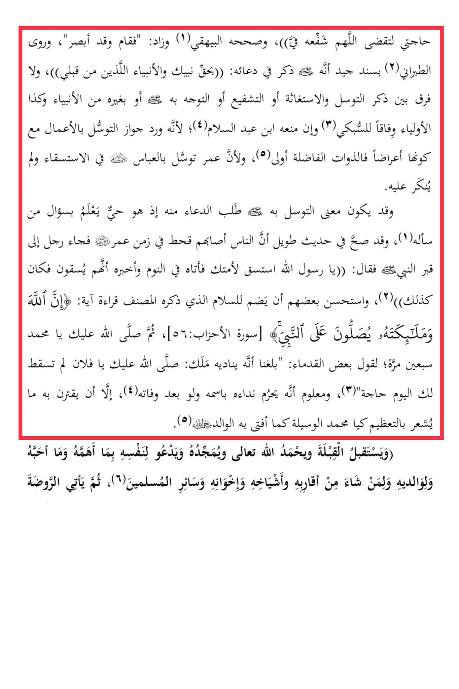

# Ibn al-Ramlī (d. 1004)

My need to fulfill, O Allah, intercede for him, and Al-Bayhaqi corrected it (1) and added: "So he stood up seeing," and At-Tabarani narrated with a good chain of transmission that he mentioned Allah in his supplication: "<mark style="color:red;">**By the right of Your Prophet and the prophets before me**</mark>, and <mark style="color:red;">**there is no difference between mentioning seeking intercession, seeking help, or seeking mediation with him or with other prophets and likewise with the saints, in accordance with**</mark>**&#x20;**<mark style="color:yellow;">**Ash-Shawkani**</mark> (3) and even if Ibn Abdul-Salam (4) prohibited it; because the permissibility of seeking intercession through actions has been mentioned, even though they are manifestations, so the virtuous individuals are more deserving (5), and because Umar sought intercession through Abbas for rain and it was not disapproved. The meaning of seeking intercession with him may be to ask for supplication from him since he is alive and knows the request of the one who asks him (1), and it has been confirmed in a lengthy hadith that people suffered from drought during Umar's time, <mark style="color:red;">**so a man came to the Prophet's grave and said: O Messenger of Allah, seek rain for your Ummah, and he came to him in a dream and informed him that they would be given rain, and it happened as such**</mark> (2), and some have recommended adding to the salutation mentioned by the author the recitation of the verse: "Indeed, Allah and His angels send blessings upon the Prophet" \[Surah Al-Ahzab: 56], then may Allah send blessings upon you, O Muhammad, seventy times; as some of the early scholars have reported that an angel calls out to him: May Allah send blessings upon you, O so-and-so, may your need not go unfulfilled today" (3), and it is known that it is prohibited to call out to him by his name even after his death (4), unless it is accompanied by something that indicates reverence, such as "O Muhammad, the means," as ruled by the respected father Allah (5). And he faces the Qibla, praises and glorifies Allah the Most High, supplicates for himself with what concerns him and what he loves, and for his parents, and for whoever he wishes among his relatives, elders, brothers, and all Muslims (6), then he visits the Rawdah.

"<mark style="color:purple;">**The Important Gems in Explaining the Nawawi Rituals by Muhammad ibn Ahmad ibn Hamzah al-Ramli**</mark>"

<figure><figcaption></figcaption></figure> <figure><figcaption></figcaption></figure>

