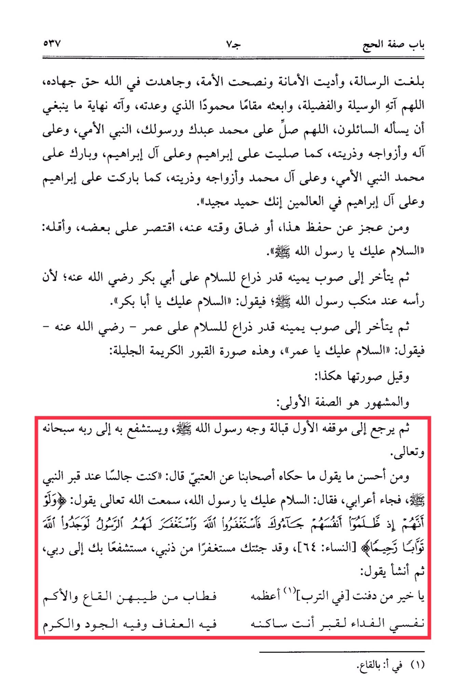

# Ibn al-Rifʿah (d. 710)

For those who are unable to memorize this, or have limited time, they may suffice with <mark style="color:red;">**saying: "Peace be upon you, O Messenger of Allah." Then they should turn to their right side as far as their arm reaches to greet Abu Bakr, may Allah be pleased with him, saying, "Peace be upon you, O Abu Bakr." Then they should turn to their right side as far as their arm reaches to greet Umar, may Allah be pleased with him, saying, "Peace be upon you, O Umar."**</mark> This is the description of the noble graves. It is said that their images are like this, but the more well-known description is the first one. <mark style="color:red;">**Then one should return to the original position facing the face of the Messenger of Allah (peace be upon him) and seek his intercession with his Lord, the Most High.**</mark> One of the best things to say, as narrated by our companions from Al-'Atbi, is: "I was sitting by the Prophet's grave when a Bedouin came and said, 'Peace be upon you, O Messenger of Allah. I heard Allah say: "And if, when they wronged themselves, they had come to you, \[O Muhammad], and asked forgiveness of Allah, and the Messenger had asked forgiveness for them, they would have found Allah Accepting of repentance and Merciful." (Quran 4:64) *<mark style="color:red;">**I have come to you seeking forgiveness for my sins, seeking your intercession with my Lord.'**</mark>* Then he recited: 'O best one among those buried in the earth, the greatest of them in fragrance, my soul is the ransom for the grave where you reside, in it is chastity, generosity, and honor.'"

"<mark style="color:purple;">**Sufficient Explanation of Al-Tashbeeh in the Jurisprudence of Imam Al-Shafi'i. The Imam, the Jurist Abu Al-Abbas Najm Al-Din Ahmad Ibn Muhammad**</mark>"

<figure><figcaption></figcaption></figure> <figure><figcaption></figcaption></figure>

