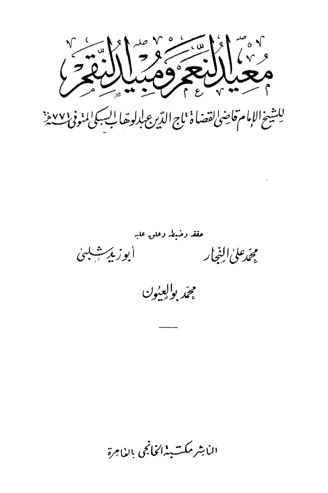
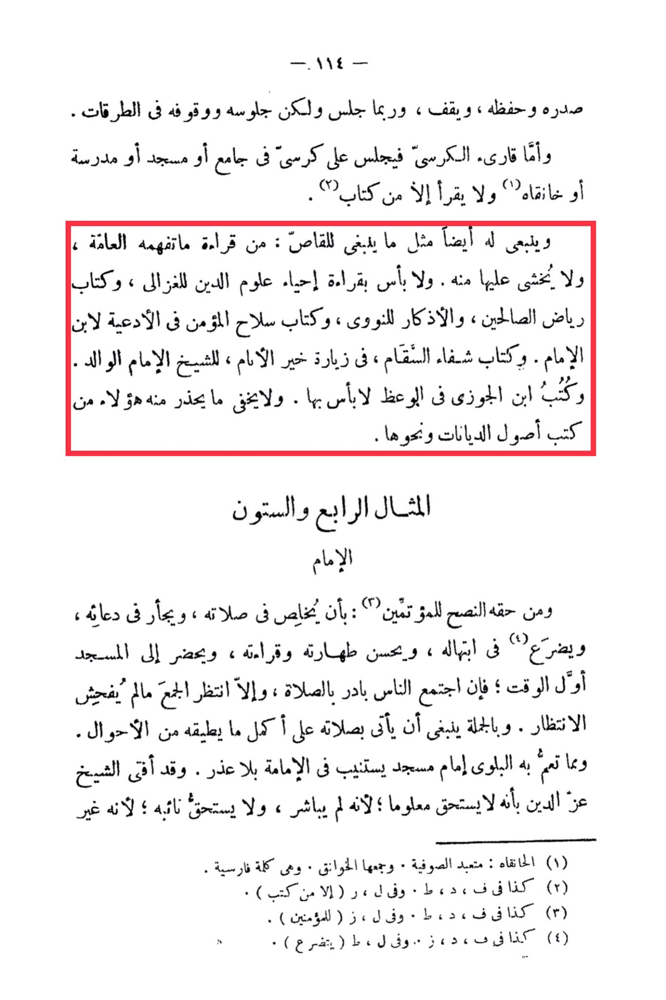

# Ibn al-Subkī (d. 771)

-118- His chest is broad and his memory is sharp, he stands, and sometimes sits, but his sitting and standing are in the pathways. As for the reader of the chair, he sits on a chair in a mosque, school, or Sufi lodge, and he only reads from a book. It is also recommended for him, as it is recommended for the storyteller, to read what the general public understands and is not feared by it. There is no harm in reading "Revival of Religious Sciences" by Al-Ghazali, "Gardens of the Righteous" by Al-Nawawi, "Fortress of the Believer in Supplications" by Ibn Al-Imam, "Healing of the Sick in Visiting the Best of Mankind" by the Sheikh Al-Imam Al-Walid. The books of Ibn Al-Jawzi in preaching are also acceptable. It is not hidden what these individuals warn against from books on the fundamentals of religions and the like. The sixty-fourth example: The Imam has the right to advise the congregants by focusing in his prayer, being sincere in his supplication, humbling himself in his imploring, perfecting his cleanliness and recitation, and arriving at the mosque early. If people are gathered, he should hasten to pray, otherwise, he should wait for the congregation as long as it does not involve indecent waiting. In general, he should perform his prayer to the best of his ability in all circumstances. It is a calamity for an Imam of a mosque to seek the position without a valid excuse. The Sheikh Az-Zain ruled that he does not deserve a salary because he did not take up the position, and he does not deserve the salary of his deputy because he is not... (Note: The text ends abruptly.)

"<mark style="color:purple;">**With the permission of the Emir Al-Amr, a prayer for the Sheikh Imam Qadi Al-Qudat Taj Al-Din Abdul Wahha Al-Sabki Al-Munufi, the last Muhammad Ali Al-Najjar, verified and organized by Muhammad Bawalayoun Abu Zeid Shalabi, that the library of Al-Khanji in Cairo be established**</mark>."

<figure><figcaption></figcaption></figure> <figure><figcaption></figcaption></figure>

