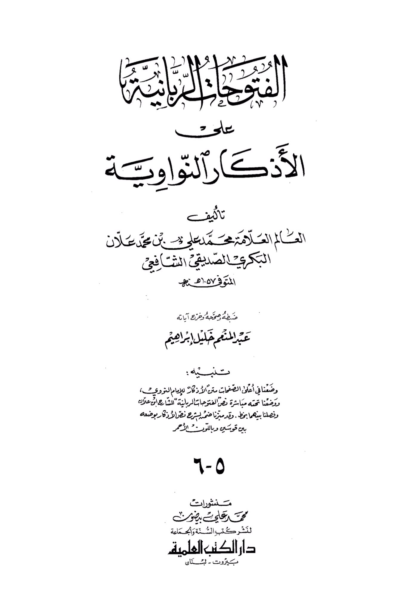
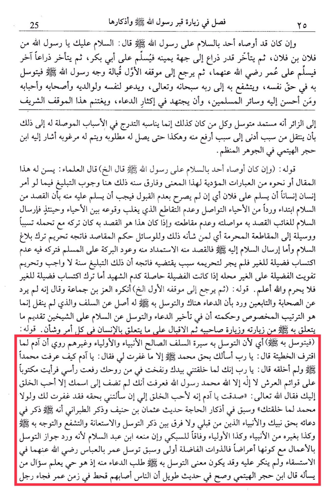

# Ibn ʿAllān (d. 1057)

Scholars have said: It is recommended for him to say this phrase or similar expressions that convey the same meaning. The difference in age here indicates the obligation to convey the message, if one person instructs another to send greetings to someone, unless the refusal to accept has been explicitly stated. In that case, it is necessary for the person to send greetings to him, as the intention of sending greetings is to initiate and maintain communication among the living, avoiding any interruption that may occur between them. Sending greetings to an absent person aims to maintain contact with them and not to cut off communication. If this is the intention, leaving it while being able to do so can lead to cutting off ties, which is prohibited. Sending greetings to someone aims to seek blessings from them and to benefit the Muslim community, while neglecting to acquire virtue for others is not forbidden. His statement: "Then he would return to his original position..." This was criticized by Al-Az bin Jama'ah, who said that it was not reported from the Companions and the Successors. It was mentioned that supplication and seeking mediation through Allah have a basis in the practices of the early generations, and what has not been transmitted is the specific arrangement. The wisdom behind delaying supplication and seeking mediation after sending greetings to the two companions is to prioritize what is related to visiting them and their companions, then focusing on matters related to the individual in every aspect. His statement: <mark style="color:red;">**"He would seek intercession through him..." Seeking mediation through the righteous predecessors, the prophets, and the saints is reported. It is narrated that when Adam committed a sin, he said: "O Lord, I ask You by the right of Muhammad, except for what You have forgiven me."**</mark> Allah replied: "O Adam, how do you know about Muhammad whom I have not created?" Adam said: "O Lord, when You created me with Your own hands and breathed into me of Your spirit, I raised my head and saw written on the pillars of the Throne: 'There is no god but Allah, Muhammad is the Messenger of Allah.' I knew that You did not attach any name to Yours except the most beloved of creation to You." Allah said: "You have spoken the truth, O Adam. He is indeed the most beloved of creation to Me. If you had asked Me by his right, I would have forgiven you. If it were not for Muhammad, I would not have created you." This hadith is mentioned in the supplications of need by Uthman ibn Hanif, and Al-Tabarani mentioned that he invoked by the right of his Prophet and the prophets before him. There is no distinction between seeking mediation, seeking assistance, intercession, or directing oneself through them, as well as through other prophets and saints, in accordance with Al-Sabki. Ibn Abd al-Salam prohibited seeking mediation through actions, even though they are indicators, as virtuous individuals are more deserving. Umar sought mediation through Abbas in the prayer for rain, and it was not objected to. Seeking mediation through someone may imply asking for supplication from them, as they are alive and aware of those who ask them. Ibn Hajar al-Haytami mentioned in a lengthy hadith that during the time of Umar, people were afflicted by drought, and a man came...

"<mark style="color:purple;">**The book "Al-Adhkar An-Nawawiyyah" is authored by the renowned scholar Muhammad Ali ibn Muhammad Al-An Bakri As-Siddiqi Ash-Shafi'i, who passed away in 57 AH**</mark>"

<figure><figcaption></figcaption></figure> <figure><figcaption></figcaption></figure>

