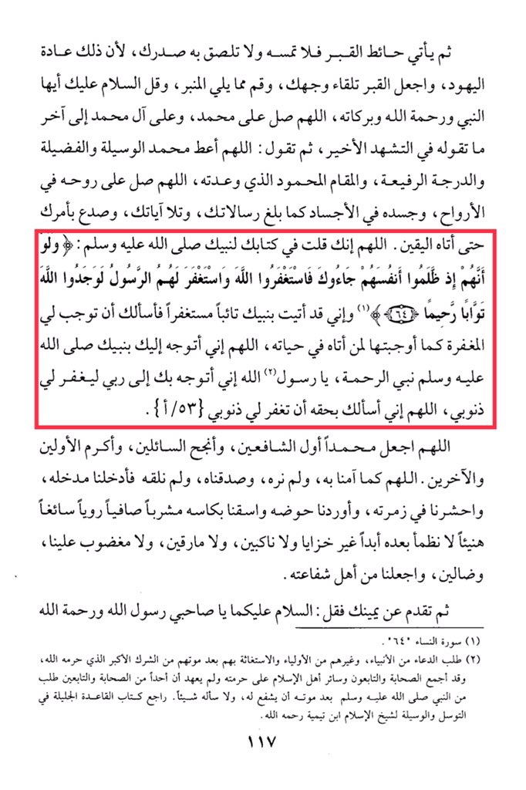

# Ibn ʿAqīl (d. 513)

&#x20;O Allah, You have said in Your Book to Your Prophet, peace be upon him: 'And if, when they wronged themselves, they had come to you, \[O Muhammad], and asked forgiveness of Allah, and the Messenger had asked forgiveness for them, they would have found Allah Accepting of repentance and Merciful.' <mark style="color:red;">**And indeed, I have come to Your Prophet repentant and seeking forgiveness, so I ask You to make forgiveness obligatory for me as You made it obligatory for those who came to him during his lifetime.**</mark><mark style="color:red;">**&#x20;**</mark>*<mark style="color:red;">**O Allah, I turn to You through Your Prophet, the Prophet of mercy, O Messenger of Allah, I turn to you to seek forgiveness for my sins.**</mark>* O Allah, I ask You by his right to forgive my sins. O Allah, make Muhammad the first to intercede, the most successful of those who seek, and the most honored among the first and the last. O Allah, as we believed in him without seeing him, <mark style="color:red;">**and affirmed him without meeting him, so admit us through his intercession**</mark>, gather us in his group, lead us to his Basin, and give us to drink from his Cup, a drink pure, refreshing, and pleasant, from which we will never thirst thereafter, without disgrace, fatigue, or intoxication, nor will we be criticized, lost, or astray, and make us among the people of his intercession. Then step forward to your right and say: Peace be upon you, O Messenger of Allah, and the mercy of Allah. (Surah An-Nisa 4:40). (2) Seeking supplication from the Prophets and others among the saints, and seeking their help after their death is a major form of polytheism that Allah has forbidden. The Companions, the Successors, and all the people of Islam have unanimously agreed on its prohibition, and it has not been reported that any of the Companions or Successors asked the Prophet, peace be upon him, for intercession after his death or asked him for anything.

"<mark style="color:purple;">**The book "Al-Tadhkirah fi al-Fiqh" according to the school of Imam Ahmad ibn Muhammad ibn Hanbal, authored by Abu al-Wafa Ali ibn Aqil ibn Muhammad ibn Aqil al-Baghdadi al-Hanbali**</mark>"

<figure><figcaption></figcaption></figure> <figure><figcaption></figcaption></figure>

