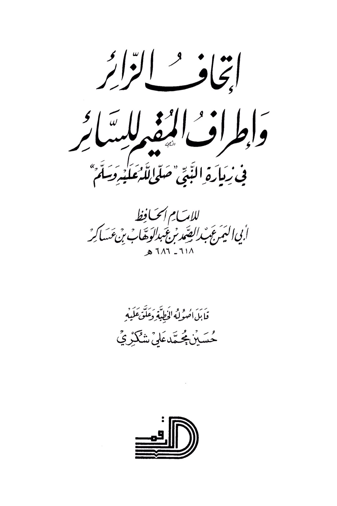
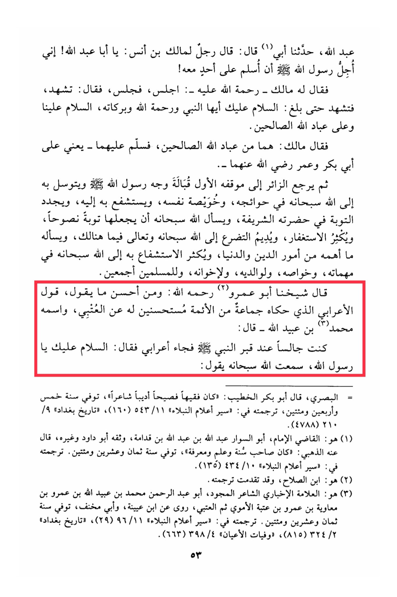

# Ibn ʿAsākir -Abū al-Yaman- (d. 686)

Abdullah, my father narrated to us, he said: A man said to Malik ibn Anas, "O Abu Abdullah! I consider it more respectful to the Messenger of Allah (peace be upon him) not to greet anyone in his presence!" So Malik - may Allah have mercy on him - said to him, "Sit down and be seated." Then he said, "<mark style="color:red;">**You should bear witness and say, 'May peace be upon you, O Prophet, and the mercy of Allah and His blessings. Peace be upon us and upon the righteous servants of Allah.'**</mark> " Malik said, "<mark style="color:red;">**They are among the righteous servants of Allah**</mark>," and he greeted them - meaning Abu Bakr and Umar, may Allah be pleased with them. <mark style="color:red;">**Then the visitor returns to his original position facing the face of the Messenger of Allah (peace be upon him) and intercedes with him to Allah in his needs, humbles himself, seeks his intercession, renews his repentance in his noble presence, asks Allah to make it sincere repentance, increases in seeking forgiveness, continues to supplicate to Allah in that place, asks Him for what is important to him in matters of religion and the world, and increases in seeking intercession with Allah in his important matters, his special needs, for his parents, his brothers, and all the Muslims**</mark>. Our sheikh Abu Amr, may Allah have mercy on him, said: "One of the best things to say is what a group of scholars narrated as recommended by Al-A'zami, whose name is Ibn Ubaydullah - he said: '<mark style="color:red;">**I was sitting by the grave of the Prophet of Allah when a Bedouin came and said, 'Peace be upon you, O Messenger of Allah**</mark>. I heard Allah, the Exalted, say...'" (End of translated text)

"<mark style="color:purple;">**The visitor's eyes were amazed by the beauty of the surroundings while walking in the visit to the Prophet, peace be upon him, to the Imam, the Hafiz, Abu Al-Yaman Abdul Samad ibn Abdul Wahab ibn Asakir**</mark>"

<figure><figcaption></figcaption></figure> <figure><figcaption></figcaption></figure>

