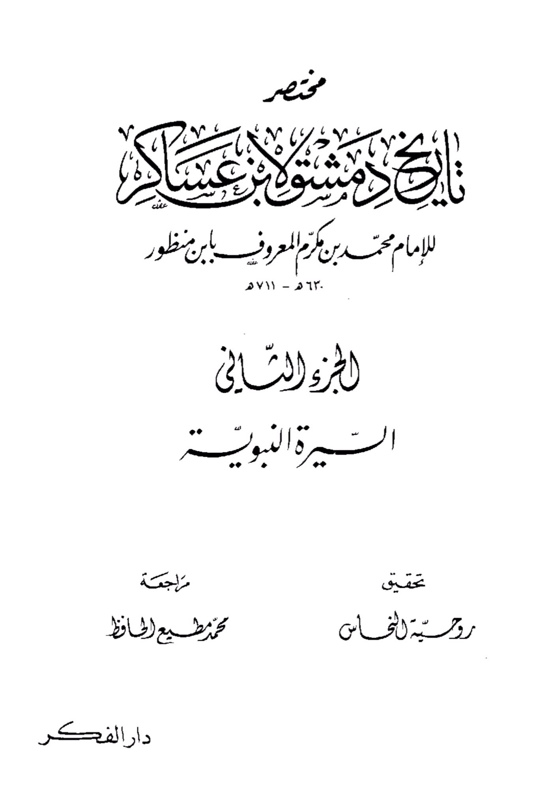
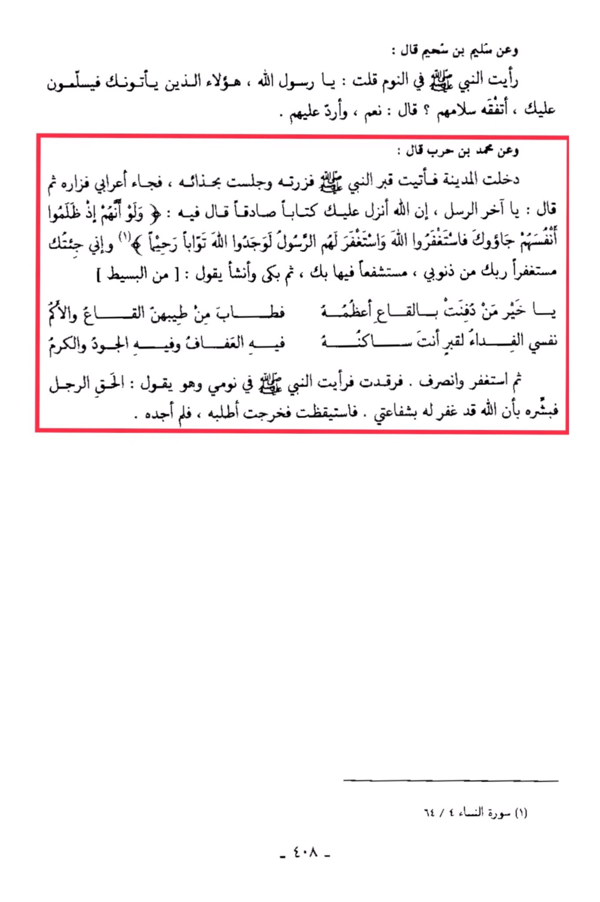

# Ibn ʿAsākir (d. 571)

Muthleem ibn Suhaym said: "I saw the Prophet in a dream and said, 'O Messenger of Allah, those who come to you and greet you, do you understand their greetings?' He said: 'Yes, I respond to them.' Muhammad ibn Harb said: '<mark style="color:red;">**I entered the city and went to the Prophet's grave, I greeted him and sat by his shoes. Then a Bedouin came and visited him, and said, 'O last of the messengers, indeed Allah has revealed to you a true book**</mark> in which it is said: "And if, when they wronged themselves, they had come to you, \[O Muhammad], and asked forgiveness of Allah, and the Messenger had asked forgiveness for them, they would have found Allah Accepting of repentance and Merciful." <mark style="color:red;">**I have come to you seeking forgiveness from your Lord for my sins, seeking your intercession**</mark>. Then he cried and recited: 'O best of those buried in the valley, its greatness is increased by you, and its depths are sweetened by your goodness. My soul is the ransom for the grave where you reside, in it is chastity, generosity, and kindness.' Then he sought forgiveness and left. I lay down and saw the Prophet in my dream saying: 'The man spoke the truth, so give him glad tidings that Allah has forgiven him through my intercession.' I woke up and went out to look for him, but I did not find him." (Surah An-Nisa, 4:64)

<figure><figcaption></figcaption></figure> <figure><figcaption></figcaption></figure>

"<mark style="color:purple;">**Summary of "Nayl al-Awtar" by Ibn Asakir on Imam Muhammad ibn Maryam, known as Ibn Mundhir, 630-711 AH, Part Two, the Prophetic Biography, edited by Ruhiyya al-Nahhas, reviewed by Muhammad Muti' al-Hafiz, Dar al-Fikr.**</mark>"
