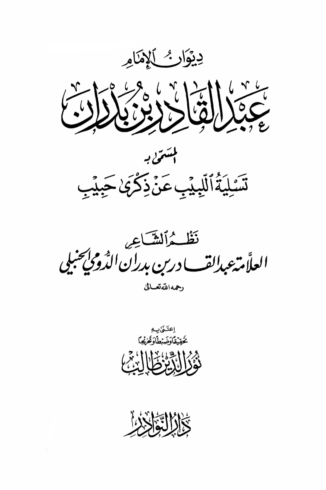
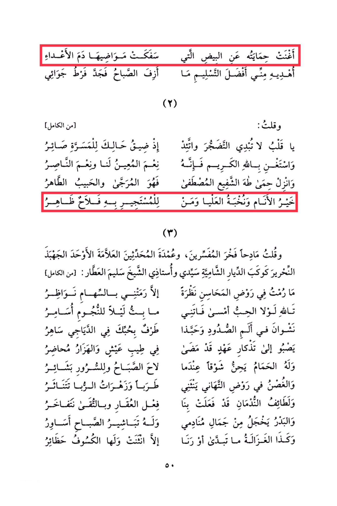

# Ibn Badrān (d. 1346)

His protection enriched the eggs, which shed the blood of their enemies. I offer him the best of surrender from me, as the morning dawned with the excess of my passion. I said: "Oh heart, do not reveal weariness and be patient. When your situation becomes difficult, turn to joy and rely on the generous God, for He is the best helper and supporter for us. Lower the protection of the intercessor, the chosen one, for he is the hoped-for and beloved, the purest of people and the elite of the high ranks. Whoever seeks refuge in him will find clear salvation. I praised the pride of the interpreters, the pillar of the scholars, the sign of uniqueness, the distinguished, the writer like the star of the Syrian homes, my master and teacher, Sheikh Salim Al-Attar. I did not cast a glance in the garden of beauties without being struck by the glances of eyes. By Allah, if it were not for love, I would not have stayed awake at night conversing with the stars. I long for the pleasure of meeting in the pain of separation, and how delightful is a glance from you in the gatherings. I yearn to remember the past in a good life, and the pigeon coos with longing when the morning breaks, bringing tidings of joy. The branch in the garden of delights sways with delight, and the flowers of spring scatter. The charms of the night have affected us like the effects of wine, and in our gatherings, we boast of our meeting. The full moon is embarrassed by the beauty of those who call upon it, and it brings tidings of the morning like bracelets. Similarly, the gazelle does not reveal itself or sing except to bend, and it has the eclipse as its enclosure.

"<mark style="color:purple;">**The collection of Imam Abdul Qadir bin Badran, known as "Tasaliyat al-Labib 'an Dhikray Habib" by the poet and scholar Abdul Qadir bin Badran al-Doumi al-Jubaili**</mark>"

<figure><figcaption></figcaption></figure> <figure><figcaption></figcaption></figure>

