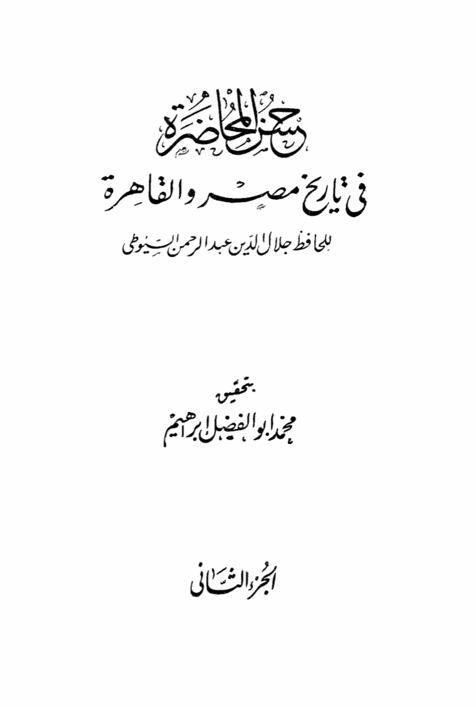
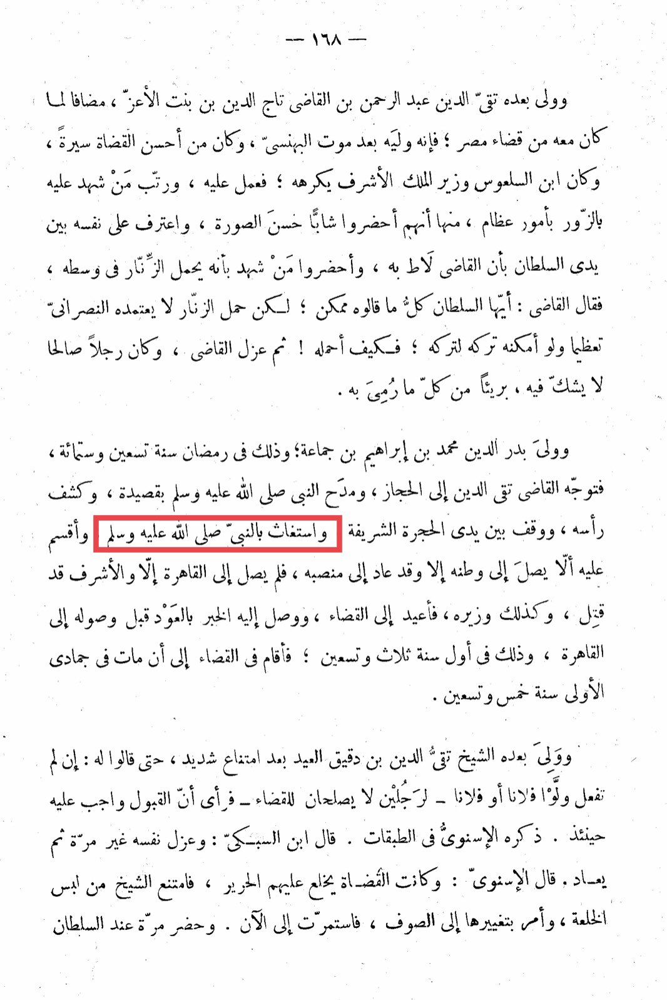

# Ibn Bint al-Aʿazz (d. 695)

After him, Taqi al-Din Abd al-Rahman bin al-Qadi Taj al-Din bin Bint al-Aziz took over, in addition to what he had in terms of governing Egypt. He became the ruler after the death of al-Bahnasi, who was known for his good reputation as a judge. He was disliked by Ibn al-Sal'us, the minister of the honorable king, who plotted against him and arranged for false witnesses to testify against him in serious matters. One of the accusations was that they brought a handsome young man who confessed in front of the Sultan that the judge had seduced him. They also brought a witness who claimed that he carried a belt around his waist. The judge responded, "O Sultan, everything they say is possible, but wearing a belt is not a sign of respect for Christians; if I could avoid it, I would. How can I wear it?" The judge was then dismissed, a righteous man who was innocent of all the accusations against him. Badr al-Din Muhammad bin Ibrahim bin Jama'a took over in the month of Ramadan in the year six hundred and ninety. The judge Taqi al-Din then headed to the Hijaz, praised the Prophet peace be upon him in a poem, uncovered his head, stood in front of the noble chamber, and sought the Prophet's help, asking that he not return to his homeland until he was reinstated in his position. He did not reach Cairo until the honorable one had been killed, along with his minister. He was reinstated as a judge, and news of his return reached him before he arrived in Cairo, in the first year of three and ninety. He remained in the judiciary until he passed away in Jumada al-Awwal in the year ninety-five. After him, Sheikh Taqi al-Din bin Daqiq al-Eid took over after much reluctance, until they said to him, "If you do not accept, we will appoint so-and-so or so-and-so - two men unsuitable for the judiciary." He then saw that acceptance was necessary at that time. Al-Isnaawi mentioned him in the categories. Ibn al-Sabki said: He resigned more than once and was reinstated. Al-Isnaawi said: The judges used to wear silk robes, but the Sheikh refused this luxury and ordered them to be changed to wool, a practice that continues to this day. He once attended in front of the Sultan.

"<mark style="color:purple;">**About the lecture on the history of "Al-Masir" and "At-Tahira" by the scholar Jalal ad-Din Abd ar-Rahman as-Suyuti, edited by Muhammad Abu al-Fadl Ibrahim, Part Two.**</mark>"

<figure><figcaption></figcaption></figure> <figure><figcaption></figcaption></figure>

