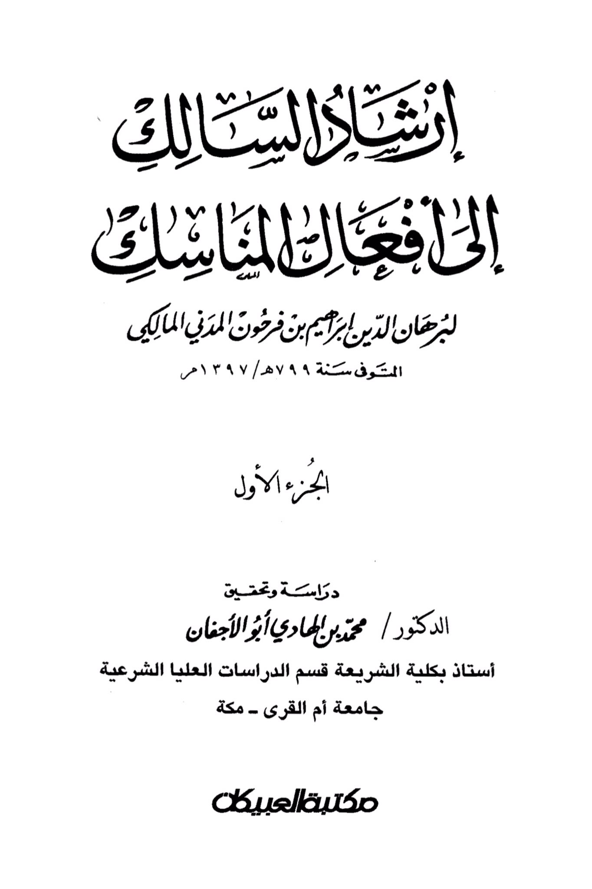
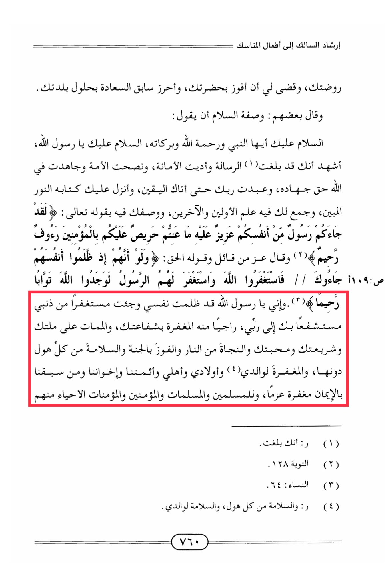

# Ibn Farḥūn (d. 799)

The description of peace is to say: Peace be upon you, O Prophet, and the mercy of Allah and His blessings. Peace be upon you, O Messenger of Allah. I bear witness that you have conveyed the message, fulfilled the trust, advised the nation, and strived in the cause of Allah as it should be strived. You worshipped your Lord until certainty came to you, and He revealed to you the clear Book, gathering in it the knowledge of the former and latter peoples, and describing you with His saying: "There has certainly come to you a Messenger from among yourselves. Grievous to him is what you suffer; \[he is] concerned over you and to the believers is kind and merciful." And the Almighty has said: "And if, when they wronged themselves, they had come to you, \[O Muhammad], and asked forgiveness of Allah, and the Messenger had asked forgiveness for them, they would have found Allah Accepting of repentance and Merciful." And indeed, <mark style="color:red;">**O Messenger of Allah, I have wronged myself and I come seeking forgiveness for my sin, seeking your intercession with my Lord, hoping for His forgiveness through your intercession, and for death upon your creed, your law, your love, and salvation from the Fire, and success in attaining Paradise, and safety from every horror except it, and forgiveness for my parents, children, family, our leaders, our brothers, and those who preceded us in faith with determination, and for the Muslim men and women, the believers who are alive among them.**</mark>

"<mark style="color:purple;">**The poetry of the traveler towards the rituals of pilgrimage, by Burhan al-Din Ibrahim ibn Farhoun al-Madani al-Maliki, who passed away in the year 799 AH / 1397 CE**</mark>"

<figure><figcaption></figcaption></figure> <figure><figcaption></figcaption></figure>

