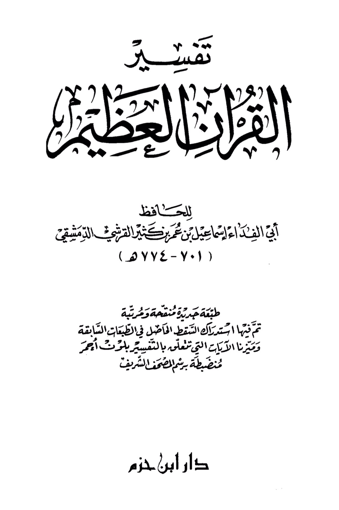
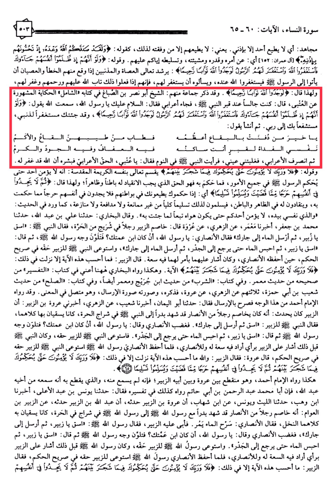

# Ibn Kathīr (d. 774)

Surah An-Nisa, verses 60-65, Mujahid: "None shall obey anyone except by My permission." Meaning: None shall obey them except those whom I have granted success to do so, as in His saying: "And indeed Allah fulfilled His promise to you when you were killing them with His permission." \[Al-Imran: 152] Meaning: by His command, decree, will, and His granting you victory over them. And His saying: "And if, when they wronged themselves, they had come to you, \[O Muhammad], and asked forgiveness of Allah, and the Messenger had asked forgiveness for them, they would have found Allah Accepting of repentance and Merciful." Allah guides the sinners and wrongdoers, when they make mistakes and commit sins, to come to the Messenger (peace be upon him) to seek forgiveness from Allah through him, and to ask him to seek forgiveness for them. If they do so, Allah will turn to them in forgiveness, mercy, and pardon, as He said: "they would have found Allah Accepting of repentance and Merciful." Some of them, like Sheikh Abu Nasr ibn As-Sabbagh, mentioned in his book "Al-Shamil," narrated the famous story of Al-Utbi: He said, "I was sitting by the Prophet's grave, and a Bedouin came and said, 'Peace be upon you, O Messenger of Allah. I heard Allah say: 'And if, when they wronged themselves, they had come to you, \[O Muhammad], and asked forgiveness of Allah, and the Messenger had asked forgiveness for them, they would have found Allah Accepting of repentance and Merciful.' So I have come to you seeking forgiveness for my sin, seeking your intercession with my Lord.' Then he recited: 'O best of those whose bodies are buried in the earth, the most exalted, the purest of them, the most fragrant of them, the soul's ransom for the grave where you reside, in it is chastity, generosity, and nobility.' Then the Bedouin left, and I fell asleep, and I saw the Prophet in my dream saying, 'O Utbi, convey the good news to the Bedouin that Allah has forgiven him.' And His saying: 'But no, by your Lord, they will not \[truly] believe until they make you, \[O Muhammad], judge concerning that over which they dispute among themselves.' Allah swears by His noble and sacred self that no one truly believes until they make the Messenger judge in all matters. Whatever he judges is the truth to which they must submit, inwardly and outwardly. Hence, He said: 'Then they would not find within themselves any discomfort from what you have judged and would submit in \[full, willing] submission.' Meaning: when they make you judge, they obey you in their hearts without any discomfort from what you have judged, submitting to it fully, without objection, defense, or dispute. As mentioned in the hadith: 'By the One in whose hand is my soul, none of you truly believes until his desires are in accordance with what I have brought.' Al-Bukhari said: Ali ibn Abdullah narrated to us, Muhammad ibn Ja'far narrated to us, Ma'mar informed us from Az-Zuhri from Urwah who said: Az-Zubair had a dispute with a man over a well in the Harrah. The Prophet said, 'O Zubair, water (your garden) and then let the water flow to your neighbor.' The Ansari said, 'O Messenger of Allah, if it is your cousin, then tell him to be just.' The face of the Prophet changed color, and he said, 'O Zubair, water (your garden) and then withhold the water until it reaches the walls (surrounding the trees).' So, the water was made to flow to the neighbor. The Prophet ensured justice for Az-Zubair in the clear judgment when the Ansari reminded him, and he gave them both a directive that was fair. Az-Zubair said, 'I do not think that this verse was revealed for any other reason: 'But no, by your Lord, they will not \[truly] believe until they make you, \[O Muhammad], judge concerning that over which they dispute among themselves.' And thus, Al-Bukhari narrated it in his book 'Tafsir' from his Sahih from the hadith of Ma'mar. In the book 'Ash-Sharab' from the hadith of Ibn Juraij and Ma'mar as well, and in the book 'As-Sulh' from the hadith of Shu'ayb ibn Abi Hamzah, all three narrated from Az-Zuhri, from Ur The Messenger of Allah, is he your cousin? The face of the Messenger of Allah (peace be upon him) changed color, then he said: "Give water, O Zubair, and then hold the water until it reaches the roots." The Prophet (peace be upon him) ensured Zubair received his right, and before that, the Prophet (peace be upon him) had indicated to Zubair with his opinion, showing generosity to him and to the Ansari. When the Ansari fulfilled his obligation, the Messenger of Allah (peace be upon him) ensured Zubair received his right in clear judgment. Zubair said: "By Allah, I do not think this verse was revealed for any other reason than this: 'But no, by your Lord, they will not \[truly] believe until they make you, \[O Muhammad], judge concerning that over which they dispute among themselves and then find within themselves no discomfort from what you have judged and submit in \[full, willing] submission.'" This was narrated by Imam Ahmad, and it is a disconnected chain between Urwah and his father Zubair, as he did not hear it directly from him. The one who completes the chain is his brother Abdullah. Abu Muhammad Abdur-Rahman ibn Abi Hatim also narrated it in his tafsir, saying: Yunus ibn Abd al-A'la informed us, Ibn Wahb narrated to us from Al-Laith and Yunus from Ibn Shihab, that Urwah ibn Zubair narrated to him that Abdullah ibn Zubair narrated to him, from Zubair ibn al-Awwam, that he had a dispute with an Ansari man who had fought at Badr. They both went to the Messenger of Allah (peace be upon him) in a garden in Harrah, where they were both watering palm trees. The Ansari man said: "Let the water flow." Zubair refused, so the Messenger of Allah (peace be upon him) said: "Give water, O Zubair, and then send to your neighbor." The Ansari man became angry and said: "O Messenger of Allah, is he your cousin?" The face of the Messenger of Allah (peace be upon him) changed color, then he said: "Give water, O Zubair, and then hold the water until it reaches the roots." The Messenger of Allah (peace be upon him) ensured Zubair received his right, and before that, the Messenger of Allah (peace be upon him) had indicated to Zubair with his opinion, showing generosity to him and to the Ansari. When the Ansari fulfilled his obligation, the Messenger of Allah (peace be upon him) ensured Zubair received his right in clear judgment. Zubair said: "I do not think this verse was revealed for any other reason than this: 'But no, by your Lord, they will not \[truly] believe until they make you, \[O Muhammad], judge concerning that over which they dispute among themselves and then find within themselves no discomfort from what you have judged and submit in \[full, willing] submission.'"

"<mark style="color:purple;">**The interpretation of the Great Quran by the Hafiz Abu Al-Fida Ismail ibn Muhammad ibn Kathir al-Qurashi al-Dimashqi (701-774 AH)**</mark>"

<figure><figcaption></figcaption></figure> <figure><figcaption></figcaption></figure>

