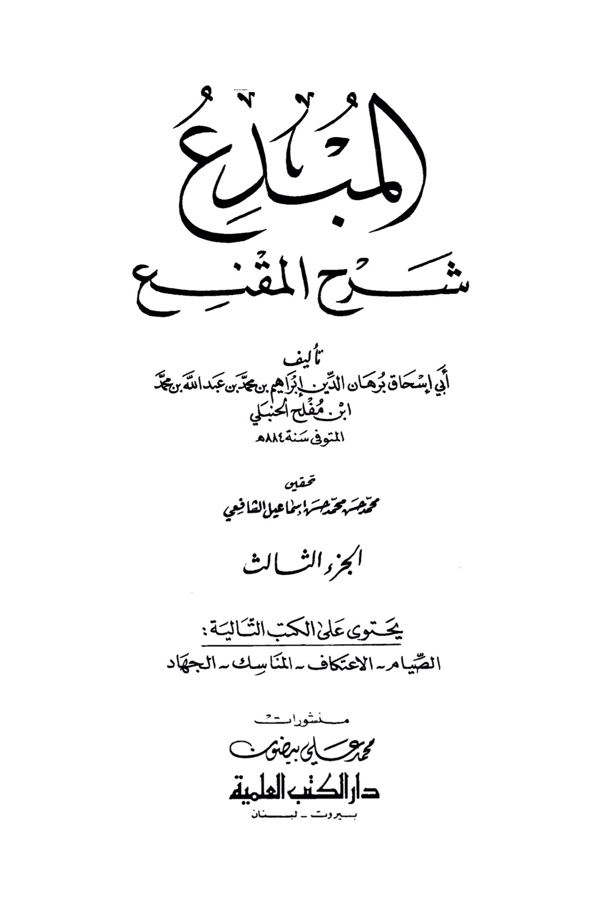
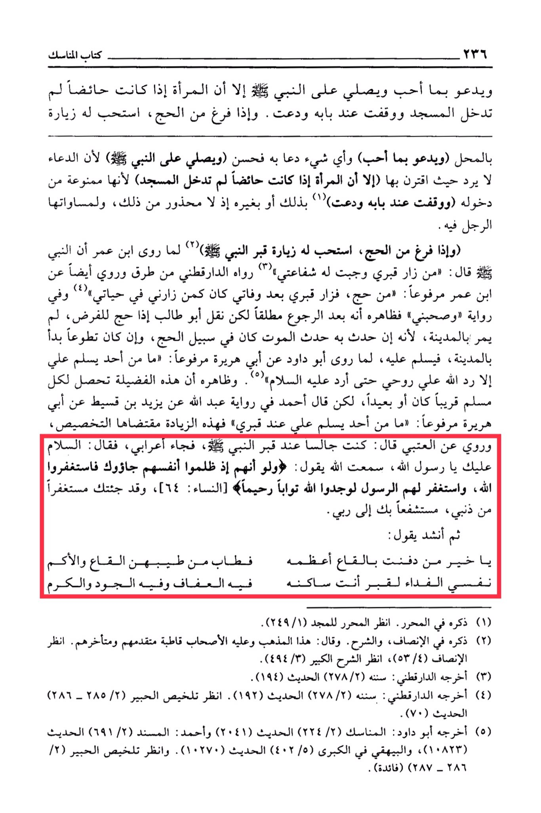

# Ibn Mufliḥ (d. 883)

A man should supplicate with what he loves and send blessings upon the Prophet. However, if a woman is menstruating, she should not enter the mosque but should stand at its door and supplicate. When he finishes the Hajj, <mark style="color:red;">**it is recommended for him to visit the Prophet's grave and supplicate with what he loves**</mark>. Any supplication he makes is good, and he should send blessings upon the Prophet because supplication is not rejected when combined with sending blessings upon the Prophet. However, if a woman is menstruating, she should not enter the mosque because she is prohibited from entering it, so she should stand at its door and supplicate in that manner or in any other way, as there is no restriction on that. Also, the man should pass by and supplicate for himself. When he finishes the Hajj, <mark style="color:red;">**it is recommended for him to visit the Prophet's grave, as Ibn Umar reported that the Prophet said: "Whoever visits my grave, my intercession is guaranteed for him.**</mark>" This hadith is narrated by Ad-Daraqutni through multiple chains, and Ibn Umar narrated it as a saying of the Prophet: "Whoever performs Hajj and then visits my grave after my death is like one who visited me during my lifetime." This narration indicates that this applies after returning from Hajj, but Abu Talib reported that if one performs the obligatory Hajj, not in Madinah, and dies during it, it is considered in the way of Hajj. However, if it is voluntary, it should start in Madinah, and upon returning, one should greet the Prophet, as Abu Dawood reported from Abu Huraira that the Prophet said: "Whenever someone greets me at my grave, Allah returns my soul to me so I can return the greeting." This virtue seems to apply to every Muslim, whether near or far. However, <mark style="color:red;">**Ahmad reported in a narration from Abdullah through Yazid bin Qusayt from Abu Huraira that the Prophet said: "Whoever greets me at my grave," indicating that this additional reward is specific to this act**</mark>. Al-Utabi reported: "I was sitting by the Prophet's grave when a Bedouin came and said, '<mark style="color:red;">**Peace be upon you, O Messenger of Allah.**</mark> I heard Allah say: 'And when they wrong themselves, they come to you, then seek forgiveness from Allah and the Messenger seeks forgiveness for them, they would find Allah Accepting of repentance, Merciful.' \[Quran 4:64]. I have come to seek forgiveness for my sins, seeking your intercession with my Lord.' Then he recited: 'O best of those buried in the valley, the most generous of them in fragrance, my soul is the ransom for the grave where you reside, in it is chastity, generosity, and honor.' This is mentioned in Al-Muharrar. See Al-Muharrar for Al-Majd (249/1). This is also mentioned in Al-Insaf and Al-Sharh, and it is the consensus of the scholars, both early and later. See Al-Insaf (53/4), see Al-Sharh Al-Kabir (494/3). This hadith is reported by Ad-Daraqutni in his Sunan (278/2) Hadith (194). This hadith is also reported by Ad-Daraqutni in his Sunan (278/2) Hadith (192). See Takhreej Al-Habeer (2/285-286) Hadith (70). This hadith is reported by Abu Dawood in Al-Manasik (2/224) Hadith (2041) and Ahmad in Al-Musnad (2/691) Hadith (10823), and Al-Bayhaqi in Al-Kabir (402/5) Hadith (10270). See Takhreej Al-Habeer (2) 286-287 (Benefit).

"<mark style="color:purple;">**The creative explanation of Al-Muqni' by Abu Ishaq Barhan al-Din Ibrahim ibn Muhammad ibn Abdullah ibn Muhammad ibn Muflih al-Hanbali**</mark>,"

<figure><figcaption></figcaption></figure> <figure><figcaption></figcaption></figure>

