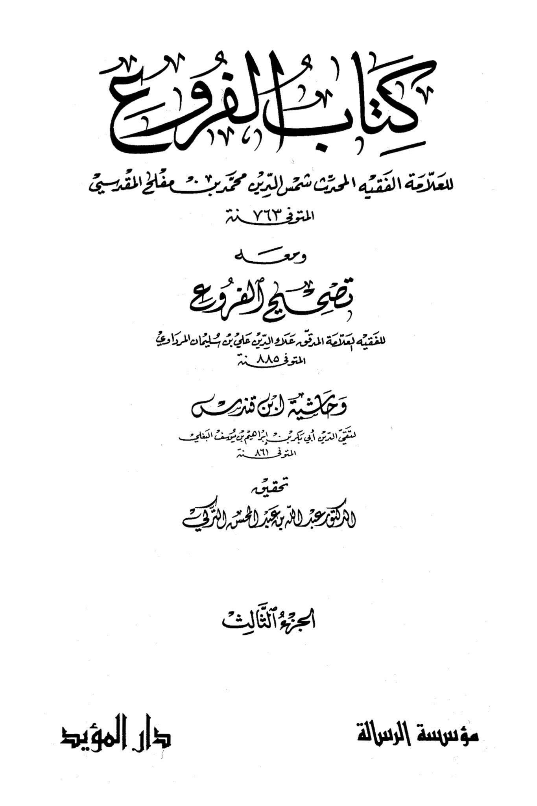
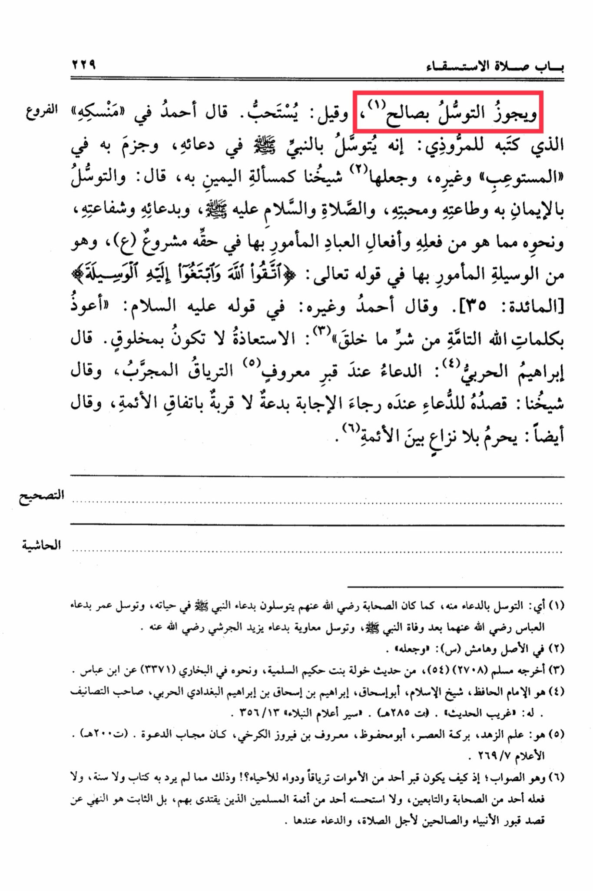

# Ibn Mufliḥ, Shams al-Dīn (d. 763

Chapter of the Prayer for Rain 229: <mark style="color:red;">**It is permissible to seek intercession through a righteous person, and it is said to be recommended.**</mark> Ahmad said in his book "Mansik" which he wrote for al-Mardawi: One may seek intercession through the Prophet · in their supplications, and he affirmed this in "al-Mustawab and others, and our teacher made it a matter of seeking his intercession like the oath, saying: Seeking intercession through faith in him, obedience to him, love for him, sending blessings and peace upon him, supplicating through him, seeking his intercession, and similar actions that are in accordance with what he did and what the commanded servants do in his right are recommended. This is part of the means commanded in the saying of Allah: "Fear Allah and seek the means of approach to Him" \[Al-Ma'idah: 35]. Ahmad and others also said regarding his saying peace be upon him: "I seek refuge in the perfect words of Allah from the evil of what He has created": Seeking refuge should not be done through a created being. Ibrahim al-Harbi said: Supplicating at a known grave is like using a tried remedy, and our teacher said: Intending to supplicate at a grave with the hope of being answered is an innovation, not a means of closeness, according to the consensus of the scholars. He also said: It is prohibited without any disagreement among the scholars. This means seeking intercession through supplication to Allah alone, as the companions used to seek intercession through the supplication of the Prophet · during his lifetime, and Umar sought intercession through the supplication of Abbas after the Prophet's death, and Muawiyah sought intercession through the supplication of Yazid al-Jarushi. In the original text and margin: "and made it." This hadith was narrated by Muslim (2708), from the narration of Khawlah bint Hakim al-Sulamiyyah, and similar narrations are found in Sahih al-Bukhari (3371) from Ibn Abbas. (4) He is the Imam, the Hafiz, the Sheikh of Islam Abu Ishaq Ibrahim ibn Ishaq ibn Ibrahim al-Baghdadi al-Harbi, the author of many works. He has "Gharib al-Hadith." (d. 285 AH). "Siyar A'lam al-Nubala" 356/13. (5) He is: the scholar of asceticism, the blessing of the era, Abu Mahfuz, Ma'ruf ibn Firuz al-Karkhi, known for his answered supplications. (d. 200 AH). "Al-A'lam" 269/7. (6) This is the correct opinion; for how can the grave of one of the deceased be a remedy and cure for the living?! This is not mentioned in the Quran, Sunnah, nor was it practiced by any of the companions or followers, nor was it approved by any of the Muslim scholars who are followed. The established practice is to visit the graves of the prophets and righteous for the purpose of prayer, while supplicating there is prohibited. This is the correction according to the footnote.

"<mark style="color:purple;">**The book "Al-Furuh" by the eminent scholar and hadith expert Shams al-Din Muhammad bin Mufattih al-Maqdisi, who passed away in 763 AH, with annotations by the meticulous scholar Talha al-Din Ali bin Sulaiman al-Mardawi**</mark>"

<figure><figcaption></figcaption></figure> <figure><figcaption></figcaption></figure>

