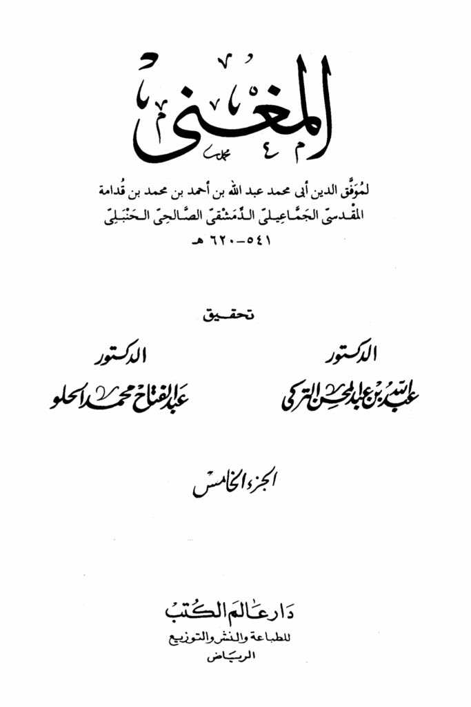
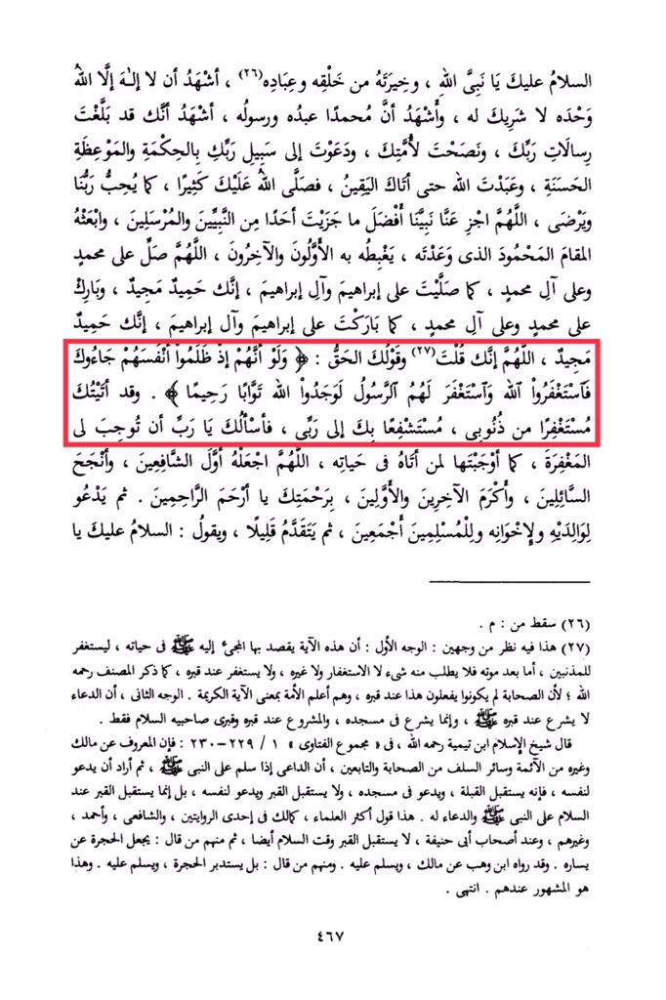

# Ibn Qudāmah (d. 620)

Peace be upon you, O Prophet of Allah, and the best of His creation and servants. I bear witness that there is no god but Allah alone, with no partner, and I bear witness that Muhammad is His servant and messenger. I bear witness that you have conveyed the messages of your Lord, advised your nation, and called to the path of your Lord with wisdom and good admonition. You worshipped Allah until certainty came to you. May Allah send blessings upon you abundantly, as much as our Lord loves and is pleased with. O Allah, reward our Prophet with the best of rewards given to any prophet or messenger, and grant him the praised station that You promised him, which the early and later generations will envy. O Allah, send blessings upon Muhammad and the family of Muhammad, as You have sent blessings upon Ibrahim and the family of Ibrahim. You are indeed praiseworthy and glorious. Bless Muhammad and the family of Muhammad, as You have blessed Ibrahim and the family of Ibrahim. You are indeed praiseworthy and glorious. O Allah, You have said, and Your word is the truth: "And if, when they wronged themselves, they had come to you, \[O Muhammad], and asked forgiveness of Allah, and the Messenger had asked forgiveness for them, they would have found Allah Accepting of repentance and Merciful." <mark style="color:red;">**I come to You seeking forgiveness for my sins, seeking intercession through You to my Lord**</mark>. I ask You, O Lord, to grant me forgiveness as You have granted it to those who sought it during their lives. O Allah, make him the first intercessor, the most successful of those who ask, and the most honorable among the early and later generations, by Your mercy, O Most Merciful. Then he prays for his parents, siblings, and all Muslims. Then he takes a step forward and says: Peace be upon you, O Prophet. This is where it was cut off: M. This has two interpretations: The first interpretation is that this verse refers to coming to the Prophet during his lifetime to seek forgiveness for the sinners. After his death, nothing is sought from him, neither forgiveness nor anything else, and forgiveness is not sought at his grave, as mentioned by the author, may Allah have mercy on him, because the companions did not do this at his grave, and they were the most knowledgeable of the nation about the meaning of the noble verse. The second interpretation is that supplication is not legislated at his grave, but rather in his mosque. It is only legislated to greet and supplicate for him at his grave and the grave of his two companions. Sheikh al-Islam Ibn Taymiyyah, may Allah have mercy on him, said in his Fatawa: "It is known from Malik and other Imams, as well as the predecessors among the companions and followers, that when a supplicant greets the Prophet, then wants to supplicate for himself, he faces the Qibla, supplicates in his mosque, and does not face the grave to supplicate for himself. Rather, he faces the grave when greeting the Prophet and supplicating for him. This is the opinion of most scholars, including Malik in one of the narrations, Shafi'i, Ahmad, and others, and among the followers of Abu Hanifa. They also do not face the grave at the time of greeting. Some of them said: Place the grave to his left. Ibn Wahb narrated this from Malik, and he greeted him. Others said: Rather, turn away from the grave and greet him. This is the popular opinion among them. End. 467.

"<mark style="color:purple;">**The singer for Muwaffaq al-Din Abu Muhammad Abdullah ibn Ahmad ibn Muhammad ibn Qudamah al-Maqdisi al-Jama'ili al-Dimashqi al-Salhi al-Hanbali 541-620 AH,**</mark>"

<figure><figcaption></figcaption></figure> <figure><figcaption></figcaption></figure>

