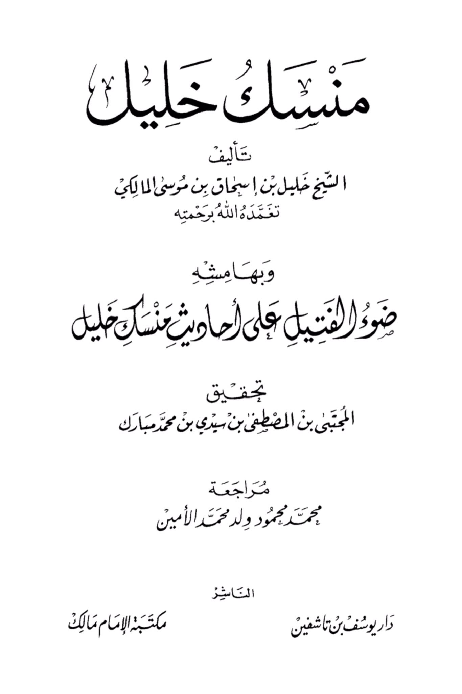
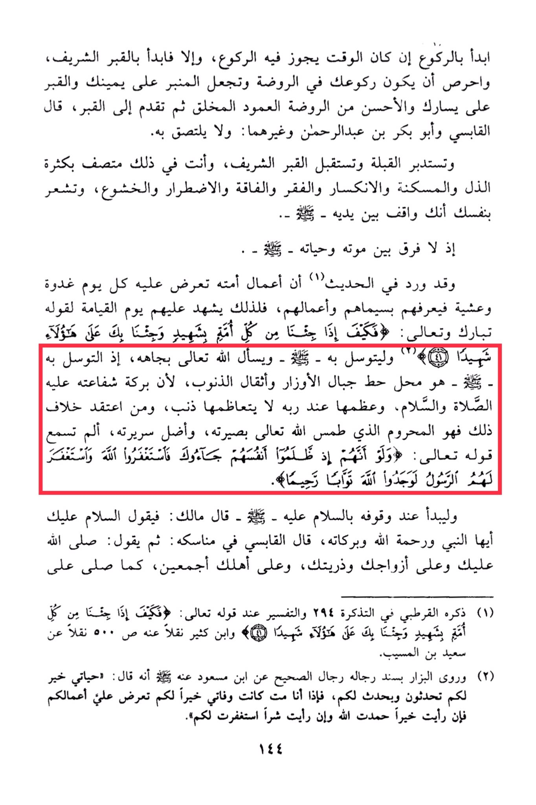

# Khalīl b. Isḥāq (d. 776)

Start with the bowing if the time allows for it, otherwise start with the noble grave. Make sure your bowing is in the Rawdah, with the pulpit on your right and the grave on your left. It is preferable to bow towards the column in the Rawdah. Then approach the grave. Al-Qabisi and Abu Bakr ibn Abd al-Rahman and others said: do not touch it. Face the direction of prayer and face the noble grave, showing humility, submission, poverty, neediness, and devotion. Feel as if you are standing in front of him, for there is no difference between his life and death. It is narrated that the deeds of his nation are presented to him every morning and evening, so he recognizes them by their marks and deeds. Therefore, he will testify for them on the Day of Resurrection. <mark style="color:red;">**Seek his intercession and ask Allah through his status, as seeking intercession through him removes mountains of sins**</mark>. <mark style="color:red;">**Whoever believes otherwise is deprived, as Allah has blinded his insight and misled his path.**</mark> Have you not heard the saying: "And if, when they wronged themselves, they had come to you, \[O Muhammad], and asked forgiveness of Allah, and the Messenger had asked forgiveness for them, they would have found Allah Accepting of repentance and Merciful." When standing, begin by sending peace upon him, saying: "Peace be upon you, O Prophet, and the mercy of Allah and His blessings." Then say: "May Allah send peace and blessings upon you and your wives and offspring and all your family." This is mentioned by al-Qurtubi in his Tafsir and Ibn Kathir narrated it from Sa'id ibn al-Musayyib. Ibn Mas'ud also narrated that he said: "My life is good for you, as you narrate and are narrated to. But when I die, my death will be good for you, as your deeds will be presented to me. If I see goodness, I will thank Allah, and if I see evil, I will seek forgiveness for you."

"<mark style="color:purple;">**Make sure to compose the book of Sheikh Khalil bin Ishaq bin Musa al-Maliki, may Allah envelop him with His mercy and illuminate his path, on the narrations about you, Khalil. This is the realization of al-Mujtaba bin al-Mustafa bin Sidi bin Muhammad Mubarak, reviewed by Muhammad Mahmoud Ould Muhammad Al-Amin, published by Dar Yusuf bin Tashfin, distributed by the Imam Malik Library**</mark>."

<figure><figcaption></figcaption></figure> <figure><figcaption></figcaption></figure>

