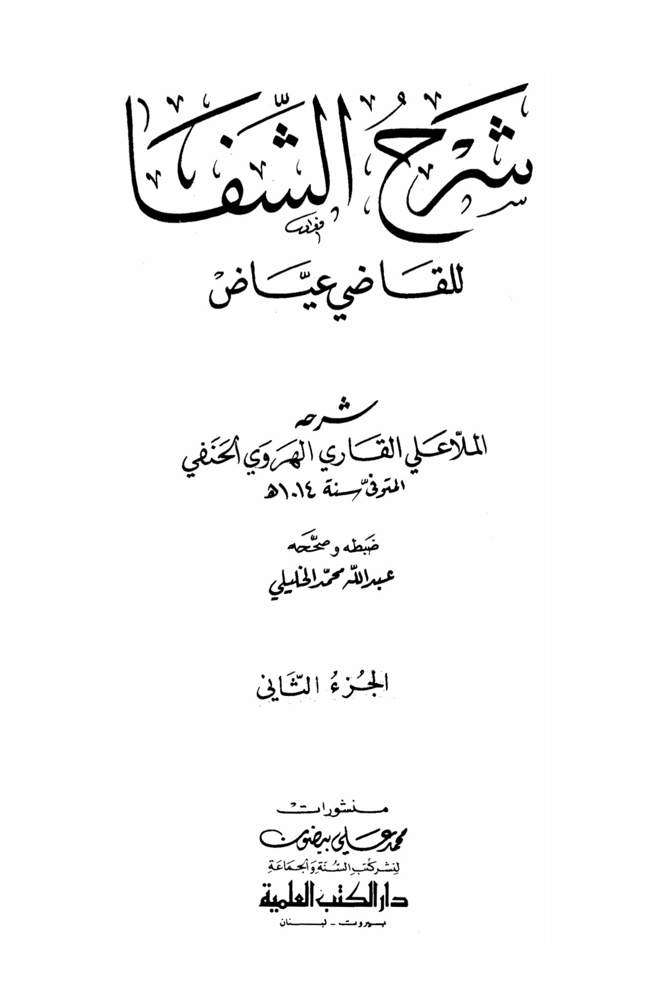
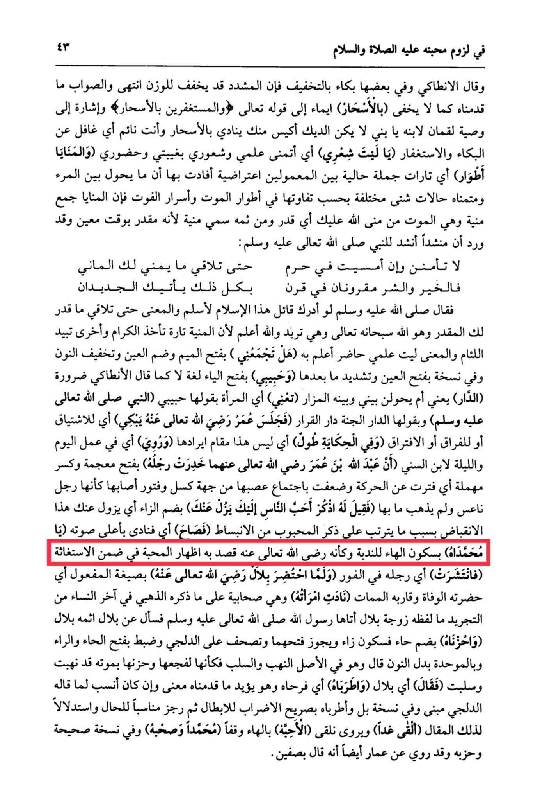

# Mullā ʿAlī (d. 1014)

Al-Antaki said, and in some instances with a soft cry, for the strictness may lighten the burden. The correct interpretation is what we have presented, as it is not hidden in the early morning prayers, indicating the saying of the Almighty, "And those who seek forgiveness in the early hours." It also refers to the advice of Luqman to his son, "O my son, do not let the rooster be more intelligent than you, calling out in the early hours while you are asleep," meaning unaware of crying and seeking forgiveness. "I wish my hair..." meaning I wish for my knowledge and awareness in my absence and presence. "And fates are stages..." meaning current situations among those affected, indicating that what prevents a person from fulfilling his desires are various circumstances depending on their differences in the stages of death and the mysteries of loss. Fates is a plural of fate, which is death, from the Arabic word "manna" meaning what Allah has decreed for you, meaning determined at a specific time. It has been reported that a poet recited to the Prophet, peace and blessings be upon him: "Name, do not feel secure, and if you spend the night in the sanctuary until you meet what fulfills your desires, both good and evil are intertwined in an era, with all that the new things will come to you." So the Prophet, peace and blessings be upon him, said, "If the one who said this Islam understood it, he would have embraced Islam," meaning until you meet what has been destined for you by the Decider, who is Allah, and she intends, and Allah knows best, because death sometimes takes the noble and other times destroys the wicked. The meaning is, I wish my present knowledge to be aware of it. "Will you gather me..." with the letter "meem" pronounced with a fatha, the "ayn" with a dhamma, and the "noon" with a tashdid, and in another version with the "ayn" pronounced with a fatha and the following letter emphasized. "And my beloved..." with the letter "ya" pronounced with a fatha, a language, not as Al-Antaki said, a necessity. "The abode" meaning will my visit be prevented between me and the shrine. "Singing" meaning the woman by saying my beloved, the Prophet, peace and blessings be upon him, and by saying the abode, the paradise, the abode of settlement. "Umar, may Allah be pleased with him, sat weeping," meaning out of longing, parting, or separation. "In the story, it was narrated..." meaning this is not the place to mention it. "And <mark style="color:red;">**it was narrated in the work of Ibn al-Sunni that Abdullah ibn Umar, may Allah be pleased with them, his leg became numb," with the "ra" pronounced with a fatha and the "ra" with a kasra, meaning it became inactive due to laziness and weakness, as if it were a sleepy leg and the issue did not go away. "So he was told, remember the most beloved person to you, and this numbness will disappear from you because of the relaxation that comes with mentioning the beloved." "So he shouted, O Muhammad!"**</mark> with the "ha" silent for lamentation, as if he, may Allah be pleased with him, intended to show love within the plea for help. "So his leg spread out immediately." "And when Bilal, may Allah be pleased with him, was on his deathbed," indicating his impending death and the approach of his demise, "his wife called out," she was a companion as mentioned by Al-Dhahabi in the end of the women of detachment, her name was the wife of Bilal. The Messenger of Allah, peace and blessings be upon him, came to her and asked about Bilal. "And she said, and she grieved," with the "ha" pronounced with a dhamma and the "za" with a sukun, although it is permissible to pronounce them with a fatha, and it is corrected by Al-Dalji to be pronounced with a fatha and a ra, and in the singular form instead of the noon. He said, while in the original meaning of plunder and theft, as if her grief and sorrow over his death had been plundered and stolen. "So Bilal said, and they rejoiced," meaning he comforted her, supporting what we have mentioned in meaning, even though it is more appropriate for what Al-Dalji said to be the subject, and in another version, "And they rejoiced," explicitly contradicting for emphasis and suitable for the situation, and as evidence for this statement. "We will meet tomorrow, the

"<mark style="color:purple;">**The book "Farari al-Qadi Ayyad" explained by al-Mulla Ali al-Qari al-Hanafi al-Harawi,**</mark>"

<figure><figcaption></figcaption></figure> <figure><figcaption></figcaption></figure>

