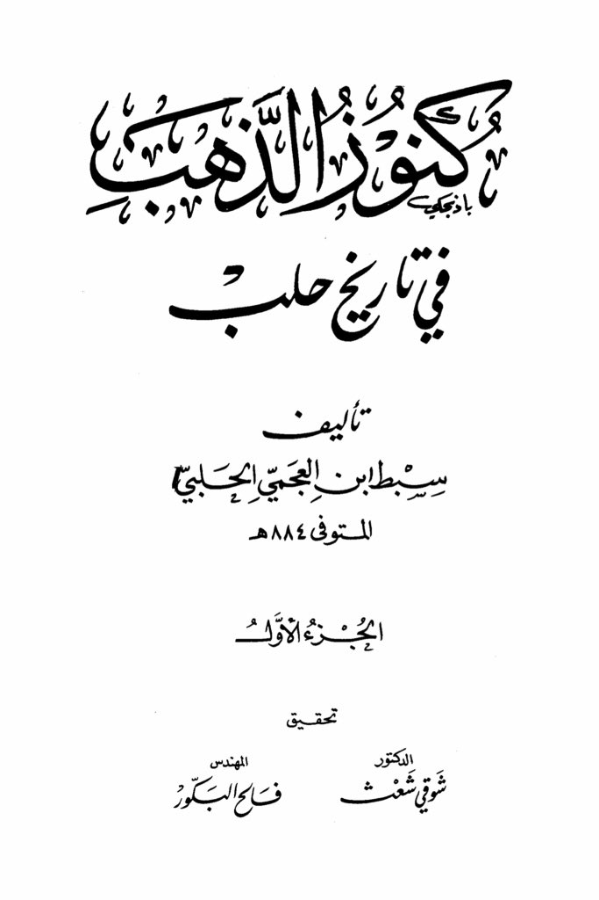
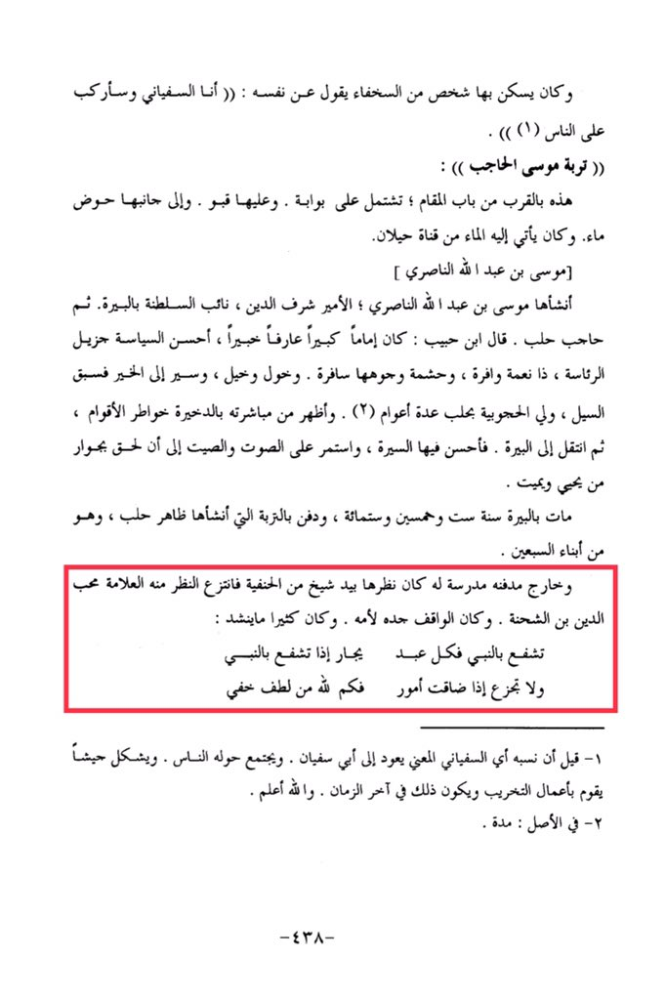

# Mūsā al-Ḥājib (d. 756)

A person from the foolish ones used to live there, saying about himself: "I am Al-Sufyani and I will dominate over people." Turbat Musa Al-Hajib: This is near the Gate of the Maqam; it includes a gate, a cellar, and next to it a water basin. Water used to come to it from the Hailan canal. Musa bin Abdullah Al-Nasiri established it. Musa bin Abdullah Al-Nasiri; Prince Sharaf al-Din, deputy of the sultanate in Beersheba, then governor of Aleppo. Ibn Habib said: He was a great imam, knowledgeable and experienced, excelling in politics and leadership, abundant in blessings, with clear dignity and honor. He was generous and noble, leading to goodness before the flood, ruling over Hajubiyah in Aleppo for several years. His dealings with people were apparent from his time in Dakhira, then he moved to Beersheba, where he continued to have a good reputation and fame until he joined those who give life and death. He died in Beersheba in the year six hundred and fifty-six, and was buried in the soil of his ancestors. Zahir of Aleppo established it, and outside his tomb, there was a school where a scholar from the Hanafi school used to teach until he was replaced by the renowned scholar Muhib al-Din ibn al-Shahna. The one standing there was his maternal grandfather. <mark style="color:red;">**He often recited: "Intercede with the Prophet, for every servant finds refuge when interceding with the Prophet, and do not despair when matters become difficult, for how many hidden kindnesses God bestows**</mark>." 1- It is said that his lineage, meaning Al-Sufyani, goes back to Abu Sufyan. People would gather around him, forming a group that engages in destructive activities, and this will happen in the end times. Allah knows best. 2- Originally meant "period." -438-

"<mark style="color:purple;">**The book "The Gold in the History of Aleppo" is authored by Subut ibn al-Ajami al-Halabi, who passed away in 884 AH. This is the first part, edited by Dr. Engineer Shouki Shatfaleh al-Bakour.**</mark>"

<figure><figcaption></figcaption></figure> <figure><figcaption></figcaption></figure>

