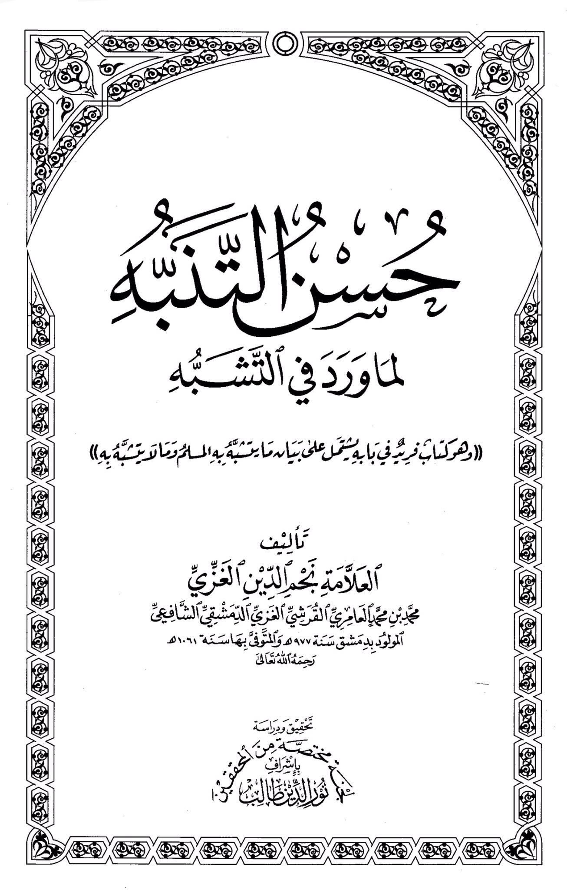
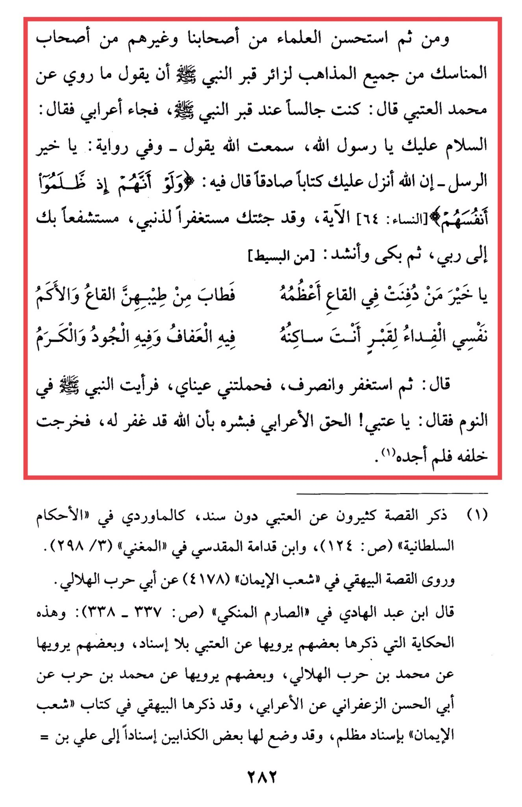

# Najm al-Dīn al-Ghazzī (d. 1061)

And then it was preferred by the scholars from our companions and others from the companions of the rituals of all schools of thought for a visitor to the Prophet's grave to say what was narrated from Muhammad al-'Atbi who said: "<mark style="color:red;">**I was sitting by the Prophet's grave, and then a Bedouin came and said: 'Peace be upon you, O Messenger of Allah**</mark>. I heard Allah say - and in another narration: 'O best of messengers - Indeed, Allah has revealed to you a true Book in which He said: 'And when they wrong themselves...' \[Quran 4:64]. <mark style="color:red;">**I have come to you seeking forgiveness for my sins, seeking your intercession with my Lord.**</mark>' Then he cried and recited: 'O best of those buried in the depths, the greatest of them, the depths and the hills have become fragrant from his fragrance. I offer myself as ransom for the grave where you reside, in it is chastity, generosity, and nobility.' He then sought forgiveness and left. My eyes carried me, and I saw the Prophet in a dream saying: 'O 'Atbi! The Bedouin spoke the truth, so give him glad tidings that Allah has forgiven him.' I followed him but did not find him." Many have mentioned this story about al-'Atbi without a chain of narration, such as al-Mawardi in "Al-Ahkam al-Sultaniyyah" and Ibn Qudamah al-Maqdisi in "Al-Mughni." Al-Bayhaqi narrated the story in "Shu'ab al-Iman" from Abu Harb al-Hilali. Ibn 'Abd al-Hadi mentioned in "Al-Sarim al-Munki" that this story, which some have narrated from al-'Atbi without a chain of narration, others have narrated from Muhammad ibn Harb al-Hilali, and others have narrated from Muhammad ibn Harb from Abu al-Hasan al-Zu'farani from the Bedouin. Al-Bayhaqi included it in his book "Shu'ab al-Iman" with a weak chain of narration, and some liars have fabricated a chain of narration to 'Ali ibn...

<figure><figcaption></figcaption></figure> <figure><figcaption></figcaption></figure>

"<mark style="color:purple;">**The art of imitation is perfected by what is mentioned in the book of resemblance, which is a unique book in its field that includes an explanation of what the peaceful imitates and what he does not imitate. Written by the scholar Nahm al-Din al-Ghazzi, Muhammad ibn Muhammad al-Amiri al-Qurashi al-Ghari al-Dimashqi al-Shafi'i, born in Damascus in 977 AH and passed away in 1061 AH**</mark>"
