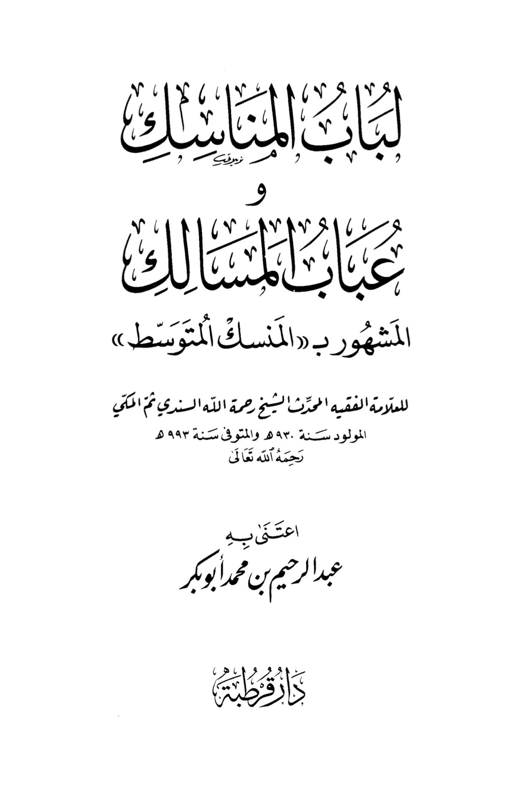
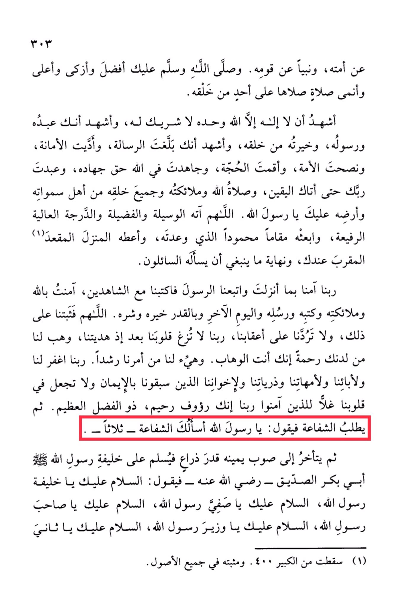

# RaḥmahAllāh al-Sindī (d. 993)

<mark style="color:red;">**May the prayers of Allah, His angels, and all His creation from the inhabitants of the heavens and the earth be upon you, O Messenger of Allah**</mark>. O Allah, grant him the means, virtues, and the high and lofty station that You have promised him, and place him in the praised station that You have promised him, and grant him the close abode with You, the ultimate request of those who ask. Our Lord, we have believed in what You have revealed and followed the Messenger, so register us among the witnesses. I believe in Allah, His angels, His books, His messengers, the Last Day, and in the divine decree, both its good and its evil. O Allah, make us steadfast in that, and do not let our hearts deviate after You have guided us, and grant us mercy from Your presence, for You are the Bestower. And make for us in our affairs right guidance. Our Lord, forgive us, our parents, our mothers, our offspring, and our brothers who have preceded us in faith, and do not place in our hearts any resentment towards those who have believed. <mark style="color:red;">**Our Lord, indeed You are Compassionate, Merciful, Possessor of great bounty. Then, whoever seeks intercession will say: "O Messenger of Allah, I ask you for intercession" three times. Then he will turn to his right side the length of an arm and greet the successor of the Messenger of Allah, Abu Bakr Al-Siddiq, may Allah be pleased with him, saying: "Peace be upon you, O successor of the Messenger of Allah. Peace be upon you, O chosen one of the Messenger of Allah. Peace be upon you, O companion of the Messenger of Allah. Peace be upon you, O minister of the Messenger of Allah. Peace be upon you, O second..." (The text continues with additional details.)**</mark>

"<mark style="color:purple;">**The book "Lubat al-Manasik" is a shining light in the field of well-known paths, known as the "Middle Path," by the eminent scholar and expert, Sheikh Rahmatullah al-Sindi**</mark>"

<figure><figcaption></figcaption></figure> <figure><figcaption></figcaption></figure>

