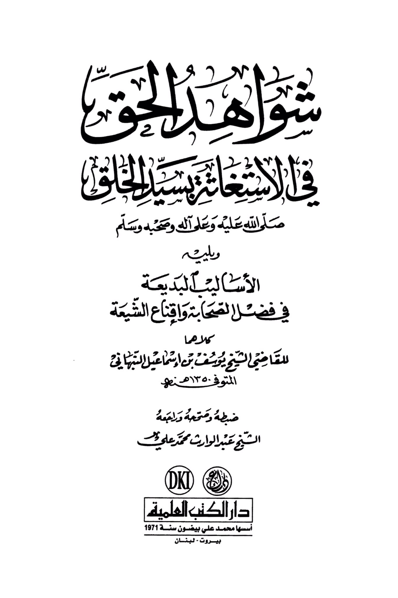
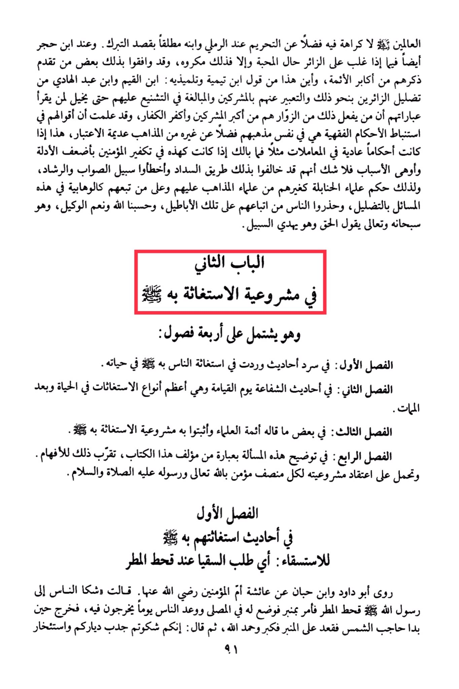

# Yūsuf al-Nabhānī (d. 1350)

<mark style="color:orange;">**The scholars unanimously agree that there is no dislike for seeking blessings at the grave, let alone it being prohibited according to Al-Ramli and his son, absolutely with the intention of seeking blessings.**</mark> According to Ibn Hajar as well, if the visitor is overwhelmed by feelings of love, then it is permissible, otherwise it is disliked. Some of the prominent Imams have also agreed on this. This is in contrast to the <mark style="color:red;">**views of Ibn Taymiyyah and his students: Ibn al-Qayyim and Ibn Abdul Hadi, who mislead visitors in a similar manner, describing them as polytheists and exaggerating in their condemnation to the extent that it may seem to the reader that those who engage in such practices are among the greatest polytheists and disbelievers.**</mark> It is known that their opinions on deriving legal rulings are limited to their own school of thought, disregarding other schools of thought. If their rulings on ordinary matters are disregarded, then what about when it comes to matters like declaring believers as disbelievers based on weak evidence and flimsy reasons? <mark style="color:red;">**Undoubtedly, they have deviated from the path of guidance, erred from the right path, and as a result, the scholars of the Hanbali school, like other scholars of different schools of thought, have warned against following them in these matters of misguidance.**</mark> They have cautioned people against adhering to their falsehoods. May Allah be sufficient for us, and He is the best disposer of affairs, and He, exalted be He, speaks the truth and guides to the right path. The second chapter on the legitimacy of seeking help from the deceased includes four sections: The first section discusses the narrations about people seeking help from the Prophet during his lifetime. The second section covers the narrations about intercession on the Day of Judgment, which is the greatest form of seeking help in life and afterlife. The <mark style="color:red;">**third section presents some statements of the scholars affirming the legitimacy of seeking help from the deceased**</mark>. The fourth section clarifies this issue with a statement from the author of this book, <mark style="color:red;">**aiming to facilitate understanding for those who believe in the legitimacy of seeking help from Allah and His Messenger**</mark>. The first section discusses the narrations about seeking help for rain, as narrated by Aisha, the Mother of the Believers. Abu Dawood and Ibn Hibban reported that Aisha said, "People complained to the Messenger of Allah about the drought, so he ordered for a pulpit to be set up in the mosque and announced to the people a day on which they should come out. When the sun appeared from behind a cloud, he sat on the pulpit, praised and glorified Allah, then said: 'You complained about the drought affecting your homes and the hardship of your livelihoods.'"

"<mark style="color:purple;">**The evidence of the investigator in relying on the Master of Creation, peace and blessings be upon him and his family and companions, and utilizing the exquisite methods in praising the companions and convincing the Shiites, both addressed to the judge Sheikh Yusuf bin Ismail al-Nabhani,**</mark>"

<figure><figcaption></figcaption></figure> <figure><figcaption></figcaption></figure>

