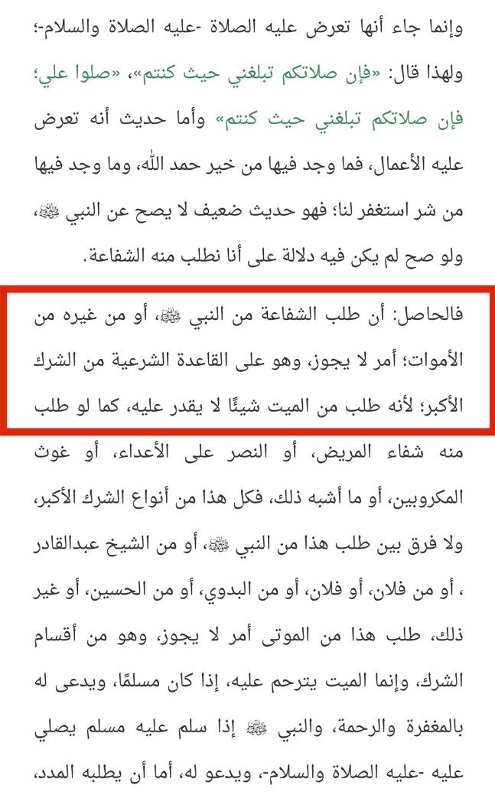

# The Salafi Dilemma

As mentioned in the introduction, Ibn Taymiyyah famously opposed tawassul (seeking intercession) and istighāthah (seeking help) from the Prophet or saints; views that ran counter to the prevailing beliefs of the vast majority of scholars. Prominent scholars like al-Jazari, Imam Subki, and others attempted to refute him, particularly on istighāthah. <mark style="color:red;">**Imam Subki emphasized that no scholar before Ibn Taymiyyah had rejected the practices of tawassul and istighāthah, stressing that these acts had long been established as permissible within Sunni Islam**</mark>. Abu Abdallāh Muhammad Ibn Musā al-Mālikī (d. 683 AH) even wrote a book defending istighāthah with the Messenger of God. His contemporary, Najm al-Dīn al-Tūfī, remarked that his generation and the ones after it had formed a consensus on the validity of such practices, meaning that rejecting istighāthah went against the scholarly consensus of the time.

The Prophet is also reported to have said within their own Hadith corpus, "<mark style="color:red;">**Follow the great majority (of scholars)**</mark>," a hadith authenticated by Al-Hakim, further supporting the idea that siding with the majority of scholars in these matters is crucial. However, despite these arguments, the Salafi movement, particularly influenced by Ibn Taymiyyah and later Muhammad ibn Abd al-Wahhab, vehemently rejects tawassul and istighāthah, particularly when practiced through deceased figures like prophets or saints. They argue that seeking intercession or aid through anyone but God is a violation of tawhid (the oneness of God). Citing Quranic verses like 1:5, "You alone we worship, and You alone we ask for help," Salafis maintain that any invocation other than to God constitutes shirk (associating partners with God).

This Salafi stance creates an inherent tension, as Salafis often rely on the legal structures and rulings of scholars from the four major Sunni schools—Hanafi, Maliki, Shafi'i, and Hanbali—all of whom historically permitted practices like tawassul and istighāthah. From a critical viewpoint, this can be seen as a form of intellectual inconsistency, as Salafis depend on jurisprudential traditions established by scholars whose views on these matters they outright reject, highlighting a complex dynamic within contemporary Islamic discourse.

If the acts of tawassul and istighāthah are indeed considered shirk, as claimed by Salafis through the teachings of Ibn Taymiyyah, Muhammad ibn Abd al-Wahhab, and others, this position would have radical implications for followers of any of the four major Sunni schools of thought. All four madhhabs—Hanafi, Maliki, Shafi'i, and Hanbali—accept and promote the practices of seeking intercession and aid through prophets and saints. By labeling these acts as shirk, the Salafi stance would effectively relegate the scholars and followers of these schools to a status of disbelief (kufr), since shirk is considered an unforgivable sin in Islam. This would mean that the overwhelming majority of Muslims, including revered scholars and jurists throughout Islamic history, are disbelievers according to Salafi logic.

## Salafi Scholar: <mark style="color:yellow;">Sheikh Bin Baz</mark>

Shaykh al-Islam Rashid al-Gangohi with-founder of Deoband:

“If you stand at the grave of the prophet ﷺ ask him to make du’a for you that Allah forgives you.”

<mark style="color:red;">**Ibn Baz: “whoever does this is a mushrik”**</mark>

Questioner: “But Shaykh can he be excused?”

<mark style="color:red;">**Ibn Baz: “No excuse!”**</mark>

"<mark style="color:red;">**Seeking help from the deceased is not permissible and falls under the category of major sin. Rather, one should seek mercy for the deceased if they were Muslim, and pray for their forgiveness and mercy. When a Muslim greets him with peace and blessings, he prays for him. However, seeking assistance from him is not permissible.**</mark>**"**

He calls it "Shirk Akhbar" - The term "shirk akbar" (الشرك الأكبر) translates to "major shirk" or "greater shirk" in English. In Islamic theology, "shirk" refers to the act of associating partners with God or attributing divine qualities to others besides Him. Bin Baz (likely unintentionally) condemned all major schools of thoughts of comitting "shirk akbar", and down below he clarifies that there is no excuse for such an individual. 



Is there excuse of ignorance in shirk?

Ibn Baz: “<mark style="color:red;">**No! such person is not excused and is a mushrik**</mark>.”



From Ibn Baz close students ar-Rājihī, there is no excuse of ignorance:



